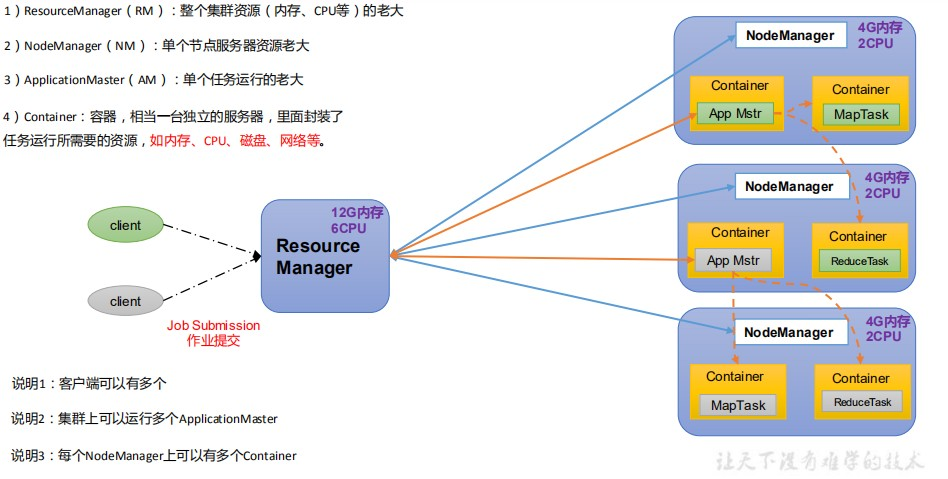
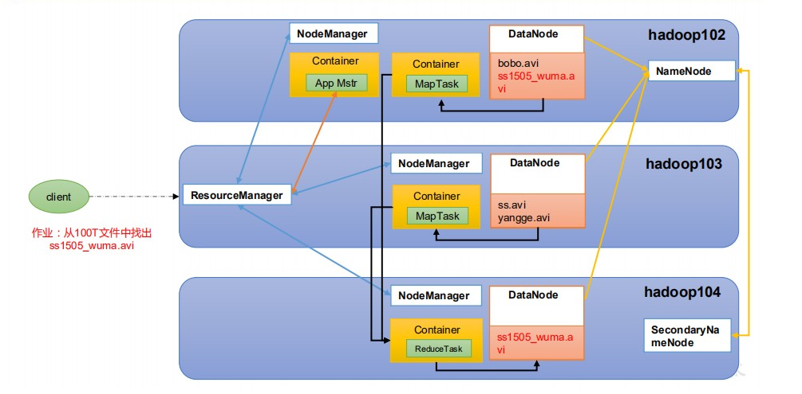
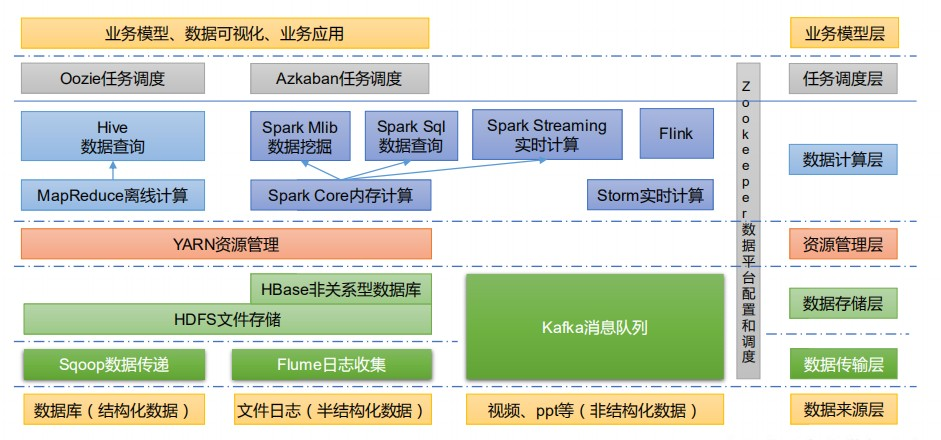

# Hadoop四高

1. 高可靠性
2. 高扩展性
3. 高效性
4. 高容错性


# Hadoop架构组成

### HDFS

分布式文件系统

1. NameNode(nn)
2. DataNode(dn)
3. Secondary NameNode(2nn)：每隔一段时间对NameNode元数据备份

### YARN

资源协调者

1. ResourceManager(RM)：整个资源（内存、CPU等）的老大
2. NodeMangeer(NM)：单个节点服务器资源老大
3. ApplicationMaster(AM)：单个任务运行老大
4. Container：容器相当于一台独立的服务器，里面封装了任务运行时所需要的资源，如CPU、内存、磁盘、网络等




### MapReduce

1. Map阶段并行处理输入数据
2. Reduce阶段对Map结果进行汇总

### HDFS、YARN、MapReduce 三者关系



#  大数据技术生态体系



# 安装

### JDK环境

### 安装Hadoop(https://archive.apache.org/dist/hadoop/common/)

1. 前置安装

   ```shell
   yum install -y epel-release net-tools
   ```

2. 上传文件

3. 解压文件

4. 配置环境变量

   ```shell
   #HADOOP_HOME
   export HADOOP_HOME=/opt/module/hadoop-3.1.3
   export PATH=$PATH:$HADOOP_HOME/bin
   export PATH=$PATH:$HADOOP_HOME/sbin
   ```

5. 刷新配置

   ```shell
   source /etc/profile
   ```

6. 查看版本

   ```shell
   hadoop -v
   ```

   

