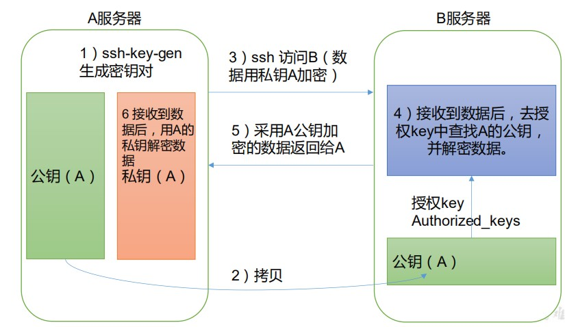

# 基本前提

### scp（secure copy）安全拷贝

定义：scp 可以实现服务器与服务器之间的数据拷贝。

基本语法：scp -r   $pdir/$fname   $user@$host:$pdir/$fname

操作：

 1. 在 hadoop102 上，将 hadoop102 中/opt/module/jdk1.8.0_212 目录拷贝到hadoop103 上。（推送）

    ```shell
    scp -r /opt/module/jdk1.8.0_212 atguigu@hadoop103:/opt/module
    ```

	2. 在 hadoop103 上，将 hadoop102 中/opt/module/hadoop-3.1.3 目录拷贝到hadoop103 上。(拉取)

    ```shell
    scp -r atguigu@hadoop102:/opt/module/hadoop-3.1.3 /opt/module/
    ```

	3. 在 hadoop103 上操作，将 hadoop102 中/opt/module 目录下所有目录拷贝到hadoop104 上。

    ```shell
    scp -r atguigu@hadoop102:/opt/module/*  atguigu@hadoop104:/opt/module
    ```

### **rsync** 远程同步工具

rsync 主要用于备份和镜像。具有速度快、避免复制相同内容和支持符号链接的优点。

rsync 和 scp 区别：用 rsync 做文件的复制要比 scp 的速度快，rsync 只对差异文件做更新。scp 是把所有文件都复制过去。


基本语法：

安装：

```shell
yum install rsync
```

语法：

```shell
rsync -av $pdir/$fname $user@$host:$pdir/$fname
```

-a 归档拷贝

-v 显示复制过程

1. 同步 hadoop102 中的/opt/module/hadoop-3.1.3 到 hadoop103

```shell
rsync -av hadoop-3.1.3/ atguigu@hadoop103:/opt/module/hadoop-3.1.3/
```


# **xsync** 集群分发脚本

1. 安装

```shell
yum install rsync
```

2. 创建文件夹vim xsync

3. 编写脚本

```shell
#!/bin/bash
#1. 判断参数个数
if [ $# -lt 1 ]
then
 echo Not Enough Arguement!
 exit;
fi
#2. 遍历集群所有机器
for host in hadoop102 hadoop103 hadoop104
do
 echo ==================== $host ====================
 #3. 遍历所有目录，挨个发送
 for file in $@
 do
 #4. 判断文件是否存在
 if [ -e $file ]
 then
 #5. 获取父目录
 pdir=$(cd -P $(dirname $file); pwd)
 #6. 获取当前文件的名称
 fname=$(basename $file)
 ssh $host "mkdir -p $pdir"
 rsync -av $pdir/$fname $host:$pdir
 else
 echo $file does not exists!
 fi
 done
done
```

4. 修改脚本 xsync 具有执行权限

```shell
chmod +x xsync
```

5. 脚本存放到用户根目录

# SSH无密登录配置

**免密登录原理**




**生成公钥和私钥(三台机器上都配置)**

```shell
cd 

ssh-keygen -t rsa

然后敲（三个回车），就会生成两个文件 id_rsa（私钥）、id_rsa.pub（公钥）
```

**将公钥拷贝到需要免登录目标机器上(三台机器上都配置)**

```shell
ssh-copy-id hadoop102
ssh-copy-id hadoop103
ssh-copy-id hadoop104
```

# 期望脚本在任何路径都能使用（脚本放在声明了全局环境变量的路径）

1. 将脚本拷贝到/bin目录下

2. 赋予执行权限

   ```shell
   chmod +x xsync
   ```

   


