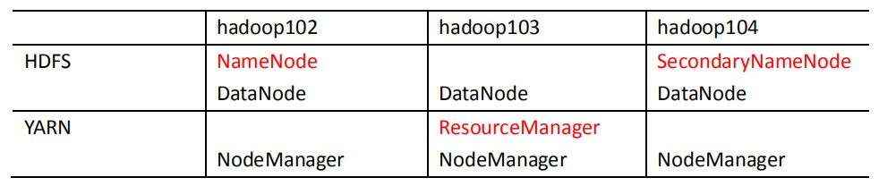
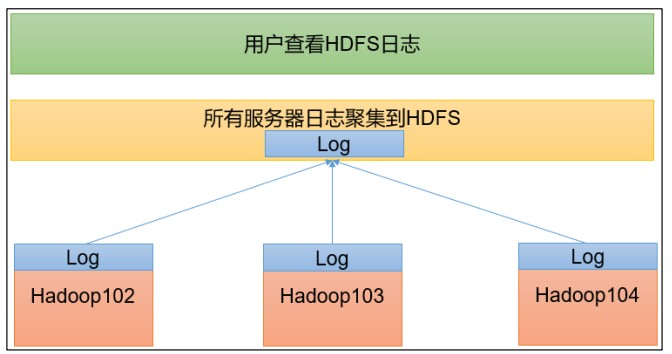
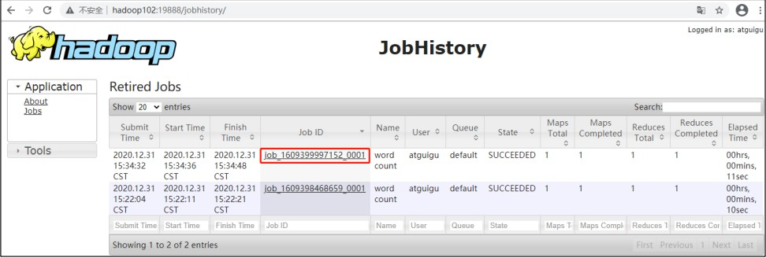
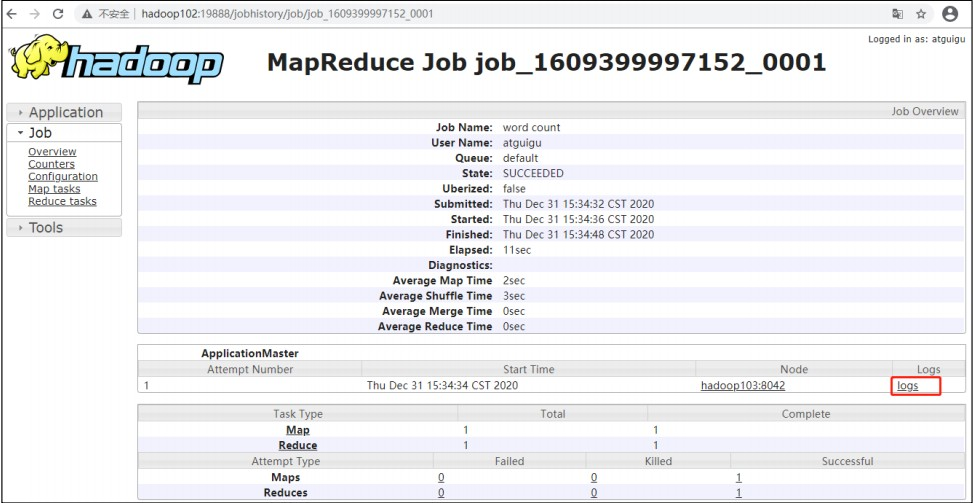
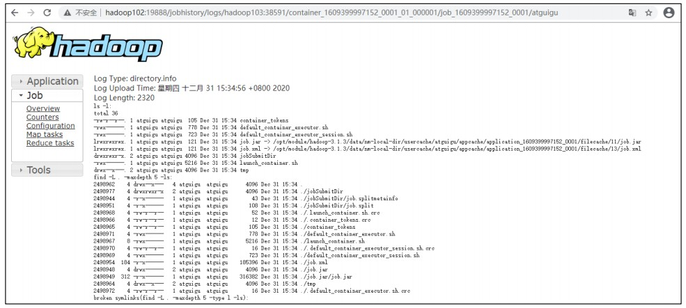

# 集群部署规划

**注意：**

1. NameNode 和 SecondaryNameNode 不要安装在同一台服务器
2. ResourceManager 也很消耗内存，不要和 NameNode、SecondaryNameNode 配置在同一台机器上。




# 配置文件说明

Hadoop 配置文件分两类：默认配置文件和自定义配置文件，只有用户想修改某一默认配置值时，才需要修改自定义配置文件，更改相应属性值。

1. 默认配置文件：

| 要获取的默认文件     | 文件存放在 Hadoop 的 jar 包中的位置                       |
| -------------------- | --------------------------------------------------------- |
| [core-default.xml]   | hadoop-common-3.1.3.jar/core-default.xml                  |
| [hdfs-default.xml]   | hadoop-hdfs-3.1.3.jar/hdfs-default.xml                    |
| [yarn-default.xml]   | hadoop-yarn-common-3.1.3.jar/yarn-default.xml             |
| [mapred-default.xml] | hadoop-mapreduce-client-core-3.1.3.jar/mapred-default.xml |

2. 自定义配置文件

**core-site.xml**、**hdfs-site.xml**、**yarn-site.xml**、**mapred-site.xml** 四个配置文件存放在$HADOOP_HOME/etc/hadoop 这个路径上，用户可以根据项目需求重新进行修改配置。


# 配置集群

### 核心配置文件

**配置 core-site.xml**

```xml
<?xml version="1.0" encoding="UTF-8"?>
<?xml-stylesheet type="text/xsl" href="configuration.xsl"?>
<configuration>
 <!-- 指定 NameNode 的地址 -->
 <property>
 <name>fs.defaultFS</name>
 <value>hdfs://ha01.prdigital.cn:8020</value>
 </property>
 <!-- 指定 hadoop 数据的存储目录 -->
 <property>
 <name>hadoop.tmp.dir</name>
 <value>/opt/module/hadoop-3.1.3/data</value>
 </property>
 <!-- 配置 HDFS 网页登录使用的静态用户为 atguigu -->
 <property>
 <name>hadoop.http.staticuser.user</name>
 <value>root</value>
 </property>
</configuration>
```

### HDFS 配置文件

**配置 hdfs-site.xml**

```xml
<?xml version="1.0" encoding="UTF-8"?>
<?xml-stylesheet type="text/xsl" href="configuration.xsl"?>
<configuration>
<!-- nn web 端访问地址-->
<property>
 <name>dfs.namenode.http-address</name>
 <value>ha01.prdigital.cn:9870</value>
 </property>
<!-- 2nn web 端访问地址-->
 <property>
 <name>dfs.namenode.secondary.http-address</name>
 <value>ha03.prdigital.cn:9868</value>
 </property>
</configuration>
```

### YARN 配置文件

**配置 yarn-site.xml**

```xml
<?xml version="1.0" encoding="UTF-8"?>
<?xml-stylesheet type="text/xsl" href="configuration.xsl"?>
<configuration>
 <!-- 指定 MR 走 shuffle -->
 <property>
 <name>yarn.nodemanager.aux-services</name>
 <value>mapreduce_shuffle</value>
 </property>
 <!-- 指定 ResourceManager 的地址-->
 <property>
 <name>yarn.resourcemanager.hostname</name>
 <value>ha02.prdigital.cn</value>
 </property>
 <!-- 环境变量的继承 -->
 <property>
 <name>yarn.nodemanager.env-whitelist</name>
 
<value>JAVA_HOME,HADOOP_COMMON_HOME,HADOOP_HDFS_HOME,HADOOP_CONF_DIR,CLASSPATH_PREPEND_DISTCACHE,HADOOP_YARN_HOME,HADOOP_MAPRED_HOME</value>
 </property>
</configuration>
```

### MapReduce 配置文件

**配置 mapred-site.xml**

```xml
<?xml version="1.0" encoding="UTF-8"?>
<?xml-stylesheet type="text/xsl" href="configuration.xsl"?>
<configuration>
<!-- 指定 MapReduce 程序运行在 Yarn 上 -->
 <property>
 <name>mapreduce.framework.name</name>
 <value>yarn</value>
 </property>
</configuration>
```

# 分发 **Hadoop** 配置文件

```shell
xsync /opt/module/hadoop-3.1.3/etc/hadoop
```


# **配置** workers

```shell
vim /opt/module/hadoop-3.1.3/etc/hadoop/workers
```

```shell
hadoop102
hadoop103
hadoop104
```

**注意**：该文件中添加的内容结尾不允许有空格，文件中不允许有空行。

**同步所有节点配置文件**

```shell
xsync /opt/module/hadoop-3.1.3/etc
```


# 启动集群

**如果集群是第一次启动**，需要在 hadoop102 节点格式化 NameNode（注意：格式化 NameNode，会产生新的集群 id，导致 NameNode 和 DataNode 的集群 id 不一致，集群找不到已往数据。如果集群在运行过程中报错，需要重新格式化 NameNode 的话，一定要先停 止 namenode 和 datanode 进程，并且要删除所有机器的 data 和 logs 目录，然后再进行格式化。）

```shell
hdfs namenode -format
```

**启动 HDFS**

```shell
sbin/start-dfs.sh
```

**在配置了 ResourceManager的节点（hadoop103）启动 YARN**

```shell
 sbin/start-yarn.sh
```

**Web 端查看 HDFS 的 NameNode**

http://hadoop102:9870/

**Web 端查看 YARN 的 ResourceManager**

http://hadoop103:8088/


# 测试

### 创建文件夹

```shell
hadoop fs -mkdir /input
```

### 上传文件

```shell
hadoop fs -put /opt/software/jdk-8u212-linux-x64.tar.gz /
```

### 下载文件

```shell
hadoop fs -get /jdk-8u212-linuxx64.tar.gz ./
```


# 配置历史服务器

**配置 mapred-site.xml**

```yaml
<!-- 历史服务器端地址 -->
<property>
 <name>mapreduce.jobhistory.address</name>
 <value>ha01.prdigital.cn:10020</value>
</property>
<!-- 历史服务器 web 端地址 -->
<property>
 <name>mapreduce.jobhistory.webapp.address</name>
 <value>ha01.prdigital.cn:19888</value>
</property>
```

**分发配置**

```shell
xsync $HADOOP_HOME/etc/hadoop/mapred-site.xml
```

**在 hadoop102 启动历史服务器**

```shell
mapred --daemon start historyserver
```

**查看是否成功**

```shell
jps
```

**查看JobHistory**

```shell
http://hadoop102:19888/jobhistory
```


# 配置日志的聚集

日志聚集概念：应用运行完成以后，将程序运行日志信息上传到 HDFS 系统上。



日志聚集功能好处：可以方便的查看到程序运行详情，方便开发调试。

**注意**：开启日志聚集功能，需要重新启动 NodeManager 、ResourceManager 和HistoryServer。

开启日志聚集功能具体步骤如下： 

1. **配置 yarn-site.xml**

   在该文件里面增加如下配置

   ```xml	
   <!-- 开启日志聚集功能 -->
   <property>
    <name>yarn.log-aggregation-enable</name>
    <value>true</value>
   </property>
   <!-- 设置日志聚集服务器地址 -->
   <property> 
    <name>yarn.log.server.url</name> 
    <value>http://hadoop102:19888/jobhistory/logs</value>
   </property>
   <!-- 设置日志保留时间为 7 天 -->
   <property>
    <name>yarn.log-aggregation.retain-seconds</name>
    <value>604800</value>
   </property>
   ```

2. **分发配置**

     ```shell
xsync $HADOOP_HOME/etc/hadoop/yarn-site.xml
     ```

3. **关闭 NodeManager 、ResourceManager 和 HistoryServer**

   ```shell
   hadoop103   sbin/stop-yarn.sh
   hadoop103   mapred --daemon stop historyserver
   ```

4. **启动 NodeManager、ResourceManage 和 HistoryServer**

```shell
hadoop103 start-yarn.sh
hadoop102 mapred --daemon start historyserver
```

5. **删除 HDFS 上已经存在的输出文件**

```shell
hadoop fs -rm -r /output
```

6. **执行 WordCount 程序**

```shell
hadoop jar share/hadoop/mapreduce/hadoop-mapreduce-examples-3.1.3.jar wordcount /input /output
```

7. **查看日志**

   1. 历史服务器地址http://hadoop102:19888/jobhistory
   2. 历史任务列表

   

   3. 查看任务运行日志

   

      4. **日志运行详情**

         


# 启停基本命令

**各个模块分开启动/停止（配置 ssh 是前提）常用**

1. 整体启动/停止HDFS

```shell
start-dfs.sh/stop-dfs.sh
```

2. 整体启动/停止 YARN

```shell
start-yarn.sh/stop-yarn.sh
```

**各个服务组件逐一启动/停止**

1. 分别启动/停止 HDFS 组件

```shell
hdfs --daemon start/stop namenode/datanode/secondarynamenode
```

2. 启动/停止 YARN

```shell
yarn --daemon start/stop resourcemanager/nodemanager
```


# 集群时间同步

