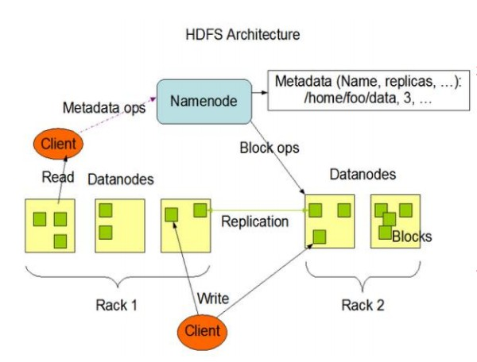
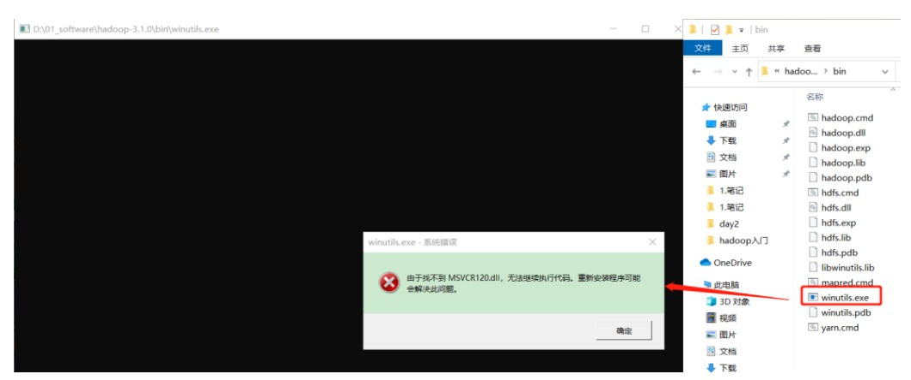
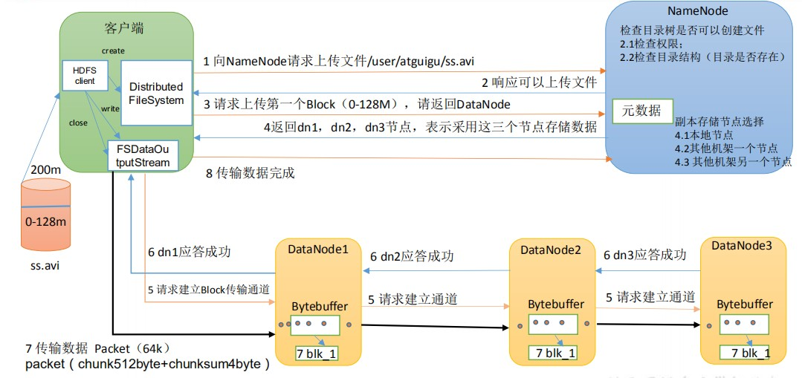
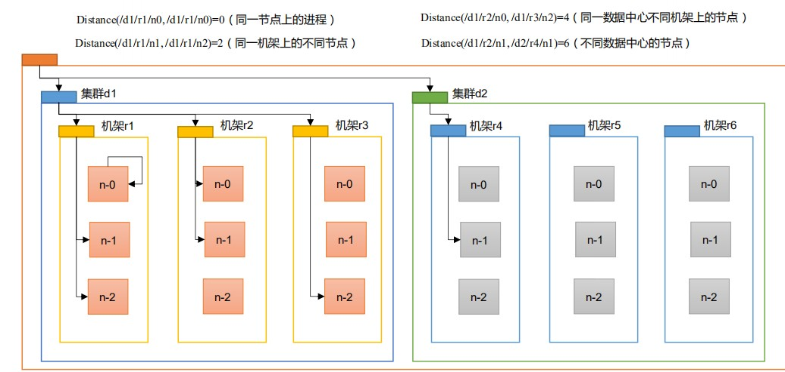
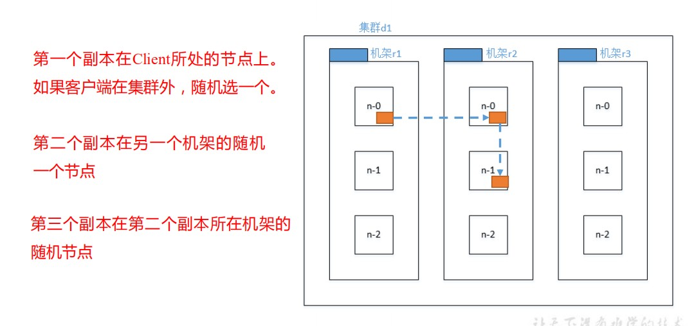
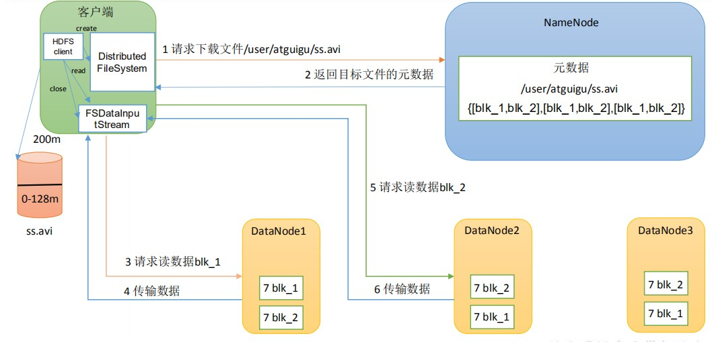
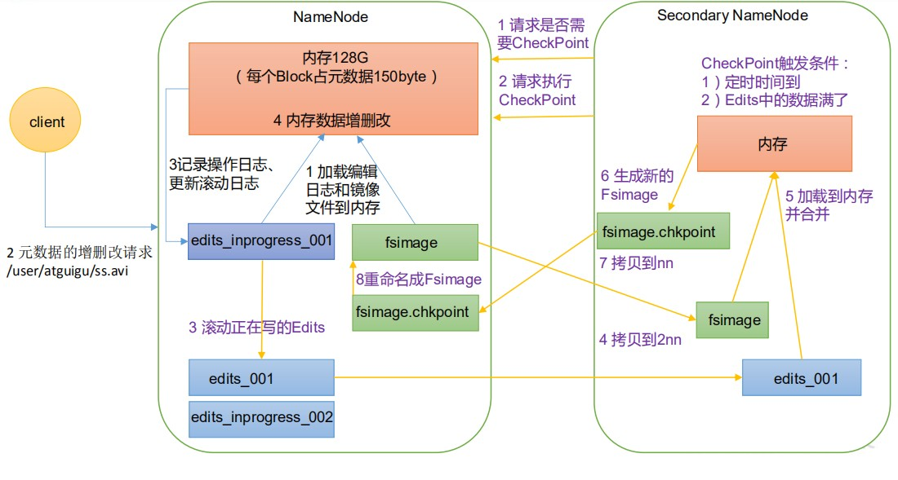
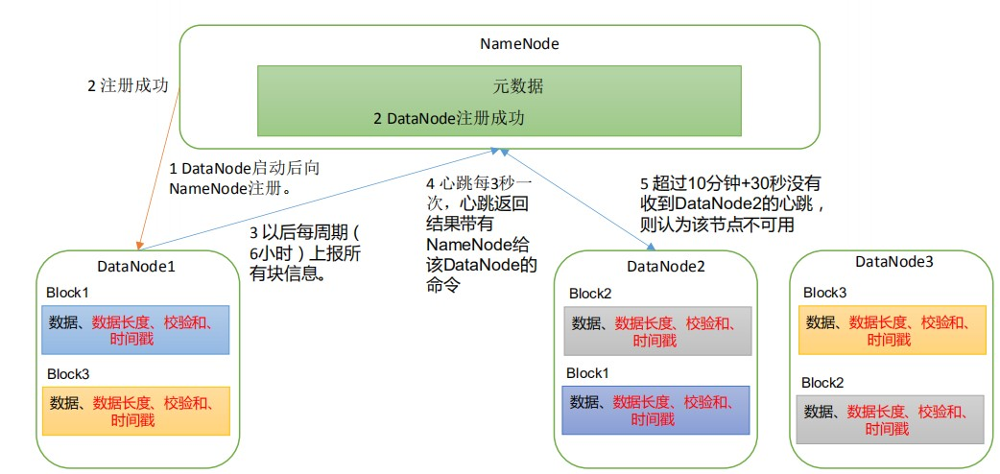
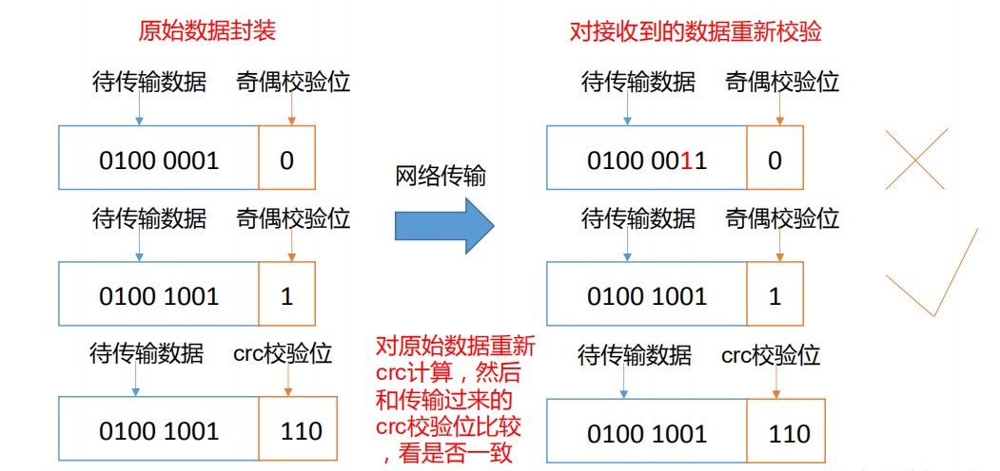
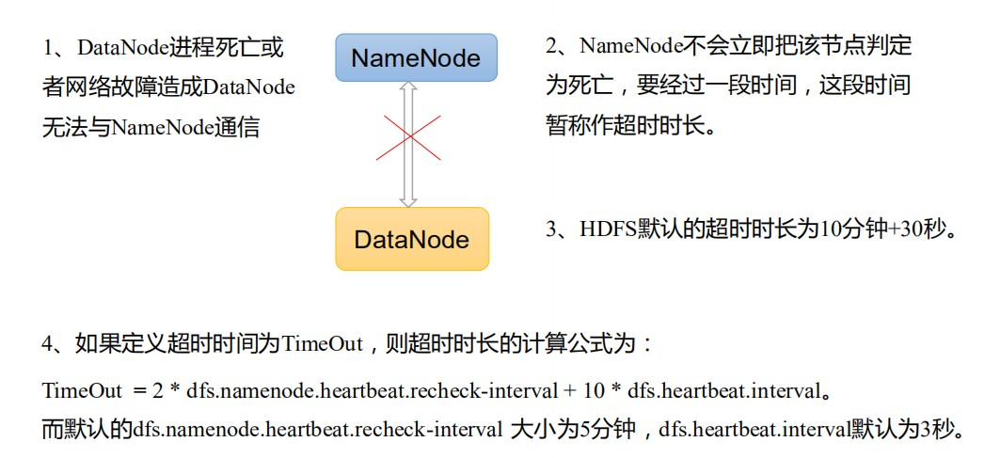

# HDFS优缺点

### 优点

1. 高容错性
2. 适合处理大数据
   1. 数据规模：GB、TB甚至PB
   2. 文件规模：能够处理百万规模以上的文件数量，数量相当之大
3. 可以构建在廉价机器上，通过多副本机制，提高可靠性

### 缺点

1. 不适合低延迟数据访问
2. 无法高效的对大量文件进行存储
   1. 存储大量小文件的话，它会占用NameNode大量的内存来存储文件目录和块信息，这样是不可取的，因为NameNode的内存总是有限的
   2. 小文件存储的寻址时间会超过读取时间，它违反了HDFS的设计目标
3. 不支持并发写入，文件随机修改
   1. 一个文件只能有一个写，不允许多个线程同时写
   2. 仅支持数据append(追加)，不支持文件的随时修改。

# HDFS组成架构




1. NameNode(nn)：就是Master,它是一个主管、管理者。 
   1. 管理HDFS的命名空间
   2. 配置副本策略
   3. 管理数据块（Block）映射信息
   4. 处理客户端读写请求
2. DataNode：就是Slave。NameNode下达命令，DataNode执行实际的操作
   1. 存储实际的数据块
   2. 执行数据块的读写操作
3. Client：就是客户端
   1. 文件切分。文件上传HDFS的时候，Client将文件切分成一个一个的Block，然后进行上传
   2. 与NameNode交互，获取文件的位置信息
   3. 与DataNode交互，读取或者写入数据
   4. Client提供一些命令来管理HDFS，比如NameNode格式化
   5. Client可以通过一些命令来访问HDFS，比如对HDFS增删改查操作
4. Secondary NameNode：并非NameNode的热备。当NameNode挂掉的时候，它并不能马上替换NameNode并提供服务
   1. 辅助NameNode，分担其工作量，比如定期合并Fsimage和Edits，并推送给NameNode;
   2. 在紧急情况下，可辅助恢复NameNode


# HDFS的Shell操作

### 基本语法

hadoop fs 具体命令 OR hdfs dfs具体命令两个是完全相同的

### 命令大全

1. 创建文件夹

```shell
 hadoop fs -mkdir /sanguo
```

2. 上传

```shell
# -moveFromLocal：从本地剪切粘贴到 HDFS
hadoop fs -moveFromLocal ./shuguo.txt /sanguo
 
# -copyFromLocal：从本地文件系统中拷贝文件到 HDFS 路径去
hadoop fs -copyFromLocal weiguo.txt /sanguo

# -put：等同于 copyFromLocal，生产环境更习惯用 put
hadoop fs -put ./wuguo.txt /sanguo

# -appendToFile：追加一个文件到已经存在的文件末尾
hadoop fs -appendToFile liubei.txt /sanguo/shuguo.txt
```

3. 下载

```shell
# -copyToLocal：从 HDFS 拷贝到本地
hadoop fs -copyToLocal /sanguo/shuguo.txt ./

# -get：等同于 copyToLocal，生产环境更习惯用 get
hadoop fs -get /sanguo/shuguo.txt ./shuguo2.txt
```

4. 直接操作

```shell
# -ls: 显示目录信息
hadoop fs -ls /sanguo

# -cat：显示文件内容
hadoop fs -cat /sanguo/shuguo.txt

# -chgrp、-chmod、-chown：Linux 文件系统中的用法一样，修改文件所属权限
hadoop fs -chmod 666 /sanguo/shuguo.txt
hadoop fs -chown atguigu:atguigu /sanguo/shuguo.txt

# -mkdir：创建路径
hadoop fs -mkdir /jinguo

# -cp：从 HDFS 的一个路径拷贝到 HDFS 的另一个路径
hadoop fs -cp /sanguo/shuguo.txt /jinguo

# -mv：在 HDFS 目录中移动文件
hadoop fs -mv /sanguo/wuguo.txt /jinguo

# -tail：显示一个文件的末尾 1kb 的数据
hadoop fs -tail /jinguo/shuguo.txt

# -rm：删除文件或文件夹
hadoop fs -rm /sanguo/shuguo.txt

# -rm -r：递归删除目录及目录里面内容
hadoop fs -rm -r /sanguo

# -du 统计文件夹的大小信息
hadoop fs -du -s -h /jinguo

hadoop fs -du -h /jinguo

# -setrep：设置 HDFS 中文件的副本数量
hadoop fs -setrep 10 /jinguo/shuguo.txt
```


# API

### 客户端环境准备

1. 找到资料包路径下的 Windows 依赖文件夹，拷贝 hadoop-3.1.0 到非中文路径（比如 d:\）
2. 配置HADOOP_HOME 环境变量
3. 配置Path 环境变量。

**注意：如果环境变量不起作用，可以重启电脑试试。**

验证 Hadoop 环境变量是否正常。双击 winutils.exe，如果报如下错误。说明缺少微软运行库（正版系统往往有这个问题）。再资料包里面有对应的微软运行库安装包双击安装即可。



### 代码

```java
package top.damoncai.hadoop.hdfs;

import org.apache.hadoop.conf.Configuration;
import org.apache.hadoop.fs.*;
import org.apache.kerby.config.Conf;
import org.junit.After;
import org.junit.Before;
import org.junit.Test;

import java.io.IOException;
import java.net.URI;
import java.net.URISyntaxException;
import java.util.Arrays;

/**
 * @author zhishun.cai
 * @date 2021/3/10 15:02
 */

public class Api {

    private FileSystem fs;

    @Before
    public void init() throws Exception {
        URI uri = new URI("hdfs://hadoop01:8020");
        Configuration configuration = new Configuration();
        configuration.set("dfs.replication", "2");
        String user = "root";
        fs = FileSystem.get(uri,configuration,user);
    }

    @After
    public void after() throws Exception {
        if(null != fs) fs.close();
    }

    /**
     * 创建文件夹
     * @throws IOException
     */
    @Test
    public void mkdir() throws IOException {
        fs.mkdirs(new Path("/xiyouji/huaguoshan"));
    }

    /**
     * 上传文件
     * 参数优先级
     * hdfs-default.xml => hdfs-site.xml => 在项目资源目录下配置文件 => 代码里配置
     * @throws Exception
     */
    @Test
    public void upload() throws Exception {
        /**
         * 参数一：是否删除本地文件
         * 参数二：文件存在是否覆盖
         * 参数三：上传文件原路径
         * 参数四：上传文件目标路径
         */
        fs.copyFromLocalFile(true,true,new Path("D:\\swk.txt"),new Path("/xiyouji/huaguoshan"));
        fs.mkdirs(new Path("/xiyouji/huaguoshan"));
    }

    /**
     * 文件下载
     */
    @Test
    public void download() throws IOException {
        /**
         * 参数一：原文件是否删除`
         * 参数二：原文件路径HDFS
         * 参数三：目标地址路径
         * 参数四：是开开启crc校验
         */
        fs.copyToLocalFile(false,new Path("/xiyouji/huaguoshan/swk.txt"),new Path("D:\\"),false);
    }

    /**
     * 文件删除
     */
    @Test
    public void delete() throws IOException {
        /**
         * 参数一：需要删除的路径`
         * 参数二：是否递归删除
         */
        fs.delete(new Path("/sanguo"),true);
    }

    /**
     * 更名和移动
     */
    @Test
    public void rename() throws IOException {
        fs.rename(new Path("/input/word.txt"),new Path("/input/word2.txt"));
    }

    /**
     * 文件详情
     */
    @Test
    public void fileDetail() throws Exception {
        RemoteIterator<LocatedFileStatus> listFiles = fs.listFiles(new Path("/"),true);
        while (listFiles.hasNext()) {
            LocatedFileStatus fileStatus = listFiles.next();
            System.out.println("========" + fileStatus.getPath() + "=========");
            System.out.println(fileStatus.getPermission());
            System.out.println(fileStatus.getOwner());
            System.out.println(fileStatus.getGroup());
            System.out.println(fileStatus.getLen());
            System.out.println(fileStatus.getModificationTime());
            System.out.println(fileStatus.getReplication());
            System.out.println(fileStatus.getBlockSize());
            System.out.println(fileStatus.getPath().getName());
            // 获取块信息
            BlockLocation[] blockLocations = fileStatus.getBlockLocations();
            System.out.println(Arrays.toString(blockLocations));
        }
    }

    /**
     * 更名和移动
     */
    @Test
    public void fileOrDir() throws IOException {
        RemoteIterator<LocatedFileStatus> listFiles = fs.listFiles(new Path("/"),true);
        while (listFiles.hasNext()) {
            LocatedFileStatus fileStatus = listFiles.next();
            System.out.println(fileStatus.isFile() ? "文件" : "文件夹");
        }
    }
}
```

# HDFS写数据流程



1. 客户端通过 Distributed FileSystem 模块向 NameNode 请求上传文件，NameNode 检查目标文件是否已存在，父目录是否存在。
2. NameNode 返回是否可以上传。
3. 客户端请求第一个 Block 上传到哪几个 DataNode 服务器上。
4. NameNode 返回 3 个 DataNode 节点，分别为 dn1、dn2、dn3。
5. 客户端通过 FSDataOutputStream 模块请求 dn1 上传数据，dn1 收到请求会继续调用dn2，然后 dn2 调用 dn3，将这个通信管道建立完成。
6. dn1、dn2、dn3 逐级应答客户端。
7. 客户端开始往 dn1 上传第一个 Block（先从磁盘读取数据放到一个本地内存缓存），以 Packet 为单位，dn1 收到一个 Packet 就会传给 dn2，dn2 传给 dn3；dn1 每传一个 packet会放入一个应答队列等待应答。
8. 当一个 Block 传输完成之后，客户端再次请求 NameNode 上传第二个 Block 的服务器。（重复执行 3-7 步）。


# 网络拓扑-节点距离计算




# Hadoop3.1.3副本节点选择



# HDFS读数据流程



1. 客户端通过 DistributedFileSystem 向 NameNode 请求下载文件，NameNode 通过查询元数据，找到文件块所在的 DataNode 地址。
2. 挑选一台 DataNode（就近原则，然后随机）服务器，请求读取数据。 
3. DataNode 开始传输数据给客户端（从磁盘里面读取数据输入流，以 Packet 为单位来做校验）。
4. 客户端以 Packet 为单位接收，先在本地缓存，然后写入目标文件。


# NameNode和SecondaryNameNode

思考：NameNode 中的元数据是存储在哪里的？

首先，我们做个假设，如果存储在 NameNode 节点的磁盘中，因为经常需要进行随机访问，还有响应客户请求，必然是效率过低。因此，元数据需要存放在内存中。但如果只存在内存中，一旦断电，元数据丢失，整个集群就无法工作了。因此产生在磁盘中备份元数据的FsImage。

这样又会带来新的问题，当在内存中的元数据更新时，如果同时更新 FsImage，就会导致效率过低，但如果不更新，就会发生一致性问题，一旦 NameNode 节点断电，就会产生数据丢失。因此，引入 Edits 文件（只进行追加操作，效率很高）。每当元数据有更新或者添加元数据时，修改内存中的元数据并追加到 Edits 中。这样，一旦 NameNode 节点断电，可以通过 FsImage 和 Edits 的合并，合成元数据。

但是，如果长时间添加数据到 Edits 中，会导致该文件数据过大，效率降低，而且一旦断电，恢复元数据需要的时间过长。因此，需要定期进行 FsImage 和 Edits 的合并，如果这个操作由NameNode节点完成，又会效率过低。因此，引入一个新的节点SecondaryNamenode，专门用于 FsImage 和 Edits 的合并。

# NameNode工作机制



1. 第一阶段：NameNode启动
   1. 第一次启动 NameNode 格式化后，创建 Fsimage 和 Edits 文件。如果不是第一次启动，直接加载编辑日志和镜像文件到内存。
   2. 客户端对元数据进行增删改的请求。
   3. NameNode 记录操作日志，更新滚动日志。
   4. NameNode 在内存中对元数据进行增删改。 
2. 第二阶段：Secondary NameNode工作
   1. Secondary NameNode 询问 NameNode 是否需要 CheckPoint。直接带回 NameNode是否检查结果。
   2. Secondary NameNode 请求执行 CheckPoint。 
   3. NameNode 滚动正在写的 Edits 日志。
   4. 将滚动前的编辑日志和镜像文件拷贝到 Secondary NameNode。 
   5. Secondary NameNode 加载编辑日志和镜像文件到内存，并合并。
   6. 生成新的镜像文件 fsimage.chkpoint。
   7. 拷贝 fsimage.chkpoint 到 NameNode。 
   8. NameNode 将 fsimage.chkpoint 重新命名成 fsimage。


# CheckPoint 时间设置

1. 通常情况下，SecondaryNameNode 每隔一小时执行一次。

```xml
[hdfs-default.xml]

<property>
 <name>dfs.namenode.checkpoint.period</name>
 <value>3600s</value>
</property>
```

2. 一分钟检查一次操作次数，当操作次数达到1 百万时，SecondaryNameNode 执行一次。

```xml
<property>
     <name>dfs.namenode.checkpoint.txns</name>
 <value>1000000</value>
<description>操作动作次数</description>
</property>
<property>
 <name>dfs.namenode.checkpoint.check.period</name>
 <value>60s</value>
<description> 1 分钟检查一次操作次数</description>
</property>
```


# DataNode工作机制



1. 一个数据块在 DataNode 上以文件形式存储在磁盘上，包括两个文件，一个是数据本身，一个是元数据包括数据块的长度，块数据的校验和，以及时间戳。

2. DataNode 启动后向 NameNode 注册，通过后，周期性（6 小时）的向 NameNode 上报所有的块信息。

   1. DN 向 NN 汇报当前解读信息的时间间隔，默认 6 小时；

   ```xml
   <property>
   <name>dfs.blockreport.intervalMsec</name>
   <value>21600000</value>
   <description>Determines block reporting interval in milliseconds.</description>
   </property>
   ```

   2. DN 扫描自己节点块信息列表的时间，默认 6 小时

   ```xml
   <property>
   <name>dfs.datanode.directoryscan.interval</name>
   <value>21600s</value>
   <description>Interval in seconds for Datanode to scan data
       directories and reconcile the difference between blocks in memory and on 
   the disk.
   Support multiple time unit suffix(case insensitive), as described
   in dfs.heartbeat.interval.
   </description>
   </property>
   ```

3. 心跳是每 3 秒一次，心跳返回结果带有 NameNode 给该 DataNode 的命令如复制块数据到另一台机器，或删除某个数据块。如果超过 10 分钟没有收到某个 DataNode 的心跳，则认为该节点不可用。

4. 集群运行中可以安全加入和退出一些机器。 


# 数据完整性

**如下是 DataNode 节点保证数据完整性的方法。**

1. 当 DataNode 读取 Block 的时候，它会计算 CheckSum。 
2. 如果计算后的 CheckSum，与 Block 创建时值不一样，说明 Block 已经损坏。
3. Client 读取其他 DataNode 上的 Block。 
4. 常见的校验算法 crc（32），md5（128），sha1（160） 
5. DataNode 在其文件创建后周期验证 CheckSum。




# 掉线时参数设置



**需要注意的是 hdfs-site.xml 配置文件中的 heartbeat.recheck.interval 的单位为毫秒，dfs.heartbeat.interval 的单位为秒。

```xml
<property>
 <name>dfs.namenode.heartbeat.recheck-interval</name>
 <value>300000</value>
</property>
<property>
 <name>dfs.heartbeat.interval</name>
 <value>3</value>
</property>
```

