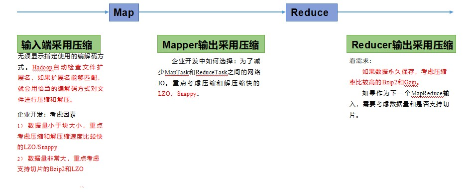

# MapReduce 定义

MapReduce 是一个分布式运算程序的编程框架，是用户开发“基于 Hadoop 的数据分析应用”的核心框架。

MapReduce 核心功能是将用户编写的业务逻辑代码和自带默认组件整合成一个完整的分布式运算程序，并发运行在一个 Hadoop 集群上。

# MapReduce 优缺点

### 优点

1. MapReduce易于编程
2. 良好的扩展性
3. 容错性
4. 适合PB级以上海量数据的离线处理

### 缺点

1. 不擅长实时计算
2. 不擅长流式计算
3. 不擅长DAG（有向无环图）计算

# MapReduce核心思想


1. 分布式的运算程序往往需要分成至少 2 个阶段。
2. 第一个阶段的 MapTask 并发实例，完全并行运行，互不相干。
3. 第二个阶段的 ReduceTask 并发实例互不相干，但是他们的数据依赖于上一个阶段的所有 MapTask 并发实例的输出。
4. MapReduce 编程模型只能包含一个 Map 阶段和一个 Reduce 阶段，如果用户的业务逻辑非常复杂，那就只能多个 MapReduce 程序，串行运行。

### MapReduce进程

一个完整的 MapReduce 程序在分布式运行时有三类实例进程：

1. **MrAppMaster**：负责整个程序的过程调度及状态协调。
2. **MapTask**：负责 Map 阶段的整个数据处理流程。
3. **ReduceTask**：负责 Reduce 阶段的整个数据处理流程。

### 常用数据序列化类型

| Java 类型 | Hadoop Writable 类型 |
| --------- | -------------------- |
| Boolean   | BooleanWritable      |
| Byte      | ByteWritable         |
| Int       | IntWritable          |
| Float     | FloatWritable        |
| Long      | LongWritable         |
| Double    | DoubleWritable       |
| String    | Text                 |
| Map       | MapWritable          |
| Array     | ArrayWritable        |
| Null      | NullWritable         |

### MapReduce编程规范

**Mapper阶段**

1. 用户自定义的Mapper要继承自己的父类
2. Mapper的输入数据是KV对的形式（KV的类型可自定义） 
3. Mapper中的业务逻辑写在map()方法中
4. Mapper的输出数据是KV对的形式（KV的类型可自定义） 
5. map()方法（MapTask进程）对每一个<K,V>调用一次

**Reducer阶段**

1. 用户自定义的Reducer要继承自己的父类
2. Reducer的输入数据类型对应Mapper的输出数据类型，也是KV
3. Reducer的业务逻辑写在reduce()方法中
4. ReduceTask进程对每一组相同k的<k,v\>组调用一次reduce()方法

**Driver阶段**

相当于YARN集群的客户端，用于提交我们整个程序到YARN集群，提交的是封装了MapReduce程序相关运行参数的job对象

# wordcount小案例

### 依赖

```xml
<dependencies>
     <dependency>
         <groupId>org.apache.hadoop</groupId>
         <artifactId>hadoop-client</artifactId>
         <version>3.1.3</version>
     </dependency>
     <dependency>
         <groupId>junit</groupId>
         <artifactId>junit</artifactId>
         <version>4.12</version>
     </dependency>
     <dependency>
         <groupId>org.slf4j</groupId>
         <artifactId>slf4j-log4j12</artifactId>
         <version>1.7.30</version>
     </dependency>
</dependencies>
```

### Mapper

```java
package top.damoncai.hadoop.mapreduce.demo_02_wordcount2;

import org.apache.hadoop.io.IntWritable;
import org.apache.hadoop.io.LongWritable;
import org.apache.hadoop.io.Text;
import org.apache.hadoop.mapreduce.Mapper;

import java.io.IOException;

/**
 * @author zhishun.cai
 * @date 2021/3/11 10:45
 */

public class WordCountMapper extends Mapper<LongWritable, Text,Text, IntWritable> {

    Text k = new Text();
    IntWritable v = new IntWritable(1);

    @Override
    protected void map(LongWritable key, Text value, Context context) throws IOException, InterruptedException {
        // 切割每一行数据
        String[] books = value.toString().split(" ");
        // 输出
        for (String book : books) {
            k.set(book);
            context.write(k,v);
        }
    }
}
```

### Reducer

```java
package top.damoncai.hadoop.mapreduce.demo_02_wordcount2;

import org.apache.hadoop.io.IntWritable;
import org.apache.hadoop.io.Text;
import org.apache.hadoop.mapreduce.Reducer;

import java.io.IOException;

/**
 * @author zhishun.cai
 * @date 2021/3/11 10:45
 */

public class WordCountReducer extends Reducer<Text, IntWritable,Text, IntWritable> {

    private IntWritable num = new IntWritable();

    private int sum;

    @Override
    protected void reduce(Text key, Iterable<IntWritable> values, Context context) throws IOException, InterruptedException {
       sum = 0;
        for (IntWritable value : values) {
            sum += 1;
        }
        this.num.set(sum);
        context.write(key,num);
    }
}
```

### Driver

```java
package top.damoncai.hadoop.mapreduce.demo_02_wordcount2;

import org.apache.hadoop.conf.Configuration;
import org.apache.hadoop.fs.Path;
import org.apache.hadoop.io.IntWritable;
import org.apache.hadoop.io.Text;
import org.apache.hadoop.mapreduce.Job;
import org.apache.hadoop.mapreduce.lib.input.FileInputFormat;
import org.apache.hadoop.mapreduce.lib.output.FileOutputFormat;

import java.io.IOException;

/**
 * @author zhishun.cai
 * @date 2021/3/11 10:56
 */

public class WordCountDriver {

    public static void main(String[] args) throws IOException, ClassNotFoundException, InterruptedException {
        // 1 获取配置信息以及获取 job 对象
        Configuration conf = new Configuration();
        Job job = Job.getInstance(conf);
        // 2 关联本 Driver 程序的 jar
        job.setJarByClass(WordCountDriver.class);
        // 3 关联 Mapper 和 Reducer 的 jar
        job.setMapperClass(WordCountMapper.class);
        job.setReducerClass(WordCountReducer.class);
        // 4 设置 Mapper 输出的 kv 类型
        job.setMapOutputKeyClass(Text.class);
        job.setMapOutputValueClass(IntWritable.class);
        // 5 设置最终输出 kv 类型
        job.setOutputKeyClass(Text.class);
        job.setOutputValueClass(IntWritable.class);
        // 6 设置输入和输出路径
        FileInputFormat.setInputPaths(job, new Path(args[0]));
        FileOutputFormat.setOutputPath(job, new Path(args[1]));
        // 7 提交 job
        boolean result = job.waitForCompletion(true);
        System.exit(result ? 0 : 1);
    }
}
```

### 添加打包插件打包

```xml
<build>
    <plugins>
        <plugin>
            <artifactId>maven-compiler-plugin</artifactId>
            <version>3.6.1</version>
            <configuration>
                <source>1.8</source>
                <target>1.8</target>
            </configuration>
        </plugin>
        <plugin>
            <artifactId>maven-assembly-plugin</artifactId>
            <configuration>
                <descriptorRefs>
                    <descriptorRef>jar-with-dependencies</descriptorRef>
                </descriptorRefs>
            </configuration>
            <executions>
                <execution>
                    <id>make-assembly</id>
                    <phase>package</phase>
                    <goals>
                        <goal>single</goal>
                    </goals>
                </execution>
            </executions>
        </plugin>
    </plugins>
</build>
```

### 上传文件到服务器

### 执行wordcount程序

```shell
hadoop jar wc.jar top.damoncai.hadoop.mapreduce.demo_02_wordcount2.WordCountDriver /input /output5
```


# 序列化

### 定义

1. **序列化**就是把内存中的对象，转换成字节序列（或其他数据传输协议）以便于存储到磁盘（持久化）和网络传输。
2. **反序列化**就是将收到字节序列（或其他数据传输协议）或者是磁盘的持久化数据，转换成内存中的对象。

### 为什么要序列化

一般来说，“活的”对象只生存在内存里，关机断电就没有了。而且“活的”对象只能由本地的进程使用，不能被发送到网络上的另外一台计算机。 然而序列化可以存储“活的”对象，可以将“活的”对象发送到远程计算机。

### 为什么不用 Java 的序列化

Java 的序列化是一个重量级序列化框架（Serializable），一个对象被序列化后，会附带很多额外的信息（各种校验信息，Header，继承体系等），不便于在网络中高效传输。所以，Hadoop 自己开发了一套序列化机制（Writable）。

### Hadoop 序列化特点：

1. **紧凑 ：**高效使用存储空间。
2. **快速：**读写数据的额外开销小。
3. **互操作：**支持多语言的交互

### **自定义** bean 对象实现序列化接口

1. 必须实现 Writable 接口
2. 反序列化时，需要反射调用空参构造函数，所以必须有空参构造
3. 重写序列化和反序列化方法

```java
@Override
public void write(DataOutput out) throws IOException {
    out.writeLong(upFlow);
	out.writeLong(downFlow);
	out.writeLong(sumFlow);
}

@Override
public void readFields(DataInput in) throws IOException {
    upFlow = in.readLong();
    downFlow = in.readLong();
    sumFlow = in.readLong();
}
```

4. 注意反序列化的顺序和序列化的顺序完全一致
5. 要想把结果显示在文件中，需要重写 toString()，可用"\t"分开，方便后续用
6. 如果需要将自定义的 bean 放在 key 中传输，则还需要实现 Comparable 接口，因为MapReduce 框中的 Shuffle 过程要求对 key 必须能排序。

```java
@Override
public int compareTo(FlowBean o) {
// 倒序排列，从大到小
return this.sumFlow > o.getSumFlow() ? -1 : 1;
}
```


# MapReduce框架原理


## InputFormat 数据输入

### **切片与** **MapTask** 并行度决定机制

1. 问题引出：MapTask 的并行度决定 Map 阶段的任务处理并发度，进而影响到整个 Job 的处理速度。
2. **MapTask** 并行度决定机制
   1. **数据块：**Block 是 HDFS 物理上把数据分成一块一块。数据块是 HDFS 存储数据单位。
   2. **数据切片：**数据切片只是在逻辑上对输入进行分片，并不会在磁盘上将其切分成片进行存储。数据切片是 MapReduce 程序计算输入数据的单位，一个切片会对应启动一个 MapTask。


### **Job** 提交流程源码和切片源码详解

1. Job 提交流程源码和切片源码详解

```java
waitForCompletion()
submit();
// 1 建立连接
connect();
// 1）创建提交 Job 的代理
new Cluster(getConfiguration());
// （1）判断是本地运行环境还是 yarn 集群运行环境
initialize(jobTrackAddr, conf); 
// 2 提交 job
submitter.submitJobInternal(Job.this, cluster)
// 1）创建给集群提交数据的 Stag 路径
Path jobStagingArea = JobSubmissionFiles.getStagingDir(cluster, conf);
// 2）获取 jobid ，并创建 Job 路径
JobID jobId = submitClient.getNewJobID();
// 3）拷贝 jar 包到集群
copyAndConfigureFiles(job, submitJobDir);
rUploader.uploadFiles(job, jobSubmitDir);
// 4）计算切片，生成切片规划文件
writeSplits(job, submitJobDir);
maps = writeNewSplits(job, jobSubmitDir);
input.getSplits(job);
// 5）向 Stag 路径写 XML 配置文件
writeConf(conf, submitJobFile);
conf.writeXml(out);
// 6）提交 Job,返回提交状态
status = submitClient.submitJob(jobId, submitJobDir.toString(), job.getCredentials());
```

2. Job提交流程源码解析


3. FileInputFormat切片源码解析


### 3.FileInputFormat 切片机制

1. 切片机制
   1. 简单地按照文件的内容长度进行切片
   2. 切片大小，默认等于Block大小
   3. 切片时不考虑数据集整体，而是逐个针对每一个文件单独切片
2. 案例分析


3. 源码中计算切片大小的公式

```java
Math.max(minSize, Math.min(maxSize, blockSize));
mapreduce.input.fileinputformat.split.minsize=1 默认值为1
mapreduce.input.fileinputformat.split.maxsize= Long.MAXValue 默认值Long.MAXValue
因此，默认情况下，切片大小=blocksize。
```

4. 切片大小设置

```java
maxsize（切片最大值）：参数如果调得比blockSize小，则会让切片变小，而且就等于配置的这个参数的值。
minsize（切片最小值）：参数调的比blockSize大，则可以让切片变得比blockSize还大。
```

5. 获取切片信息API

```java
// 获取切片的文件名称
String name = inputSplit.getPath().getName();
// 根据文件类型获取切片信息
FileSplit inputSplit = (FileSplit) context.getInputSplit();
```

### TextInputFormat

1. FileInputFormat 实现类

​    FileInputFormat 常见的接口实现类包括：TextInputFormat、KeyValueTextInputFormat、NLineInputFormat、CombineTextInputFormat 和自定义 InputFormat 等。

2. TextInputFormat

TextInputFormat 是默认的 FileInputFormat 实现类。按行读取每条记录。键是存储该行在整个文件中的起始字节偏移量， LongWritable 类型。值是这行的内容，不包括任何行终止符（换行符和回车符），Text 类型。

### CombineTextInputFormat 切片机制

框架默认的 TextInputFormat 切片机制是对任务按文件规划切片，不管文件多小，都会是一个单独的切片，都会交给一个 MapTask，这样如果有大量小文件，就会产生大量的MapTask，处理效率极其低下。

1. 应用场景：

   CombineTextInputFormat 用于小文件过多的场景，它可以将多个小文件从逻辑上规划到一个切片中，这样，多个小文件就可以交给一个 MapTask 处理。

2. 虚拟存储切片最大值设置

   CombineTextInputFormat.setMaxInputSplitSize(job, 4194304);// 4m

   注意：虚拟存储切片最大值设置最好根据实际的小文件大小情况来设置具体的值。

3. 切片机制

   生成切片过程包括：虚拟存储过程和切片过程二部分。


1. 虚拟存储过程：

   将输入目录下所有文件大小，依次和设置的 setMaxInputSplitSize 值比较，如果不大于设置的最大值，逻辑上划分一个块。如果输入文件大于设置的最大值且大于两倍，那么以最大值切割一块；当剩余数据大小超过设置的最大值且不大于最大值 2 倍，此时将文件均分成 2 个虚拟存储块（防止出现太小切片）。

   例如 setMaxInputSplitSize 值为 4M，输入文件大小为 8.02M，则先逻辑上分成一个4M。剩余的大小为 4.02M，如果按照 4M 逻辑划分，就会出现 0.02M 的小的虚拟存储文件，所以将剩余的 4.02M 文件切分成（2.01M 和 2.01M）两个文件。 

2. 切片过程：

   a. 判断虚拟存储的文件大小是否大于 setMaxInputSplitSize 值，大于等于则单独形成一个切片

   b.如果不大于则跟下一个虚拟存储文件进行合并，共同形成一个切片。

   c.测试举例：有 4 个小文件大小分别为 1.7M、5.1M、3.4M 以及 6.8M 这四个小文件，则虚拟存储之后形成 6 个文件块，大小分别为：1.7M，（2.55M、2.55M），3.4M 以及（3.4M、3.4M）最终会形成 3 个切片，大小分别为：（1.7+2.55）M，（2.55+3.4）M，（3.4+3.4）M 

###  CombineTextInputFormat 案例实操

1. 在 WordcountDriver 中增加如下代码

   ```java
   // 如果不设置 InputFormat，它默认用的是 TextInputFormat.class
   job.setInputFormatClass(CombineTextInputFormat.class);
   //虚拟存储切片最大值设置 4m
   CombineTextInputFormat.setMaxInputSplitSize(job, 4194304);
   ```

# MapReduce 工作流程


​			上面的流程是整个 MapReduce 最全工作流程，但是 Shuffle 过程只是从第 7 步开始到第16 步结束，具体 Shuffle 过程详解，如下：

			 1. MapTask 收集我们的 map()方法输出的 kv 对，放到内存缓冲区中
   			 2. 从内存缓冲区不断溢出本地磁盘文件，可能会溢出多个文件
            			 3. 多个溢出文件会被合并成大的溢出文件
                  			 4. 在溢出过程及合并的过程中，都要调用 Partitioner 进行分区和针对 key 进行排序
                        			 5. ReduceTask 根据自己的分区号，去各个 MapTask 机器上取相应的结果分区数据
                              			 6. ReduceTask 会抓取到同一个分区的来自不同 MapTask 的结果文件，ReduceTask 会将这些文件再进行合并（归并排序）
                                    			 7. 合并成大文件后，Shuffle 的过程也就结束了，后面进入 ReduceTask 的逻辑运算过程（从文件中取出一个一个的键值对 Group，调用用户自定义的 reduce()方法）

**注意：**

1. Shuffle 中的缓冲区大小会影响到 MapReduce 程序的执行效率，原则上说，缓冲区越大，磁盘 io 的次数越少，执行速度就越快
2. 缓冲区的大小可以通过参数调整，参数：mapreduce.task.io.sort.mb 默认 100M

# **Shuffle** 机制


# **Partition** 分区

1. 问题：要求将统计结果按照条件输出到不同文件中（分区）。比如：将统计结果按照手机归属地不同省份输出到不同文件中（分区）

2. 默认Partitioner分区 

   ```java
   public class HashPartitioner<K, V> extends Partitioner<K, V> {
   	public int getPartition(K key, V value, int numReduceTasks) {
   		return (key.hashCode() & Integer.MAX_VALUE) % numReduceTasks; 
   	} 
   }
   
   默认分区是根据key的hashCode对ReduceTasks个数取模得到的。用户没法控制哪个key存储到哪个分区
   ```

3. 自定义Partitioner步骤

   1. 自定义类继承Partitioner，重写getPartition()方法

      ```java
      public class CustomPartitioner extends Partitioner<Text, FlowBean> {
          @Override
          public int getPartition(Text key, FlowBean value, int numPartitions) {
              // 控制分区代码逻辑
              … …
              return partition; 
          }
      }
      ```

   2. 在Job驱动中，设置自定义Partitioner

      ```java
      job.setPartitionerClass(CustomPartitioner.class)
      ```

   3. 自定义Partition后，要根据自定义Partitioner的逻辑设置相应数量的ReduceTask

      ```java
      job.setNumReduceTasks(5);
      ```

4. 分区总结

   1. 如果ReduceTask的数量\> getPartition的结果数，则会多产生几个空的输出文件part-r-000xx； 
   2. 如果1<ReduceTask的数量<getPartition的结果数，则有一部分分区数据无处安放，会Exception；
   3. 如 果ReduceTask的数量=1，则不管MapTask端输出多少个分区文件，最终结果都交给这一个ReduceTask，最终也就只会产生一个结果文件 part-r-00000；
   4. 分区号必须从零开始，逐一累加。 

5. 案例分析 - 假如：假设自定义分区数为5，则

   1. job.setNumReduceTasks(1);  会正常运行，只不过会产生一个输出文件
   2. job.setNumReduceTasks(2)；会报错IO
   3. job.setNumReduceTasks(6)；大于5，程序会正常运行，会产生空文件

# 排序

**FlowBean实现WritableComparable接口重写compareTo方法**

# Combiner合并

1. Combiner是MR程序中Mapper和Reducer之外的一种组件

2. Combiner组件的父类就是Reducer

3. Combiner和Reducer的区别在于运行的位置

   Combiner是在每一个MapTask所在的节点运行

   Reducer是接收全局所有Mapper的输出结果

4. Combiner的意义就是对每一个MapTask的输出进行局部汇总，以减小网络传输量

5. Combiner能够应用的前提是不能影响最终的业务逻辑，而且，Combiner的输出kv应该跟Reducer的输入kv类型要对应起来。

   平均值算法可能会导致数据问题，求和可以使用

6. 自定义Combiner实现步骤

   1. 自定义一个 Combiner 继承 Reducer，重写 Reduce 方法

      ```java
      public class CustomerCombiner extends Reducer<Text, IntWritable, Text, IntWritable> {
      
          private IntWritable outV = new IntWritable();
      
          @Override
          protected void reduce(Text key, Iterable<IntWritable> values, Context
                  context) throws IOException, InterruptedException {
              int sum = 0;
              for (IntWritable value : values) {
                  sum += value.get();
              }
      
              outV.set(sum);
      
              context.write(key,outV);
          }
      }
      ```

   2. 在 Job 驱动类中设置： 

      ```java
      job.setCombinerClass(WordCountCombiner.class);
      ```

      

# MapTask 工作机制


1. Read 阶段：MapTask 通过 InputFormat 获得的 RecordReader，从输入 InputSplit 中解析出一个个 key/value。 

2. Map 阶段：该节点主要是将解析出的 key/value 交给用户编写 map()函数处理，并产生一系列新的 key/value。 

3. Collect 收集阶段：在用户编写 map()函数中，当数据处理完成后，一般会调用OutputCollector.collect()输出结果。在该函数内部，它会将生成的 key/value 分区（调用Partitioner），并写入一个环形内存缓冲区中。

4. Spill 阶段：即“溢写”，当环形缓冲区满后，MapReduce 会将数据写到本地磁盘上，生成一个临时文件。需要注意的是，将数据写入本地磁盘之前，先要对数据进行一次本地排序，并在必要时对数据进行合并、压缩等操作。 

   1. 步骤 1：利用快速排序算法对缓存区内的数据进行排序，排序方式是，先按照分区编号Partition 进行排序，然后按照 key 进行排序。这样，经过排序后，数据以分区为单位聚集在一起，且同一分区内所有数据按照 key 有序。

   2. 步骤 2：按照分区编号由小到大依次将每个分区中的数据写入任务工作目录下的临时文件 output/spillN.out（N 表示当前溢写次数）中。如果用户设置了 Combiner，则写入文件之前，对每个分区中的数据进行一次聚集操作。

   3. 步骤 3：将分区数据的元信息写到内存索引数据结构 SpillRecord 中，其中每个分区的元信息包括在临时文件中的偏移量、压缩前数据大小和压缩后数据大小。如果当前内存索引大小超过 1MB，则将内存索引写到文件 output/spillN.out.index 中。 

   4. 步骤 4：Merge 阶段：当所有数据处理完成后，MapTask 对所有临时文件进行一次合并，以确保最终只会生成一个数据文件。

      当所有数据处理完后，MapTask 会将所有临时文件合并成一个大文件，并保存到文件output/file.out 中，同时生成相应的索引文件 output/file.out.index。 

      在进行文件合并过程中，MapTask 以分区为单位进行合并。对于某个分区，它将采用多轮递归合并的方式。每轮合并 mapreduce.task.io.sort.factor（默认 10）个文件，并将产生的文件重新加入待合并列表中，对文件排序后，重复以上过程，直到最终得到一个大文件。

      让每个 MapTask 最终只生成一个数据文件，可避免同时打开大量文件和同时读取大量小文件产生的随机读取带来的开销。


# ReduceTask工作机制


1. Copy 阶段：ReduceTask 从各个 MapTask 上远程拷贝一片数据，并针对某一片数据，如果其大小超过一定阈值，则写到磁盘上，否则直接放到内存中。
2. Sort 阶段：在远程拷贝数据的同时，ReduceTask 启动了两个后台线程对内存和磁盘上的文件进行合并，以防止内存使用过多或磁盘上文件过多。按照 MapReduce 语义，用户编写 reduce()函数输入数据是按 key 进行聚集的一组数据。为了将 key 相同的数据聚在一起，Hadoop 采用了基于排序的策略。由于各个 MapTask 已经实现对自己的处理结果进行了局部排序，因此，ReduceTask 只需对所有数据进行一次归并排序即可。
3. Reduce 阶段：reduce()函数将计算结果写到 HDFS 上。

### ReduceTask 并行度决定机制

MapTask 并行度由切片个数决定，切片个数由输入文件和切片规则决定。

ReduceTask 的并行度同样影响整个 Job 的执行并发度和执行效率，但与 MapTask 的并发数由切片数决定不同，ReduceTask 数量的决定是可以直接手动设置：

```java
// 默认值是 1，手动设置为 4
job.setNumReduceTasks(4);
```

如果分区数不是1，但是ReduceTask为1，是否执行分区过程。答案是：不执行分区过程。因为在MapTask的源码中，执行分区的前提是先判断ReduceNum个数是否大于1。不大于1肯定不执行

# Hadoop 数据压缩



### 压缩参数配置

**为了支持多种压缩/解压缩算法，Hadoop 引入了编码/解码器**


**要在 Hadoop 中启用压缩，可以配置如下参数**

| 参数                                                         | 默认值                                          | 阶段         | 建议                                             |
| ------------------------------------------------------------ | ----------------------------------------------- | ------------ | ------------------------------------------------ |
| io.compression.codecs（在 core-site.xml 中配置）             | 无，这个需要在命令行输入hadoop checknative 查看 | 输入压缩     | Hadoop 使用文件扩展名判断是否支持某种编解码器    |
| mapreduce.map.output.compr ess（在 mapred-site.xml 中配置）  | false                                           | mapper 输出  | 这个参数设为 true 启用压缩                       |
| mapreduce.map.output.compr ess.codec（在 mapred- site.xml 中配置） | org.apache.hadoop.io.com press.DefaultCodec     | mapper 输出  | 企业多使用 LZO 或Snappy 编解码器在此阶段压缩数据 |
| mapreduce.output.fileoutpu tformat.compress（在mapred-site.xml 中配置） | false                                           | reducer 输出 | 这个参数设为 true 启用压缩                       |
| mapreduce.output.fileoutpu tformat.compress.codec（在mapred-site.xml 中配置） | org.apache.hadoop.io.com press.DefaultCodec     | reducer 输出 | 使用标准工具或者编解码器，如 gzip 和bzip2        |

### Map输出端采用压缩

```java
// 开启 map 端输出压缩
conf.setBoolean("mapreduce.map.output.compress", true);

// 设置 map 端输出压缩方式
conf.setClass("mapreduce.map.output.compress.codec", BZip2Codec.class,CompressionCodec.class);
```

### Reduce输出端采用压缩

```java
// 设置 reduce 端输出压缩开启
FileOutputFormat.setCompressOutput(job, true);

// 设置压缩的方式
FileOutputFormat.setOutputCompressorClass(job, BZip2Codec.class);
FileOutputFormat.setOutputCompressorClass(job, GzipCodec.class); FileOutputFormat.setOutputCompressorClass(job,DefaultCodec.class);
```

