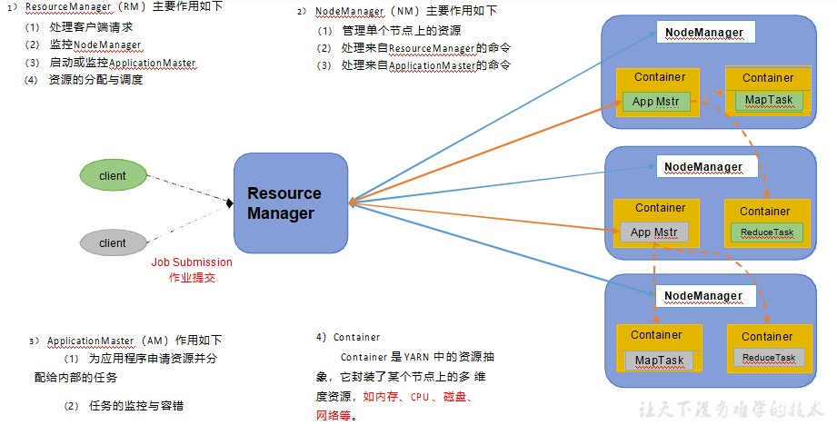
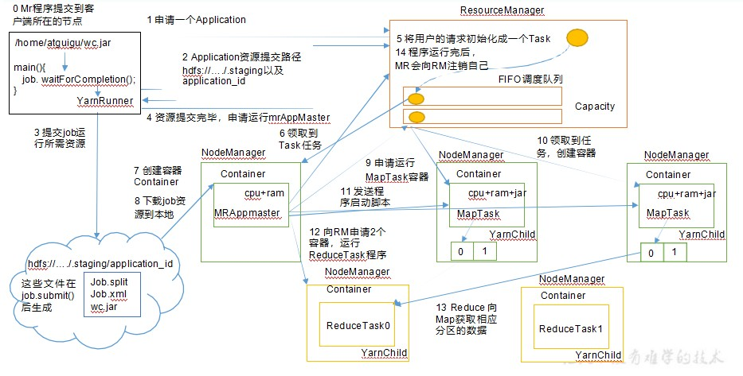
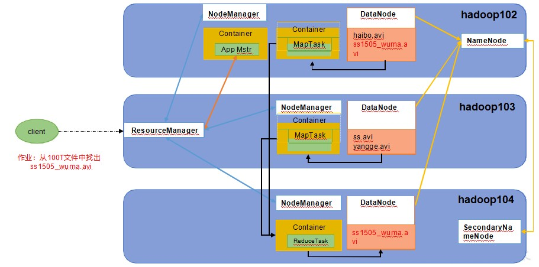
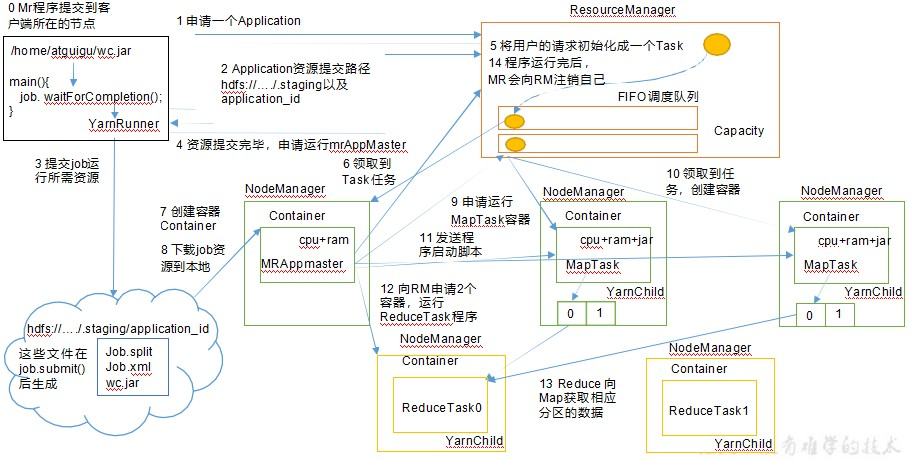
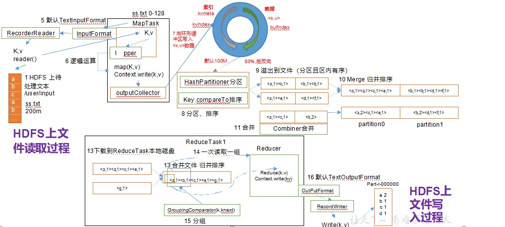

# YARN基础架构

YARN 主要由 ResourceManager、NodeManager、ApplicationMaster 和 Container 等组件构成。



# YARN工作机制



1. MR 程序提交到客户端所在的节点
2. YarnRunner 向ResourceManager 申请一个 Application
3. RM 将该应用程序的资源路径返回给 YarnRunner
4. 该程序将运行所需资源提交到 HDFS 上
5. 程序资源提交完毕后，申请运行 mrAppMaster
6. RM 将用户的请求初始化成一个 Task
7. 其中一个NodeManager 领取到 Task 任务
8. 该 NodeManager 创建容器 Container，并产生 MRAppmaster
9. Container 从HDFS 上拷贝资源到本地
10. MRAppmaster 向RM 申请运行 MapTask 资源
11. RM 将运行 MapTask 任务分配给另外两个 NodeManager，另两个 NodeManager 分别领取任务并创建容器
12.  MR 向两个接收到任务的NodeManager 发送程序启动脚本，这两个 NodeManager分别启动 MapTask，MapTask 对数据分区排序
13. MrAppMaster 等待所有 MapTask 运行完毕后，向 RM 申请容器，运行 ReduceTask
14. ReduceTask 向 MapTask 获取相应分区的数据
15. 程序运行完毕后，MR 会向 RM 申请注销自己

# 作业提交全过程

### HDFS、YARN、MapReduce三者关系



### 作业提交过程之YARN



### 作业提交过程之HDFS & MapReduce



**作业提交全过程详解**

1. 作业提交

   1. Client 调用 job.waitForCompletion 方法，向整个集群提交 MapReduce 作业
   2. Client 向 RM 申请一个作业 id
   3. RM 给 Client 返回该 job 资源的提交路径和作业 id
   4. Client 提交 jar 包、切片信息和配置文件到指定的资源提交路径
   5. Client 提交完资源后，向 RM 申请运行 MrAppMaster

2. 初始化作业

   6. 当 RM 收到 Client 的请求后，将该 job 添加到容量调度器中
   7. 某一个空闲的 NM 领取到该 Job
   8. 该 NM 创建 Container，并产生 MRAppmaster
   9. 下载Client 提交的资源到本地

3. 任务分配

   10.  MrAppMaster 向 RM 申请运行多个 MapTask 任务资源
   11. RM 将运行 MapTask 任务分配给另外两个NodeManager，另两个 NodeManager分别领取任务并创建容器

4. 任务运行

   12. MR 向两个接收到任务的 NodeManager 发送程序启动脚本， 这两个NodeManager 分别启动 MapTask，MapTask 对数据分区排序。
   13. MrAppMaster 等待所有MapTask 运行完毕后，向RM 申请容器，运行ReduceTask
   14. ReduceTask 向 MapTask 获取相应分区的数据
   15. 程序运行完毕后，MR 会向 RM 申请注销自己

5. 进度和状态更新

   YARN 中的任务将其进度和状态(包括 counter)返回给应用管理器,  客户端每秒(通过mapreduce.client.progressmonitor.pollinterval 设置)向应用管理器请求进度更新, 展示给用户

6. 作业完成

   除了向应用管理器请求作业进度外, 客户端每 5 秒都会通过调用 waitForCompletion()来检查作业是否完成。时间间隔可以通过mapreduce.client.completion.pollinterval 来设置。作业完成之后, 应用管理器和 Container 会清理工作状态。作业的信息会被作业历史服务器存储以备之后用户核查。

# Yarn 调度器和调度算法

目前，Hadoop 作业调度器主要有三种：FIFO、容量（Capacity Scheduler）和公平（FairScheduler）。Apache Hadoop3.1.3 默认的资源调度器是 Capacity Scheduler。

CDH 框架默认调度器是 Fair Scheduler

具体设置详见：yarn-default.xml 文件

# Yarn常用命令

1. 列出所有Application

   ```shell	
   yarn application -list
   ```

2. 根据 Application 状态过滤：yarn application -list -appStates（所有状态：ALL、NEW、  NEW_SAVING、SUBMITTED、ACCEPTED、RUNNING、FINISHED、FAILED、KILLED)

   ```shell
   yarn application -list -appStates FINISHED
   ```

3. Kill 掉Application

   ```shell
   yarn application -kill application_1612577921195_0001
   ```

4. 查询Application 日志yarn logs -applicationId <ApplicationId>

   ```shell
   yarn logs -applicationId application_1612577921195_0001
   ```

5. 查询Container 日志 yarn logs -applicationId <ApplicationId> -containerId <ContainerId>

   ```shell
   yarn logs -applicationId application_1612577921195_0001 -containerId container_1612577921195_0001_01_000001
   ```

6. 列出所有Container：yarn container -list <ApplicationAttemptId>

   ```shell
   yarn container -list appattempt_1612577921195_0001_000001
   ```

7. 打印 Container 状态：yarn container -status <ContainerId>

   ```shell
   yarn container -status container_1612577921195_0001_01_000001
   ```

   **注：只有在任务跑的途中才能看到 container 的状态**

8. 列出所有节点：yarn node -list -all

   ```shell
    yarn node -list -all
   ```

9. 加载队列配置：yarn rmadmin -refreshQueues

   ```shell
   yarn rmadmin -refreshQueues
   ```

10. 打印队列信息：yarn queue -status <QueueName>

    ```shell
    yarn queue -status default
    ```

    