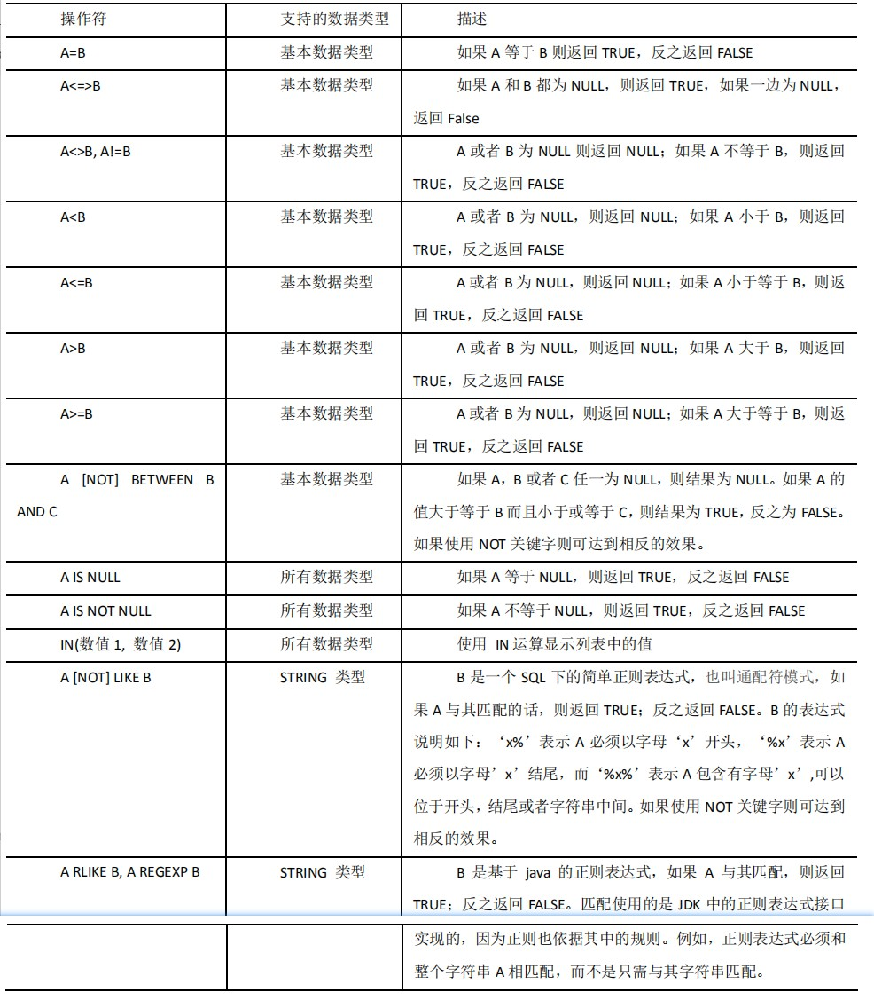

# 数据导入

### load

**语法：**

```shell
hive> load data [local] inpath '数据的 path' [overwrite] into table student [partition (partcol1=val1,…)];
```

1. load data:表示加载数据
2. local:表示从本地加载数据到 hive 表；否则从 HDFS 加载数据到 hive 表 
3. inpath:表示加载数据的路径
4. overwrite:表示覆盖表中已有数据，否则表示追加
5. into table:表示加载到哪张表
6. student:表示具体的表
7. partition:表示上传到指定分区

**本地：**

```创建一张表
load data local inpath '/opt/module/hive/datas/student.txt' into table default.student;
```

**HDFS**

```shell
load data inpath '/user/atguigu/hive/student.txt' into table default.student;
```

**加载数据覆盖表中已有的数据**

```shell
load data inpath '/user/atguigu/hive/student.txt' overwrite into table default.student;
```

### Insert

**基本插入数据**

```shell
insert into table student_par values(1,'wangwu'),(2,'zhaoliu');
```

**基本模式插入（根据单张表查询结果）**

```shell
insert overwrite table student_par
select id, name from student where month='201709';
```

insert into：以追加数据的方式插入到表或分区，原有数据不会删除

insert overwrite：会覆盖表中已存在的数据

**注意：**insert 不支持插入部分字段

### 创建表时插入数据（As Select）

```shell
create table if not exists student3 
as select id, name from student;
```

### 创建表时指定加载路径（HDFS）

```shell
create external table if not exists student5(
 id int, name string
 )
 row format delimited fields terminated by '\t'
 location '/student;
```

# 数据导出

### Insert导出

1. 导出到本地

   ```shell
   insert overwrite local directory '/opt/module/hive/data/export/student' 
   select * from student;
   ```

2. 格式化导出到本地

   ```shell
   insert overwrite local directory '/opt/module/hive/data/export/student1'
   ROW FORMAT DELIMITED FIELDS TERMINATED BY '\t'
   select * from student;
   ```

3. 将查询结果导出到HDFS上(没有local)

   ```shell
   insert overwrite directory '/user/atguigu/student2'
   ROW FORMAT DELIMITED FIELDS TERMINATED BY '\t' 
   select * from student;
   ```

4. hadoop命令导出到本地

   ```shell
   dfs -get /user/hive/warehouse/student/student.txt /opt/module/data/export/student3.txt; 
   ```

5. Hive Shell命令导出（hive -f/-e 执行语句或者脚本 > file）

   ```shell
    bin/hive -e 'select * from default.student;' > /opt/module/hive/data/export/student4.txt;
   ```

6. Export导出到HDFS上

   ```shell
   export table default.student to '/user/hive/warehouse/export/student';
   ```

# 清除表中数据

Truncate 只能删除管理表，不能删除外部表中数据

```shell
truncate table student;
```

# 数据查询

**注意：**

1. SQL 语言大小写不敏感
2. SQL 可以写在一行或者多行
3. 关键字不能被缩写也不能分行
4. 各子句一般要分行写
5. 使用缩进提高语句的可读性

### 比较运算符



### Like和RLike

1. % 代表零个或多个字符(任意个字符)
2. _ 代表一个字符
3. RLIKE 子句是 Hive 中这个功能的一个扩展，其可以通过 Java 的正则表达式这个更强大的语言来指定匹配条件

# Join

1. 内连接

   内连接：只有进行连接的两个表中都存在与连接条件相匹配的数据才会被保留下来。

   ```shell
   select e.empno, e.ename, d.deptno from emp e join dept d on e.deptno = d.deptno;
   ```

2. 左外连接

   左外连接：JOIN 操作符左边表中符合 WHERE 子句的所有记录将会被返回。

   ```shell
   select e.empno, e.ename, d.deptno from emp e left join dept d on e.deptno = d.deptno;
   ```

3. 右外连接

   右外连接：JOIN 操作符右边表中符合 WHERE 子句的所有记录将会被返回

   ```sql
   select e.empno, e.ename, d.deptno from emp e right join dept d on e.deptno = d.deptno;
   ```

4. 满外连接

   满外连接：将会返回所有表中符合 WHERE 语句条件的所有记录。如果任一表的指定字段没有符合条件的值的话，那么就使用 NULL 值替代。

   ```sql
   select e.empno, e.ename, d.deptno from emp e full join dept d on e.deptno = d.deptno;
   ```

5. 多表连接

   注意：连接 n 个表，至少需要 n-1 个连接条件。例如：连接三个表，至少需要两个连接条件。

# 排序

### Order By

1. Order By：全局排序，只有一个 Reducer 
2. ASC（ascend）: 升序（默认）
3. DESC（descend）: 降序

### Sort By

Sort By：对于大规模的数据集 order by 的效率非常低。在很多情况下，并不需要全局排序，此时可以使用 sort by。

Sort by 为每个 reducer 产生一个排序文件。每个 Reducer 内部进行排序，对全局结果集来说不是排序。

```shell
#设置reduce个数
set mapreduce.job.reduces=3;

#查看reduce个数

```

### Distribute By

Distribute By： 在有些情况下，我们需要控制某个特定行应该到哪个 reducer，通常是为了进行后续的聚集操作。**distribute by** 子句可以做这件事。**distribute by** 类似 MR 中 partition（自定义分区），进行分区，结合 sort by 使用。

对于 distribute by 进行测试，一定要分配多 reduce 进行处理，否则无法看到 distribute by 的效果。

**注意：**

1. distribute by 的分区规则是根据分区字段的 hash 码与 reduce 的个数进行模除后，余数相同的分到一个区。 distribute by 的分区规则是根据分区字段的 hash 码与 reduce 的个数进行模除后，余数相同的分到一个区。
2.  Hive 要求 DISTRIBUTE BY 语句要写在 SORT BY 语句之前

### Cluster By

当 distribute by 和 sorts by 字段相同时，可以使用 cluster by 方式。

cluster by 除了具有 distribute by 的功能外还兼具 sort by 的功能。但是排序只能是升序排序，不能指定排序规则为 ASC 或者 DESC

**以下两种等价写法**

```shell
select * from emp cluster by deptno;
select * from emp distribute by deptno sort by deptno;
```

