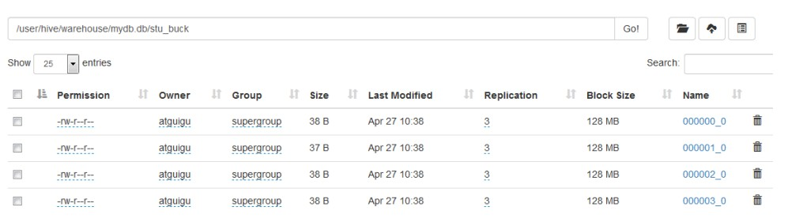

# 分区表

分区表实际上就是对应一个 HDFS 文件系统上的独立的文件夹，该文件夹下是该分区所有的数据文件。Hive 中的分区就是分目录，把一个大的数据集根据业务需要分割成小的数据集。在查询时通过 WHERE 子句中的表达式选择查询所需要的指定的分区，这样的查询效率会提高很多。

### 一级分区

1. 创建分区

   ```shell
   create table dept_partition(
   deptno int, dname string, loc string
   )
   partitioned by (day string)
   row format delimited fields terminated by '\t';
   ```

   **注意：**分区字段不能是表中已经存在的数据，可以将分区字段看作表的伪列。

2. 加载数据

   ```shell
   load data local inpath '/opt/module/hive/datas/dept_20200401.log' into table dept_partition partition(day='20200401');
   load data local inpath '/opt/module/hive/datas/dept_20200402.log' into table dept_partition partition(day='20200402');
   load data local inpath '/opt/module/hive/datas/dept_20200403.log' into table dept_partition partition(day='20200403');
   ```

3. 查询分区表中的数据

   ```shell
   # 单分区
   select * from dept_partition where day='20200401';
   
   # 多分区
    select * from dept_partition where day='20200401'
    union
    select * from dept_partition where day='20200402'
    union
    select * from dept_partition where day='20200403';
    
    select * from dept_partition where day='20200401' or day='20200402' or day='20200403';
   ```

4. 增加分区

   ```shell
   # 单个
   alter table dept_partition add partition(day='20200404');
   
   # 多个
   alter table dept_partition add partition(day='20200405') partition(day='20200406');
   ```

5. 删除分区

   ```shell
   # 删除单个分区
   alter table dept_partition drop partition (day='20200406');
   
   # 删除多个分区
   alter table dept_partition drop partition (day='20200404'), partition(day='20200405');
   ```

6. 查看表有多少个分区

   ```shell
   show partitions dept_partition;
   ```

7. 查看分区表结构

   ```shell
   desc formatted dept_partition;
   ```


### 二级分区

1. 创建

   ```shell
   create table dept_partition2(
    deptno int, dname string, loc string
    )
    partitioned by (day string, hour string)
    row format delimited fields terminated by '\t';
   ```

2. 加载数据到二级分区

   ```shell
   load data local inpath 
   '/opt/module/hive/datas/dept_20200401.log' into table
   dept_partition2 partition(day='20200401', hour='12');
   ```

3. 查询分区数据

   ```shell
   select * from dept_partition2 where day='20200401' and hour='12';
   ```

4. 把数据直接上传到分区目录上，让分区表和数据产生关联的三种方式

   1. 方式一：上传数据后修复

      ```shell
      msck repair table dept_partition2;
      ```

   2. 方式二：上传数据后添加

      ```shell
      # 上传数据
      dfs -mkdir -p
      /user/hive/warehouse/mydb.db/dept_partition2/day=20200401/hour=14;
      hive (default)> dfs -put /opt/module/hive/datas/dept_20200401.log 
      /user/hive/warehouse/mydb.db/dept_partition2/day=20200401/hour=14;
      
      # 添加执行分区
      alter table dept_partition2 add partition(day='201709',hour='14');
      ```

   3. 方式三：创建文件夹后 load 数据到分区

      ```shell
      # 创建文件
      dfs -mkdir -p /user/hive/warehouse/mydb.db/dept_partition2/day=20200401/hour=15;
      
      # 上传数据
      load data local inpath '/opt/module/hive/datas/dept_20200401.log' into table dept_partition2 partition(day='20200401',hour='15');
      ```

   ### 动态分区

   关系型数据库中，对分区表 Insert 数据时候，数据库自动会根据分区字段的值，将数据插入到相应的分区中，Hive 中也提供了类似的机制，即动态分区(Dynamic Partition)，只不过，使用 Hive 的动态分区，需要进行相应的配置。

   **开启动态分区参数设置**

   1. 开启动态分区功能（默认 true，开启）

      ```shell
      hive.exec.dynamic.partition=true
      ```

   2. 设置为非严格模式（动态分区的模式，默认 strict，表示必须指定至少一个分区为静态分区，nonstrict 模式表示允许所有的分区字段都可以使用动态分区。）

      ```shell
      hive.exec.dynamic.partition.mode=nonstrict
      ```

   3. 在所有执行 MR 的节点上，最大一共可以创建多少个动态分区。默认 1000

      ```shell
      在所有执行 MR 的节点上，最大一共可以创建多少个动态分区。默认 1000
      ```

   4. 在每个执行 MR 的节点上，最大可以创建多少个动态分区。该参数需要根据实际的数据来设定。比如：源数据中包含了一年的数据，即 day 字段有 365 个值，那么该参数就需要设置成大于 365，如果使用默认值 100，则会报错。

      ```shell
      hive.exec.max.dynamic.partitions.pernode=100
      ```

   5. 整个 MR Job 中，最大可以创建多少个 HDFS 文件。默认 100000

      ```shell
      hive.exec.max.created.files=100000
      ```

   6. 当有空分区生成时，是否抛出异常。一般不需要设置。默认 false

      ```shell
      hive.error.on.empty.partition=false
      ```

   **实操**

   1. 创建目标分区表

      ```shell
      create table dept_partition_dy(id int, name string) 
      partitioned by (loc int) row format delimited fields terminated by '\t';
      ```

   2. 设置动态分区

      ```shell
      insert into table dept_partition_dy partition(loc) select deptno, dname, loc from dept;
      ```

   3. 查看目标分区表的分区情况

      ```shell
      show partitions dept_partition;
      ```

   
   

# 分桶表

分区提供一个隔离数据和优化查询的便利方式。不过，并非所有的数据集都可形成合理的分区。对于一张表或者分区，Hive 可以进一步组织成桶，也就是更为细粒度的数据范围划分

分桶是将数据集分解成更容易管理的若干部分的另一个技术。

分区针对的是数据的存储路径；分桶针对的是数据文件。

**创建分桶表**

```sql
create table stu_buck(id int, name string)
clustered by(id) 
into 4 buckets
row format delimited fields terminated by '\t';
```

**查看表结构**

```shell
desc formatted stu_buck;

Num Buckets: 4
```

**加载数据**

```shell
load data inpath '/student.txt' into table stu_buck;
```

**查看**



**分桶规则**

根据结果可知：Hive 的分桶采用对分桶字段的值进行哈希，然后除以桶的个数求余的方式决定该条记录存放在哪个桶当中

**分桶操作注意事项**

1. reduce 的个数设置为-1,让 Job 自行决定需要用多少个 reduce 或者将 reduce 的个数设置为大于等于分桶表的桶数

2. 从 hdfs 中 load 数据到分桶表中，避免本地文件找不到问题

3. 不要使用本地模式

4. insert方式将数据导入分桶表

   ```shell
   insert into table stu_buck select * from student_insert
   ```

**抽样查询**

对于非常大的数据集，有时用户需要使用的是一个具有代表性的查询结果而不是全部结果。Hive 可以通过对表进行抽样来满足这个需求

语法: TABLESAMPLE(BUCKET x OUT OF y)

```sql
select * from stu_buck tablesample(bucket 1 out of 4 on id);
```

**注意**：x 的值必须小于等于 y 的值，否则

```shell
FAILED: SemanticException [Error 10061]: Numerator should not be bigger 
than denominator in sample clause for table stu_buck
```

