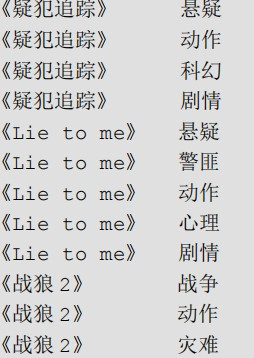
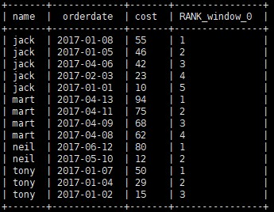

# 函数

### 系统内置函数

1. 查看系统自带函数

   ```sql
   show functions;
   ```

2. 显示自带函数的方法

   ```sql
   desc function upper;
   ```

3. 详细显示自带函数的用法

   ```sql
   desc function extended upper;
   ```

### 常用的内置函数

**NVL：** NVL( value，default_value)

它的功能是如果 value 为 NULL，则 NVL 函数返回 default_value 的值，否则返回 value值，如果两个参数都为 NULL ，则返回 NULL

---

**CASE WHEN THEN ELSE END**

```sql
select
 dept_id,
 sum(case sex when '男' then 1 else 0 end) male_count,
 sum(case sex when '女' then 1 else 0 end) female_count
from emp_sex
group by dept_id;
```

---

**行转列**

1. **CONCAT(string A/col, string B/col…)：**返回输入字符串连接后的结果，支持任意个输入字符串

2. **CONCAT_WS(separator, str1, str2,...)：**它是一个特殊形式的 CONCAT()。第一个参数剩余参数间的分隔符。分隔符可以是与剩余参数一样的字符串。如果分隔符是 NULL，返回值也将为 NULL。这个函数会跳过分隔符参数后的任何 NULL 和空字符串。分隔符将被加到被连接的字符串之间;

   **注意:** CONCAT_WS must be "string or array<string>"

3. **COLLECT_SET(col)：**函数只接受基本数据类型，它的主要作用是将某字段的值进行去重汇总，产生 Array 类型字段。

**列转行**

1. EXPLODE(col)：将 hive 一列中复杂的 Array 或者 Map 结构拆分成多行

2. **LATERAL VIEW**

   **用法：**LATERAL VIEW udtf(expression) tableAlias AS columnAlias

   **解释：**用于和 split, explode 等 UDTF 一起使用，它能够将一列数据拆成多行数据，在此基础上可以对拆分后的数据进行聚合。

   **实操：**

   1. 创建表并导入数据

      ```shell
       vi movie_info.txt
      《疑犯追踪》	悬疑,动作,科幻,剧情
      《Lie to me》	悬疑,警匪,动作,心理,剧情
      《战狼 2》	战争,动作,灾难
      
      create table movie_info(
       movie string,
       category string)
      row format delimited fields terminated by "\t";
      load data local inpath "/opt/module/data/movie.txt" into table movie_info;
      ```

   2. SQL

      ```shell
      SELECT
      movie,
      category_name
      FROM
      movie_info
      lateral VIEW
      explode(split(category,",")) movie_info_tmp AS category_name;
      ```

   3. 效果

      

   

   ### 窗口函数

   **OVER()：**指定分析函数工作的数据窗口大小，这个数据窗口大小可能会随着行的变而变化

   **CURRENT ROW：**当前行

   **n PRECEDING：**往前 n 行数据

   **n FOLLOWING：**往后 n 行数据

   **UNBOUNDED：**起点

   ​			**UNBOUNDED PRECEDING** 表示从前面的起点

   ​			**UNBOUNDED FOLLOWING **表示到后面的终点

   **LAG(col,n,default_val)：**往前第 n 行数据

   **LEAD(col,n, default_val)：**往后第 n 行数据

   **NTILE(n)：**把有序窗口的行分发到指定数据的组中，各个组有编号，编号从 1 开始，对于每一行，NTILE 返回此行所属的组的编号。注意：n 必须为 int 类型

   

   **数据**

   ```shell
   jack,2017-01-01,10
   tony,2017-01-02,15
   jack,2017-02-03,23
   tony,2017-01-04,29
   jack,2017-01-05,46
   jack,2017-04-06,42
   tony,2017-01-07,50
   jack,2017-01-08,55
   mart,2017-04-08,62
   mart,2017-04-09,68
   neil,2017-05-10,12
   mart,2017-04-11,75
   neil,2017-06-12,80
   mart,2017-04-13,94
   ```

   1. 查询在 2017 年 4 月份购买过的顾客及总人数

      ```sql
      select name,count(*) over () 
      from business
      where substring(orderdate,1,7) = '2017-04'
      group by name;
      ```

   2. 查询顾客的购买明细及月购买总额

      ```sql
      select name,orderdate,cost,sum(cost) over(partition by month(orderdate)) 
      from business;
      ```

   3. 将每个顾客的 cost 按照日期进行累加

      ```sql
      select name,orderdate,cost,
      sum(cost) over() as sample1,--所有行相加
      sum(cost) over(partition by name) as sample2,--按 name 分组，组内数据相加
      sum(cost) over(partition by name order by orderdate) as sample3,--按 name
      分组，组内数据累加
      sum(cost) over(partition by name order by orderdate rows between 
      UNBOUNDED PRECEDING and current row ) as sample4 ,--和 sample3 一样,由起点到
      当前行的聚合
      sum(cost) over(partition by name order by orderdate rows between 1 
      PRECEDING and current row) as sample5, --当前行和前面一行做聚合
      sum(cost) over(partition by name order by orderdate rows between 1 
      PRECEDING AND 1 FOLLOWING ) as sample6,--当前行和前边一行及后面一行
      sum(cost) over(partition by name order by orderdate rows between current 
      row and UNBOUNDED FOLLOWING ) as sample7 --当前行及后面所有行
      from business;
      ```

      **rows 必须跟在 order by 子句之后，对排序的结果进行限制，使用固定的行数来限制分区中的数据行数量**

   4. 查看顾客上次的购买时间

      ```sql
      select name,orderdate,cost,
      lag(orderdate,1,'1900-01-01') over(partition by name order by orderdate ) 
      as time1, lag(orderdate,2) over (partition by name order by orderdate) as time2 
      from business;
      ```

   5. 查询前 20%时间的订单信息

      ```sql
      select * from (
       select name,orderdate,cost, ntile(5) over(order by orderdate) sorted
       from business
      ) t
      where sorted = 1;
      ```

   ### Rank

   1. RANK() 排序相同时会重复，总数不会变
   2. DENSE_RANK() 排序相同时会重复，总数会减少
   3. ROW_NUMBER() 会根据顺序计算

   **统计每个用户消费排序倒序**

   ```sql
   select name,orderdate,cost ,RANK() over(partition by name order by cost desc) from business;
   ```

   

### 其余常用函数

```sql
常用日期函数
unix_timestamp:返回当前或指定时间的时间戳	
select unix_timestamp();
select unix_timestamp("2020-10-28",'yyyy-MM-dd');

from_unixtime：将时间戳转为日期格式
select from_unixtime(1603843200);

current_date：当前日期
select current_date;

current_timestamp：当前的日期加时间
select current_timestamp;

to_date：抽取日期部分
select to_date('2020-10-28 12:12:12');

year：获取年
select year('2020-10-28 12:12:12');

month：获取月
select month('2020-10-28 12:12:12');

day：获取日
select day('2020-10-28 12:12:12');

hour：获取时
select hour('2020-10-28 12:12:12');

minute：获取分
select minute('2020-10-28 12:12:12');

second：获取秒
select second('2020-10-28 12:12:12');

weekofyear：当前时间是一年中的第几周
select weekofyear('2020-10-28 12:12:12');

dayofmonth：当前时间是一个月中的第几天
select dayofmonth('2020-10-28 12:12:12');

months_between： 两个日期间的月份
select months_between('2020-04-01','2020-10-28');

add_months：日期加减月
select add_months('2020-10-28',-3);

datediff：两个日期相差的天数
select datediff('2020-11-04','2020-10-28');

date_add：日期加天数
select date_add('2020-10-28',4);

date_sub：日期减天数
select date_sub('2020-10-28',-4);

last_day：日期的当月的最后一天
select last_day('2020-02-30');

date_format(): 格式化日期
select date_format('2020-10-28 12:12:12','yyyy/MM/dd HH:mm:ss');

常用取整函数
round： 四舍五入
select round(3.14);
select round(3.54);

ceil：  向上取整
select ceil(3.14);
select ceil(3.54);

floor： 向下取整
select floor(3.14);
select floor(3.54);

常用字符串操作函数
upper： 转大写
select upper('low');

lower： 转小写
select lower('low');

length： 长度
select length("atguigu");

trim：  前后去空格
select trim(" atguigu ");

lpad： 向左补齐，到指定长度
select lpad('atguigu',9,'g');

rpad：  向右补齐，到指定长度
select rpad('atguigu',9,'g');

regexp_replace：使用正则表达式匹配目标字符串，匹配成功后替换！
SELECT regexp_replace('2020/10/25', '/', '-');

集合操作
size： 集合中元素的个数
select size(friends) from test3;

map_keys： 返回map中的key
select map_keys(children) from test3;

map_values: 返回map中的value
select map_values(children) from test3;

array_contains: 判断array中是否包含某个元素
select array_contains(friends,'bingbing') from test3;

sort_array： 将array中的元素排序
select sort_array(friends) from test3;

grouping_set:多维分析
```

