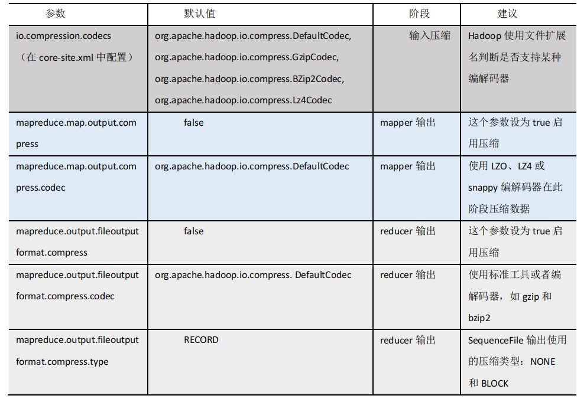
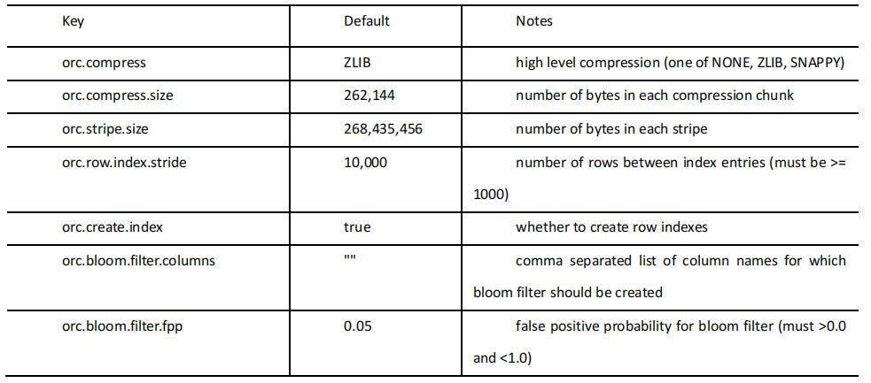

# Hadoop压缩配置

### MR支持的压缩编码

| 压缩格式 | 算法    | 文件扩展名 | 是否可切分 |
| -------- | ------- | ---------- | ---------- |
| DEFLATE  | DEFLATE | .deflate   | 否         |
| Gzip     | DEFLATE | .gz        | 否         |
| bzip2    | bzip2   | .bzip2     | 是         |
| LZO      | LZO     | .lzo       | 是         |
| Snappy   | Snappy  | .snappy    | 否         |

### 压缩参数配置

要在 Hadoop 中启用压缩，可以配置如下参数（mapred-site.xml 文件中）：



#  开启Map输出阶段压缩（MR引擎）

开启 map 输出阶段压缩可以减少 job 中 map 和 Reduce task 间数据传输量。具体配置如下：

1. 开启 hive 中间传输数据压缩功能

   ```shell
   set hive.exec.compress.intermediate=true;
   ```

2. 开启 mapreduce 中 map 输出压缩功能

   ```shell
   set mapreduce.map.output.compress=true;
   ```

3. 设置 mapreduce 中 map 输出数据的压缩方式

   ```shell
   set mapreduce.map.output.compress.codec=org.apache.hadoop.io.compress.SnappyCodec;
   ```

4. 执行查询语句

   ```shell
   select count(ename) name from emp;
   ```

#  开启Reduce输出阶段压缩（MR引擎）

当 Hive 将 输 出 写 入 到 表 中 时 ， 输出内容同样可以进行压缩。属性hive.exec.compress.output控制着这个功能。用户可能需要保持默认设置文件中的默认值false，这样默认的输出就是非压缩的纯文本文件了。用户可以通过在查询语句或执行脚本中设置这个值为 true，来开启输出结果压缩功能。

1. 开启 hive 最终输出数据压缩功能

   ```shell
   set hive.exec.compress.output=true;
   ```

2. 开启 mapreduce 最终输出数据压缩

   ```shell
   set mapreduce.output.fileoutputformat.compress=true;
   ```

3. 设置 mapreduce 最终数据输出压缩方式

   ```shell
   set mapreduce.output.fileoutputformat.compress.codec = org.apache.hadoop.io.compress.SnappyCodec;
   ```

4. 设置 mapreduce 最终数据输出压缩为块压缩

   ```shell
   set mapreduce.output.fileoutputformat.compress.type=BLOCK;
   ```

# 文件存储格式

**Hive 支持的存储数据的格式主要有：TEXTFILE 、SEQUENCEFILE、ORC、PARQUET。**

1. 列式存储和行式存储
2. TextFile格式
3. Orc格式
4. Parquet格式

# 测试存储和压缩

**ORC 存储方式的压缩：**



**注意：所有关于 ORCFile 的参数都是在 HQL 语句的 TBLPROPERTIES 字段里面出现**

1. 创建一个ZLIB压缩的ORC存储方式

   ```sql
   create table log_orc_zlib(
   track_time string,
   url string,
   session_id string,
   referer string,
   ip string,
   end_user_id string,
   city_id string
   )
   row format delimited fields terminated by '\t'
   stored as orc
   tblproperties("orc.compress"="ZLIB");
   ```

2. 创建一个SNAPPY压缩的ORC存储方式

   ```sql
   create table log_orc_snappy(
   track_time string,
   url string,
   session_id string,
       referer string,
   ip string,
   end_user_id string,
   city_id string
   )
   row format delimited fields terminated by '\t'
   stored as orc
   tblproperties("orc.compress"="SNAPPY");
   ```

   