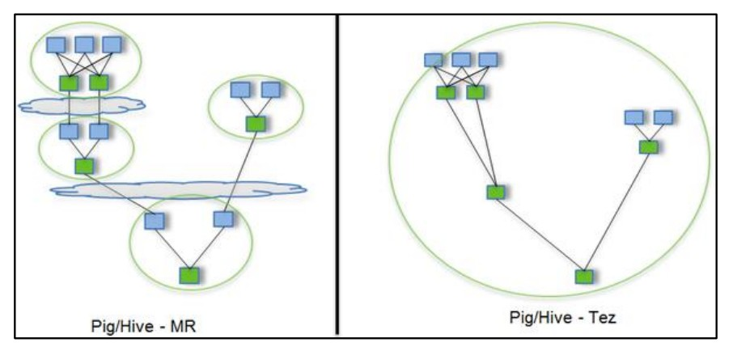

Tez 是一个 Hive 的运行引擎，性能优于 MR。为什么优于 MR 呢？看下



用 Hive 直接编写 MR 程序，假设有四个有依赖关系的 MR 作业，上图中，绿色是 ReduceTask，云状表示写屏蔽，需要将中间结果持久化写到 HDFS。

Tez 可以将多个有依赖的作业转换为一个作业，这样只需写一次 HDFS，且中间节点较少，从而大大提升作业的计算性能。


**安装**

1.将tez安装包拷贝到集群，并解压 tar包	

```shell
mkdir /opt/module/tez
tar -zxvf /opt/software/tez-0.10.1-SNAPSHOT-minimal.tar.gz -C /opt/module/tez
```

2.上传tez依赖到HDFS

```shell
hadoop fs -mkdir /tez
hadoop fs -put /opt/software/tez-0.10.1-SNAPSHOT.tar.gz /tez
```

3.新建tez-site.xml

```shell
vim $HADOOP_HOME/etc/hadoop/tez-site.xml
```

添加

```shell
<?xml version="1.0" encoding="UTF-8"?>
<?xml-stylesheet type="text/xsl" href="configuration.xsl"?>
<configuration>
<property>
<name>tez.lib.uris</name>
 <value>${fs.defaultFS}/tez/tez-0.10.1-SNAPSHOT.tar.gz</value>
</property>
<property>
 <name>tez.use.cluster.hadoop-libs</name>
 <value>true</value>
</property>
<property>
 <name>tez.am.resource.memory.mb</name>
 <value>1024</value>
 </property>
<property>
 <name>tez.am.resource.cpu.vcores</name>
 <value>1</value>
</property>
<property>
 <name>tez.container.max.java.heap.fraction</name>
 <value>0.4</value>
</property>
<property>
 <name>tez.task.resource.memory.mb</name>
 <value>1024</value>
</property>
<property>
 <name>tez.task.resource.cpu.vcores</name>
 <value>1</value>
</property>
</configuration>
```

4.修改Hadoop环境变量

```shell
vim $HADOOP_HOME/etc/hadoop/shellprofile.d/tez.sh
```

添加 Tez 的 Jar 包相关信息

```shell
hadoop_add_profile tez
function _tez_hadoop_classpath
{
 hadoop_add_classpath "$HADOOP_HOME/etc/hadoop" after
 hadoop_add_classpath "/opt/module/tez/*" after
 hadoop_add_classpath "/opt/module/tez/lib/*" after
}
```

5.修改Hive的计算引擎

```shell
 vim $HIVE_HOME/conf/hive-site.xml
```

添加

```shell
<property>
 <name>hive.execution.engine</name>
 <value>tez</value>
</property>
<property>
 <name>hive.tez.container.size</name>
 <value>1024</value>
</property>
```

6.解决日志Jar包冲突

```shell
rm /opt/module/tez/lib/slf4j-log4j12-1.7.10.jar
```

