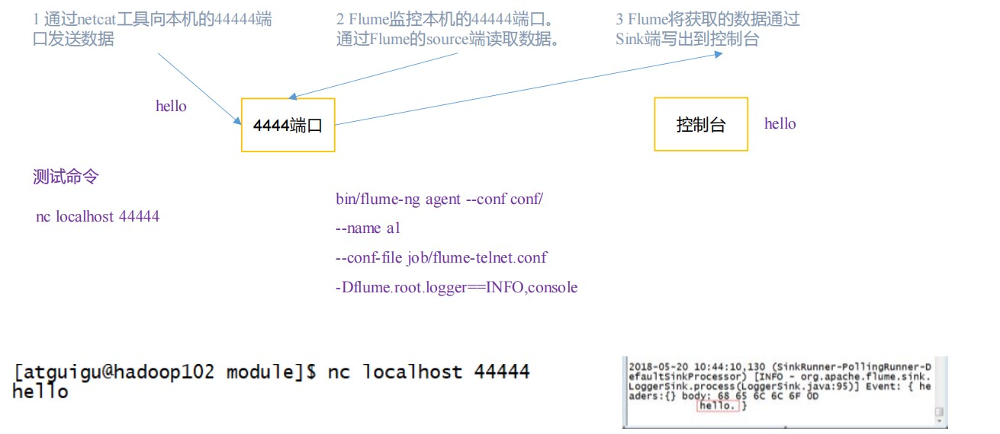
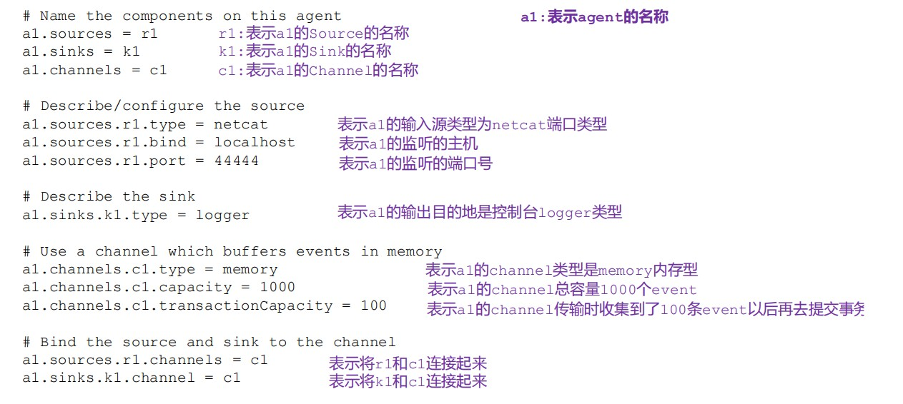
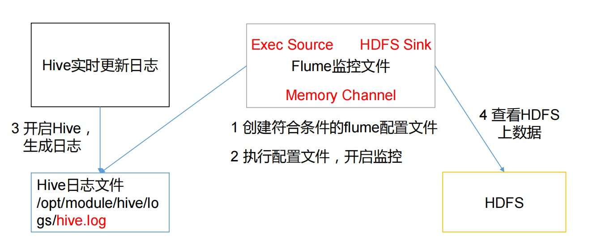
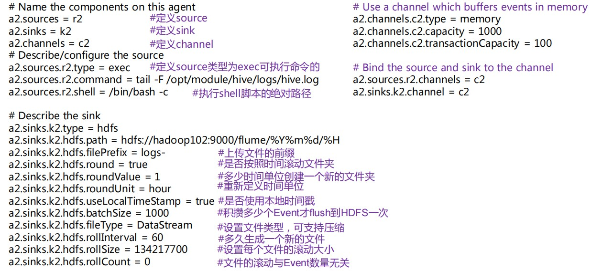
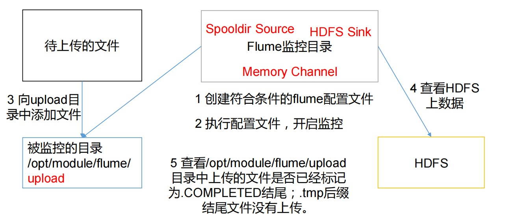
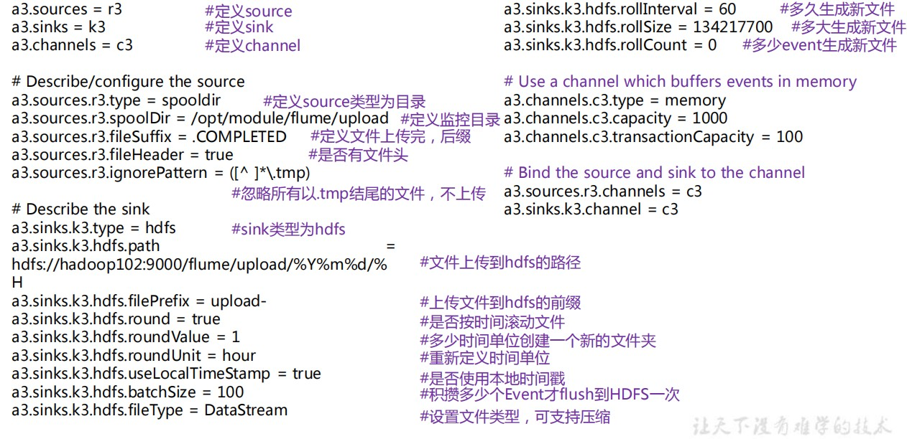
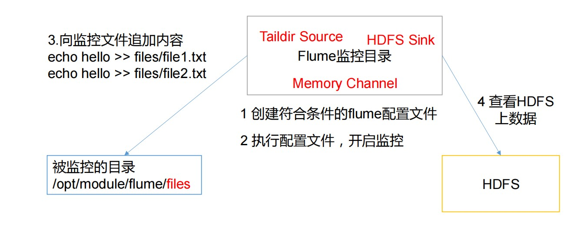
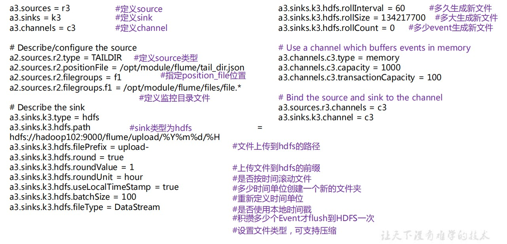

# Flume安装

1. 上传文件并解压

2. 将flume/conf下的flume-env.sh.template文件修改为flume-env.sh并配置 flume-env.sh文件

   ```shell
   mv flume-env.sh.template flume-env.sh
   vi flume-env.sh
   
   export JAVA_HOME=/usr/java/jdk1.8.0_191-amd64
   ```

# 入门案例(NetCat Source)



### 实现步骤

1. 安装netcat工具

   ```shell
   sudo yum install -y nc
   ```

2. 判断 44444 端口是否被占用

   ```shell
   sudo netstat -tunlp | grep 44444
   ```

3. 创建 Flume Agent 配置文件 flume-netcat-logger.conf

   ```shell
   mkdir job
   cd job/
   ```

   在 job 文件夹下创建 Flume Agent 配置文件 flume-netcat-logger.conf

    ```shell
   vim flume-netcat-logger.conf
   
   添加内容如下：
   # Name the components on this agent
   a1.sources = r1
   a1.sinks = k1
   a1.channels = c1
   # Describe/configure the source
   a1.sources.r1.type = netcat
   a1.sources.r1.bind = localhost
   a1.sources.r1.port = 44444
   # Describe the sink
   a1.sinks.k1.type = logger
   # Use a channel which buffers events in memory
   a1.channels.c1.type = memory
   a1.channels.c1.capacity = 1000
   a1.channels.c1.transactionCapacity = 100
   # Bind the source and sink to the channel
   a1.sources.r1.channels = c1
   a1.sinks.k1.channel = c1
    ```

   

4.  先开启 flume 监听端口

   ```shell
   # 第一种
   bin/flume-ng agent --conf conf/ --name a1 --conf-file job/flume-netcat-logger.conf -Dflume.root.logger=INFO,console
   
   # 第二种
   bin/flume-ng agent -c conf/ -n a1 -f job/flume-netcat-logger.conf -Dflume.root.logger=INFO,console
   
   参数说明：
   --conf/-c：表示配置文件存储在 conf/目录
   --name/-n：表示给 agent 起名为 a1
   --conf-file/-f：flume 本次启动读取的配置文件是在 job 文件夹下的 flume-telnet.conf
   文件。-Dflume.root.logger=INFO,console ：-D 表示 flume 运行时动态修改 flume.root.logger
   参数属性值，并将控制台日志打印级别设置为 INFO 级别。日志级别包括:log、info、warn、error。
   ```

5. 使用 netcat 工具向本机的 44444 端口发送内容

   ```shell
   nc localhost 44444
   ```

   

# 实时监控单个追加文件(Exec Source)



1. Flume 要想将数据输出到 HDFS，须持有 Hadoop 相关 jar 包

   ```shell
   将
   
   commons-configuration-1.6.jar、
   hadoop-auth-2.7.2.jar、
   hadoop-common-2.7.2.jar、
   hadoop-hdfs-2.7.2.jar、
   commons-io-2.4.jar、
   htrace-core-3.1.0-incubating.jar
   
   拷贝到/opt/module/flume/lib 文件夹下
   ```

2. 创建 flume-file-hdfs.conf 文件

   ```shell
   vim flume-file-hdfs.conf
   ```

   添加内容

   ```shell
   # Name the components on this agent
   a2.sources = r2
   a2.sinks = k2
   a2.channels = c2
   # Describe/configure the source
   a2.sources.r2.type = exec
   a2.sources.r2.command = tail -F /opt/module/hive/logs/hive.log
   a2.sources.r2.shell = /bin/bash -c
   # Describe the sink
   a2.sinks.k2.type = hdfs
   a2.sinks.k2.hdfs.path = hdfs://master:8020/flume/%Y%m%d/%H
   #上传文件的前缀
   a2.sinks.k2.hdfs.filePrefix = logs-
   #是否按照时间滚动文件夹
   a2.sinks.k2.hdfs.round = true
   #多少时间单位创建一个新的文件夹
   a2.sinks.k2.hdfs.roundValue = 1
   #重新定义时间单位
   a2.sinks.k2.hdfs.roundUnit = hour
   #是否使用本地时间戳
   a2.sinks.k2.hdfs.useLocalTimeStamp = true
   #积攒多少个 Event 才 flush 到 HDFS 一次
   a2.sinks.k2.hdfs.batchSize = 1000
   #设置文件类型，可支持压缩
   a2.sinks.k2.hdfs.fileType = DataStream
   #多久生成一个新的文件
   a2.sinks.k2.hdfs.rollInterval = 30
   #设置每个文件的滚动大小
   a2.sinks.k2.hdfs.rollSize = 134217700
   #文件的滚动与 Event 数量无关
   a2.sinks.k2.hdfs.rollCount = 0
   # Use a channel which buffers events in memory
   a2.channels.c2.type = memory
   a2.channels.c2.capacity = 1000
   a2.channels.c2.transactionCapacity = 100
   # Bind the source and sink to the channel
   a2.sources.r2.channels = c2
   a2.sinks.k2.channel = c2
   ```

   **注意：**

   对于所有与时间相关的转义序列，Event Header 中必须存在以 “timestamp”的 key（除非hdfs.useLocalTimeStamp 设置为 true，此方法会使用 TimestampInterceptor 自动添加timestamp）。

   a3.sinks.k3.hdfs.useLocalTimeStamp = true

   

3. 运行Flume

   ```shell
   bin/flume-ng agent --conf conf/ --name a2 --conf-file job/flume-file-hdfs.conf
   ```

4. hadoop web查看文件

**注意：**有数据丢失或者重复问题

# 实时监控目录下多个文件(Spooldir Source)



1. 创建配置文件

   ```shell
   vim flume-dir-hdfs.conf
   ```

   添加内容

   ```shell
   a3.sources = r3
   a3.sinks = k3
   a3.channels = c3
   
   # Describe/configure the source
   a3.sources.r3.type = spooldir
   a3.sources.r3.spoolDir = /opt/module/flume/upload
   a3.sources.r3.fileSuffix = .COMPLETED
   a3.sources.r3.fileHeader = true
   #忽略所有以.tmp 结尾的文件，不上传
   a3.sources.r3.ignorePattern = ([^ ]*\.tmp)
   
   # Describe the sink
   a3.sinks.k3.type = hdfs
   a3.sinks.k3.hdfs.path = hdfs://master:8020/flume/upload/%Y%m%d/%H
   #上传文件的前缀
   a3.sinks.k3.hdfs.filePrefix = upload-
   #是否按照时间滚动文件夹
   a3.sinks.k3.hdfs.round = true
   #多少时间单位创建一个新的文件夹
   a3.sinks.k3.hdfs.roundValue = 1
   #重新定义时间单位
   a3.sinks.k3.hdfs.roundUnit = hour
   #是否使用本地时间戳
   a3.sinks.k3.hdfs.useLocalTimeStamp = true
   #积攒多少个 Event 才 flush 到 HDFS 一次
   a3.sinks.k3.hdfs.batchSize = 100
   #设置文件类型，可支持压缩
   a3.sinks.k3.hdfs.fileType = DataStream
   #多久生成一个新的文件
   a3.sinks.k3.hdfs.rollInterval = 60
   #设置每个文件的滚动大小大概是 128M
   a3.sinks.k3.hdfs.rollSize = 134217700
   #文件的滚动与 Event 数量无关
   a3.sinks.k3.hdfs.rollCount = 0
   
   # Use a channel which buffers events in memory
   a3.channels.c3.type = memory
   a3.channels.c3.capacity = 1000
   a3.channels.c3.transactionCapacity = 100
   
   # Bind the source and sink to the channel
   a3.sources.r3.channels = c3
   a3.sinks.k3.channel = c3
   ```

   

2. 启动监控文件夹命令

   ```shell
   bin/flume-ng agent --conf conf/ --name a3 --conf-file job/flume-dir-hdfs.conf
   ```

   **说明：**

   在使用 Spooling Directory Source 时不要在监控目录中创建并持续修改文件

   上传完成的文件会以.COMPLETED 结尾

   被监控文件夹每 500 毫秒扫描一次文件变动

3. 向 upload 文件夹中添加文件

   ```shell
   mkdir upload
   touch atguigu.txt
   touch atguigu.tmp
   ```

4. 查看 HDFS 上的数据


# 实时监控目录下的多个追加文件(Taildir Source)



1. 创建配置文件 flume-taildir-hdfs.conf

   添加内容

   ```shell
   a3.sources = r3
   a3.sinks = k3
   a3.channels = c3
   # Describe/configure the source
   a3.sources.r3.type = TAILDIR
   a3.sources.r3.positionFile = /opt/module/flume/tail_dir.json
   a3.sources.r3.filegroups = f1
   a3.sources.r3.filegroups.f1 = /opt/module/flume/files/file.*
   # Describe the sink
   a3.sinks.k3.type = hdfs
   a3.sinks.k3.hdfs.path = 
   hdfs://hadoop102:9000/flume/upload/%Y%m%d/%H
   #上传文件的前缀
   a3.sinks.k3.hdfs.filePrefix = upload- #是否按照时间滚动文件夹
   a3.sinks.k3.hdfs.round = true
   #多少时间单位创建一个新的文件夹
   a3.sinks.k3.hdfs.roundValue = 1
   #重新定义时间单位
   a3.sinks.k3.hdfs.roundUnit = hour
   #是否使用本地时间戳
   a3.sinks.k3.hdfs.useLocalTimeStamp = true
   #积攒多少个 Event 才 flush 到 HDFS 一次
   a3.sinks.k3.hdfs.batchSize = 100
   #设置文件类型，可支持压缩
   a3.sinks.k3.hdfs.fileType = DataStream
   #多久生成一个新的文件
   a3.sinks.k3.hdfs.rollInterval = 60
   #设置每个文件的滚动大小大概是 128M
   a3.sinks.k3.hdfs.rollSize = 134217700 #文件的滚动与 Event 数量无关
   a3.sinks.k3.hdfs.rollCount = 0
   # Use a channel which buffers events in memory
   a3.channels.c3.type = memory
   a3.channels.c3.capacity = 1000
   a3.channels.c3.transactionCapacity = 100
   # Bind the source and sink to the channel
   a3.sources.r3.channels = c3
   a3.sinks.k3.channel = c3
   ```

   

2. 启动监控文件夹命令

   ```shell
   bin/flume-ng agent --conf conf/ --name a3 --conf-file job/flume-taildir-hdfs.conf
   ```

3. 向 files 文件夹中追加内容

   ```shell
   mkdir files
   
   echo hello >> file1.txt
   echo atguigu >> file2.txt
   ```

4. 查看 HDFS 上的数据


**Taildir 说明：** 

Taildir Source 维护了一个 json 格式的 position File，其会定期的往 position File中更新每个文件读取到的最新的位置，因此能够实现断点续传。Position File 的格式如下：

```shell
{"inode":2496272,"pos":12,"file":"/opt/module/flume/files/file1.txt"}
{"inode":2496275,"pos":12,"file":"/opt/module/flume/files/file2.txt"}
```

注：Linux 中储存文件元数据的区域就叫做 inode，每个 inode 都有一个号码，操作系统用 inode 号码来识别不同的文件，Unix/Linux 系统内部不使用文件名，而使用 inode 号码来

