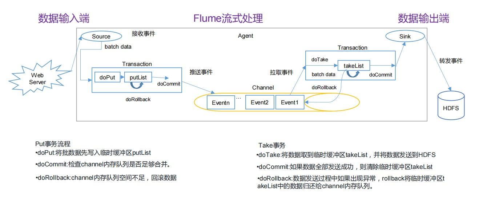
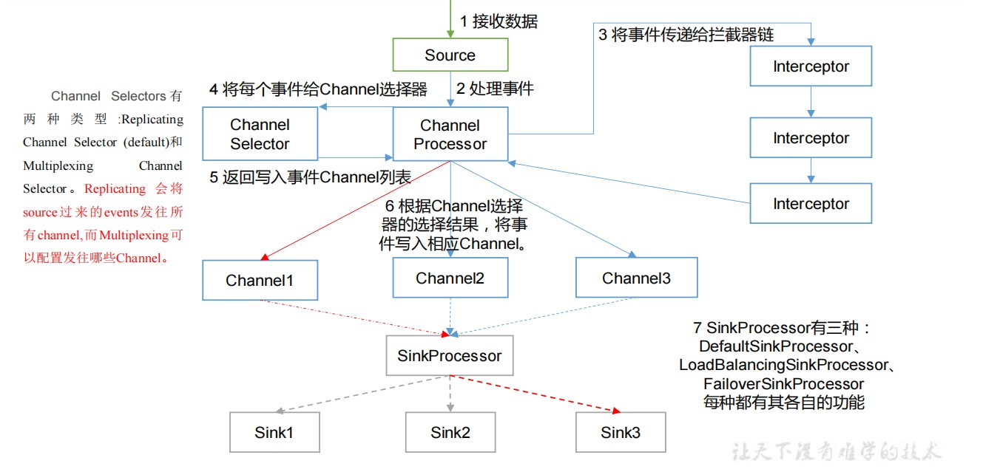
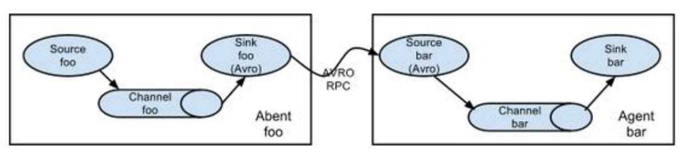
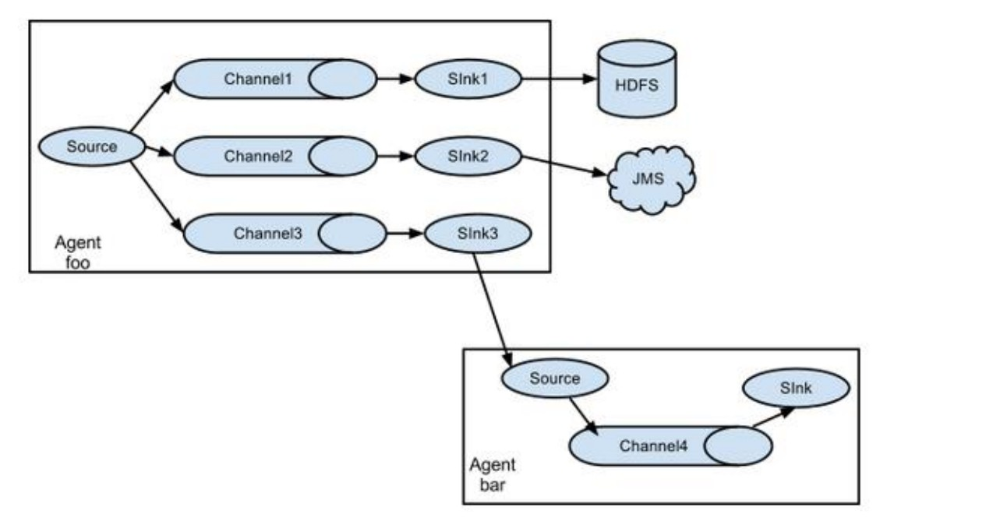
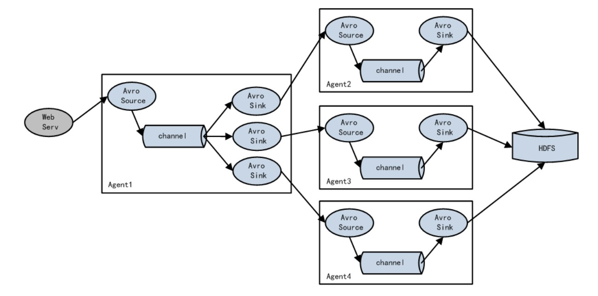
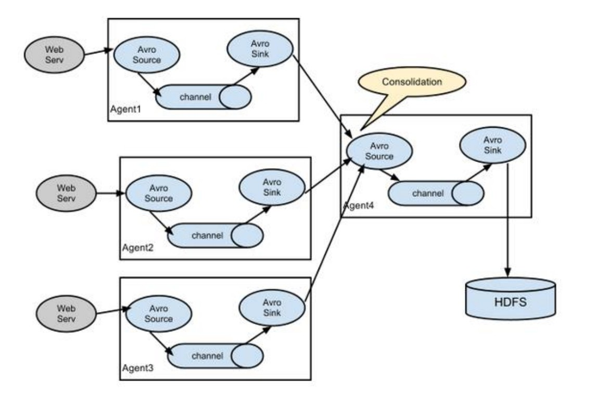

# Flume事务

# Flume Agent内部原理

**重要组件：** 

1. **ChannelSelector** 

   ChannelSelector 的作用就是选出 Event 将要被发往哪个 Channel。其共有两种类型，分别是 Replicating（复制）和 Multiplexing（多路复用）。

   ReplicatingSelector 会将同一个 Event 发往所有的 Channel，Multiplexing 会根据相应的原则，将不同的 Event 发往不同的 Channel。

2. **SinkProcessor**

   SinkProcessor 共 有 三 种 类 型 ， 分 别 是 DefaultSinkProcessor 、LoadBalancingSinkProcessor 和 FailoverSinkProcessorDefaultSinkProcessor 对 应 的 是 单 个 的 Sink ， LoadBalancingSinkProcessor 和 FailoverSinkProcessor 对应的是 Sink Group，LoadBalancingSinkProcessor 可以实现负载均衡的功能，FailoverSinkProcessor 可以实现故障转移的功能。

# Flume拓扑结构

### 简单串联

这种模式是将多个 flume 顺序连接起来了，从最初的 source 开始到最终 sink 传送的目的存储系统。此模式不建议桥接过多的 flume 数量，flume 数量过多不仅会影响传输速率，而且一旦传输过程中某个节点 flume 宕机，会影响整个传输系统。

### 复制和多路复用

Flume 支持将事件流向一个或者多个目的地。这种模式可以将相同数据复制到多个channel 中，或者将不同数据分发到不同的 channel 中，sink 可以选择传送到不同的目的地。

### 负载均衡和故障转移

Flume支持使用将多个sink逻辑上分到一个sink组，sink组配合不同的SinkProcessor可以实现负载均衡和错误恢复的功能。

### 聚合

这种模式是我们最常见的，也非常实用，日常 web 应用通常分布在上百个服务器，大者甚至上千个、上万个服务器。产生的日志，处理起来也非常麻烦。用 flume 的这种组合方式能很好的解决这一问题，每台服务器部署一个 flume 采集日志，传送到一个集中收集日志的flume，再由此 flume 上传到 hdfs、hive、hbase 等，进行日志分析。