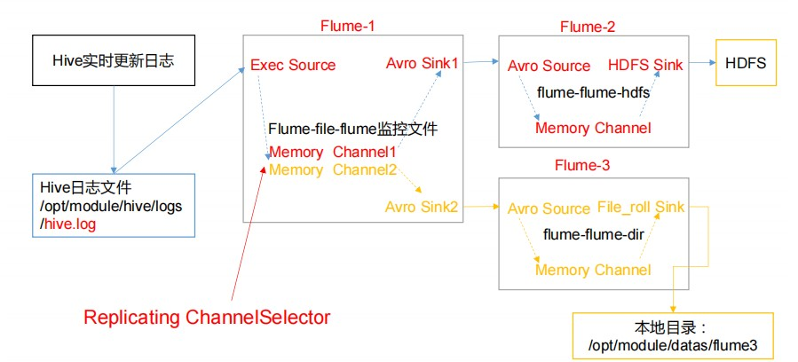
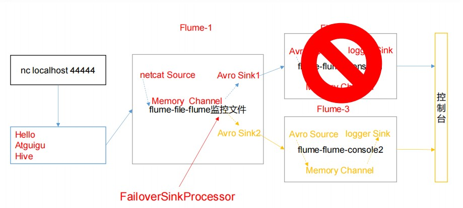
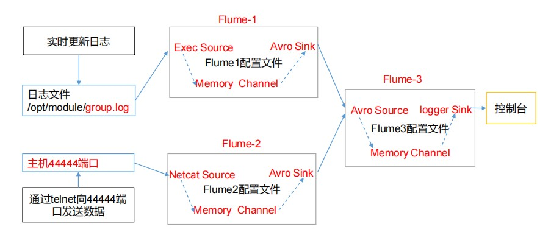

# 复制和多路复用

**描述**

使用 Flume-1 监控文件变动，Flume-1 将变动内容传递给 Flume-2，Flume-2 负责存储到 HDFS。同时 Flume-1 将变动内容传递给 Flume-3，Flume-3 负责输出到 Local FileSystem



**创建flume-file-flume.conf**

```shell
# Name the components on this agent
a1.sources = r1
a1.sinks = k1 k2
a1.channels = c1 c2
# 将数据流复制给所有 channel
a1.sources.r1.selector.type = replicating
# Describe/configure the source
a1.sources.r1.type = exec
a1.sources.r1.command = tail -F /opt/module/hive/logs/hive.log
a1.sources.r1.shell = /bin/bash -c
# Describe the sink
# sink 端的 avro 是一个数据发送者
a1.sinks.k1.type = avro
a1.sinks.k1.hostname = hadoop102
a1.sinks.k1.port = 4141
a1.sinks.k2.type = avro
a1.sinks.k2.hostname = hadoop102
a1.sinks.k2.port = 4142
# Describe the channel
a1.channels.c1.type = memory
a1.channels.c1.capacity = 1000
a1.channels.c1.transactionCapacity = 100
a1.channels.c2.type = memory
a1.channels.c2.capacity = 1000
a1.channels.c2.transactionCapacity = 100
# Bind the source and sink to the channel
a1.sources.r1.channels = c1 c2
a1.sinks.k1.channel = c1
a1.sinks.k2.channel = c2
```

**创建 flume-flume-hdfs.conf**

 ```shell
# Name the components on this agent
a2.sources = r1
a2.sinks = k1
a2.channels = c1
# Describe/configure the source
# source 端的 avro 是一个数据接收服务
a2.sources.r1.type = avro
a2.sources.r1.bind = hadoop102
a2.sources.r1.port = 4141
# Describe the sink
a2.sinks.k1.type = hdfs
a2.sinks.k1.hdfs.path = hdfs://hadoop102:9000/flume2/%Y%m%d/%H
#上传文件的前缀
a2.sinks.k1.hdfs.filePrefix = flume2- #是否按照时间滚动文件夹
a2.sinks.k1.hdfs.round = true
#多少时间单位创建一个新的文件夹
a2.sinks.k1.hdfs.roundValue = 1
#重新定义时间单位
a2.sinks.k1.hdfs.roundUnit = hour
#是否使用本地时间戳
a2.sinks.k1.hdfs.useLocalTimeStamp = true
#积攒多少个 Event 才 flush 到 HDFS 一次
a2.sinks.k1.hdfs.batchSize = 100
#设置文件类型，可支持压缩
a2.sinks.k1.hdfs.fileType = DataStream
#多久生成一个新的文件
a2.sinks.k1.hdfs.rollInterval = 600
#设置每个文件的滚动大小大概是 128M
a2.sinks.k1.hdfs.rollSize = 134217700
#文件的滚动与 Event 数量无关
a2.sinks.k1.hdfs.rollCount = 0
# Describe the channel
a2.channels.c1.type = memory
a2.channels.c1.capacity = 1000
a2.channels.c1.transactionCapacity = 100
# Bind the source and sink to the channel
a2.sources.r1.channels = c1
a2.sinks.k1.channel = c1
 ```

**创建 flume-flume-dir.conf** 

```shell
# Name the components on this agent
a3.sources = r1
a3.sinks = k1
a3.channels = c2
# Describe/configure the source
a3.sources.r1.type = avro
a3.sources.r1.bind = hadoop102
a3.sources.r1.port = 4142

# Describe the sink
a3.sinks.k1.type = file_roll
a3.sinks.k1.sink.directory = /opt/module/data/flume3
# Describe the channel
a3.channels.c2.type = memory
a3.channels.c2.capacity = 1000
a3.channels.c2.transactionCapacity = 100
# Bind the source and sink to the channel
a3.sources.r1.channels = c2
a3.sinks.k1.channel = c2
```

**执行配置文件** 

```shell
bin/flume-ng agent --conf conf/ --name a3 --conf-file job/group1/flume-flume-dir.conf

bin/flume-ng agent --conf conf/ --name a2 --conf-file job/group1/flume-flume-hdfs.conf

bin/flume-ng agent --conf conf/ --name a1 --conf-file job/group1/flume-file-flume.conf
```


# 负载均衡和故障转移

**描述**

使用 Flume1 监控一个端口，其 sink 组中的 sink 分别对接 Flume2 和 Flume3，采用FailoverSinkProcessor，实现故障转移的功能。



**创建 flume-netcat-flume.conf** 

配置 1 个 netcat source 和 1 个 channel、1 个 sink group（2 个 sink），分别输送给 flume-flume-console1 和 flume-flume-console2。

```shell
# Name the components on this agent
a1.sources = r1
a1.channels = c1
a1.sinkgroups = g1
a1.sinks = k1 k2
# Describe/configure the source
a1.sources.r1.type = netcat
a1.sources.r1.bind = localhost
a1.sources.r1.port = 44444
a1.sinkgroups.g1.processor.type = failover
a1.sinkgroups.g1.processor.priority.k1 = 5
a1.sinkgroups.g1.processor.priority.k2 = 10
a1.sinkgroups.g1.processor.maxpenalty = 10000
# Describe the sink
a1.sinks.k1.type = avro
a1.sinks.k1.hostname = hadoop102
a1.sinks.k1.port = 4141
a1.sinks.k2.type = avro
a1.sinks.k2.hostname = hadoop102
a1.sinks.k2.port = 4142
# Describe the channel
a1.channels.c1.type = memory
a1.channels.c1.capacity = 1000
a1.channels.c1.transactionCapacity = 100
# Bind the source and sink to the channel
a1.sources.r1.channels = c1
a1.sinkgroups.g1.sinks = k1 k2
a1.sinks.k1.channel = c1
a1.sinks.k2.channel = c1
```

**创建 flume-flume-console1.conf** 

配置上级 Flume 输出的 Source，输出是到本地控制台

```shell
# Name the components on this agent
a2.sources = r1
a2.sinks = k1
a2.channels = c1
# Describe/configure the source
a2.sources.r1.type = avro
a2.sources.r1.bind = hadoop102
a2.sources.r1.port = 4141
# Describe the sink
a2.sinks.k1.type = logger
# Describe the channel
a2.channels.c1.type = memory
a2.channels.c1.capacity = 1000
a2.channels.c1.transactionCapacity = 100
# Bind the source and sink to the channel
a2.sources.r1.channels = c1
a2.sinks.k1.channel = c1
```

**创建 flume-flume-console2.conf**

配置上级 Flume 输出的 Source，输出是到本地控制台

```shell
# Name the components on this agent
a3.sources = r1
a3.sinks = k1
a3.channels = c2
# Describe/configure the source
a3.sources.r1.type = avro
a3.sources.r1.bind = hadoop102
a3.sources.r1.port = 4142
# Describe the sink
a3.sinks.k1.type = logger
# Describe the channel
a3.channels.c2.type = memory
a3.channels.c2.capacity = 1000
a3.channels.c2.transactionCapacity = 100
# Bind the source and sink to the channel
a3.sources.r1.channels = c2
a3.sinks.k1.channel = c2
```

**执行配置文件** 

```shell
bin/flume-ng agent --conf conf/ --name a3 --conf-file job/group2/flume-flume-console2.conf -Dflume.root.logger=INFO,console

bin/flume-ng agent --conf conf/ --name a2 --conf-file job/group2/flume-flume-console1.conf -Dflume.root.logger=INFO,console

bin/flume-ng agent --conf conf/ --name a1 --conf-file job/group2/flume-netcat-flume.conf
```

**使用 netcat 工具向本机的 44444 端口发送内容**

```shell
nc localhost 44444
```

**查看 Flume2 及 Flume3 的控制台打印日志** 

**将 Flume2 kill，观察 Flume3 的控制台打印情况**

# 聚合

**描述**

hadoop102 上的 Flume-1 监控文件/opt/module/data/group.log，

hadoop103 上的 Flume-2 监控某一个端口的数据流，

Flume-1 与 Flume-2 将数据发送给 hadoop104 上的 Flume-3，Flume-3 将最终数据打印到控制台。



**分发 Flume**

**创建 flume1-logger-flume.conf** 

配置 Source 用于监控 hive.log 文件，配置 Sink 输出数据到下一级 Flume

在 hadoop102 上编辑配置文件

```shell
# Name the components on this agent
a1.sources = r1
a1.sinks = k1
a1.channels = c1
# Describe/configure the source
a1.sources.r1.type = exec
a1.sources.r1.command = tail -F /opt/module/group.log
a1.sources.r1.shell = /bin/bash -c
# Describe the sink
a1.sinks.k1.type = avro
a1.sinks.k1.hostname = hadoop104
a1.sinks.k1.port = 4141

# Describe the channel
a1.channels.c1.type = memory
a1.channels.c1.capacity = 1000
a1.channels.c1.transactionCapacity = 100
# Bind the source and sink to the channel
a1.sources.r1.channels = c1
a1.sinks.k1.channel = c1
```

**创建 flume2-netcat-flume.conf** 

配置 Source 监控端口 44444 数据流，配置 Sink 数据到下一级 Flume： 

在 hadoop103 上编辑配置文件

```shell
# Name the components on this agent
a2.sources = r1
a2.sinks = k1
a2.channels = c1
# Describe/configure the source
a2.sources.r1.type = netcat
a2.sources.r1.bind = hadoop103
a2.sources.r1.port = 44444
# Describe the sink
a2.sinks.k1.type = avro
a2.sinks.k1.hostname = hadoop104
a2.sinks.k1.port = 4141
# Use a channel which buffers events in memory
a2.channels.c1.type = memory
a2.channels.c1.capacity = 1000
a2.channels.c1.transactionCapacity = 100
# Bind the source and sink to the channel
a2.sources.r1.channels = c1
a2.sinks.k1.channel = c1
```

**创建 flume3-flume-logger.conf** 

配置 source 用于接收 flume1 与 flume2 发送过来的数据流，最终合并后 sink 到控制台。

在 hadoop104 上编辑配置文件

```shell
# Name the components on this agent
a3.sources = r1
a3.sinks = k1
a3.channels = c1
# Describe/configure the source
a3.sources.r1.type = avro
a3.sources.r1.bind = hadoop104
a3.sources.r1.port = 4141
# Describe the sink
# Describe the sink
a3.sinks.k1.type = logger
# Describe the channel
a3.channels.c1.type = memory
a3.channels.c1.capacity = 1000
a3.channels.c1.transactionCapacity = 100
# Bind the source and sink to the channel
a3.sources.r1.channels = c1
a3.sinks.k1.channel = c1
```

**执行配置文件**

```shell
bin/flume-ng agent --conf conf/ --name a3 --conf-file job/group3/flume3-flume-logger.conf -Dflume.root.logger=INFO,console

bin/flume-ng agent --conf conf/ --name a2 --conf-file job/group3/flume1-logger-flume.conf

bin/flume-ng agent --conf conf/ --name a1 --conf-file job/group3/flume2-netcat-flume.conf
```

**在 hadoop103 上向/opt/module 目录下的 group.log 追加内容**

```shell
echo 'hello' > group.log
```

**在 hadoop102 上向 44444 端口发送数据** 

```shell
telnet hadoop102 44444
```

**检查 hadoop104 上数据**

