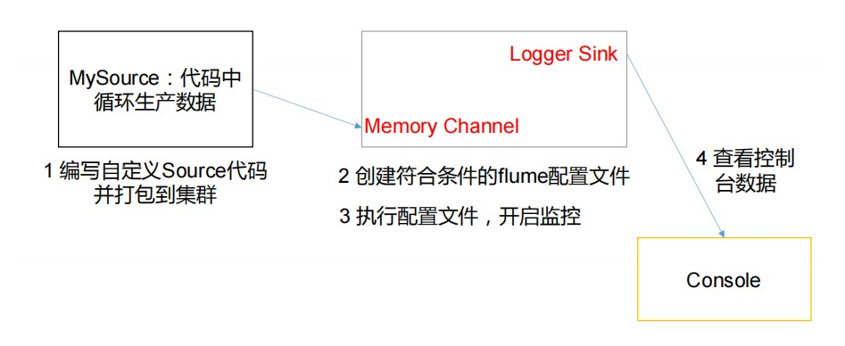
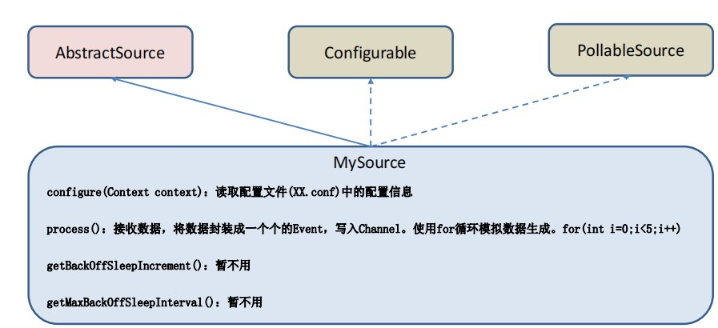

# 自定义Source

MySource 需要继承 AbstractSource 类并实现 Configurable 和 PollableSource 接口

实现相应方法：

getBackOffSleepIncrement()//暂不用

getMaxBackOffSleepInterval()//暂不用

configure(Context context)//初始化 context（读取配置文件内容）

process()//获取数据封装成 event 并写入 channel，这个方法将被循环调用。

使用场景：读取 MySQL 数据或者其他文件系统


**需求**

使用 flume 接收数据，并给每条数据添加前缀，输出到控制台。前缀可从 flume 配置文件中配置。





**编码**

1. 依赖

   ```yaml
   <dependencies>
        <dependency>
            <groupId>org.apache.flume</groupId>
            <artifactId>flume-ng-core</artifactId>
            <version>1.7.0</version>
        </dependency>
   </dependencies>
   ```

2. 自定义实现类

   ```shell
   package com.atguigu;
   import org.apache.flume.Context;
   import org.apache.flume.EventDeliveryException;
   import org.apache.flume.PollableSource;
   import org.apache.flume.conf.Configurable;
   import org.apache.flume.event.SimpleEvent;
   import org.apache.flume.source.AbstractSource;
   import java.util.HashMap;
   public class MySource extends AbstractSource implements 
   Configurable, PollableSource {
    //定义配置文件将来要读取的字段
    private Long delay;
    private String field;
    //初始化配置信息
    @Override
    public void configure(Context context) {
    delay = context.getLong("delay");
    field = context.getString("field", "Hello!");
    }
    @Override
    public Status process() throws EventDeliveryException {
    try {
    //创建事件头信息
    HashMap<String, String> hearderMap = new HashMap<>();
    //创建事件
    SimpleEvent event = new SimpleEvent();
    //循环封装事件
    for (int i = 0; i < 5; i++) {
    //给事件设置头信息
    event.setHeaders(hearderMap);
    //给事件设置内容
    event.setBody((field + i).getBytes());
    //将事件写入 channel
    getChannelProcessor().processEvent(event);
    Thread.sleep(delay);
    }
    } catch (Exception e) {
    e.printStackTrace();
    return Status.BACKOFF;
    }
    return Status.READY;
    }
    @Override
    public long getBackOffSleepIncrement() {
    return 0;
    }
    @Override
    public long getMaxBackOffSleepInterval() {
    return 0;
     } 
     }
   ```

3. 打包上传

   将写好的代码打包，并放到 flume 的 lib 目录（/opt/module/flume）

4. 配置文件

   ```shell
   # Name the components on this agent
   a1.sources = r1
   a1.sinks = k1
   a1.channels = c1
   # Describe/configure the source
   a1.sources.r1.type = com.atguigu.MySource
   a1.sources.r1.delay = 1000
   #a1.sources.r1.field = atguigu
   # Describe the sink
   a1.sinks.k1.type = logger
   # Use a channel which buffers events in memory
   a1.channels.c1.type = memory
   a1.channels.c1.capacity = 1000
   a1.channels.c1.transactionCapacity = 100
   # Bind the source and sink to the channel
   a1.sources.r1.channels = c1
   a1.sinks.k1.channel = c1
   ```

5. 开启任务

   ```shell
   bin/flume-ng agent -c conf/ -f job/mysource.conf -n a1 -Dflume.root.logger=INFO,console
   ```

   