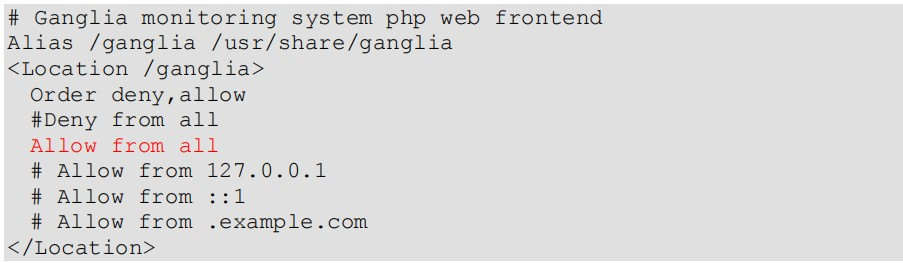
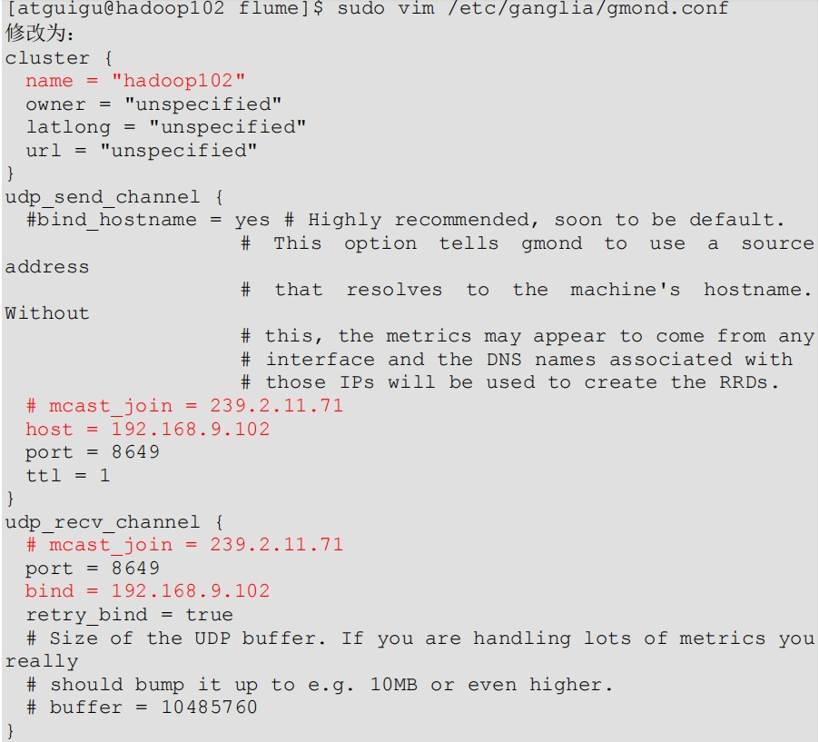
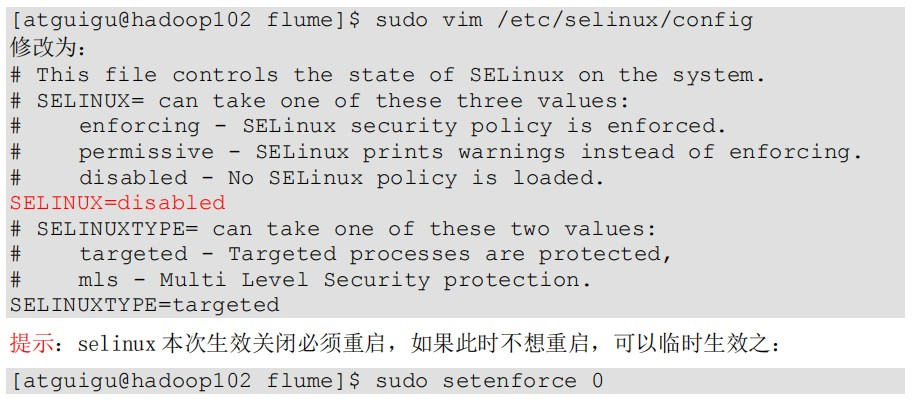
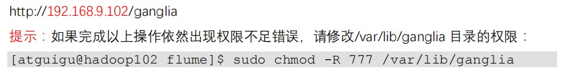
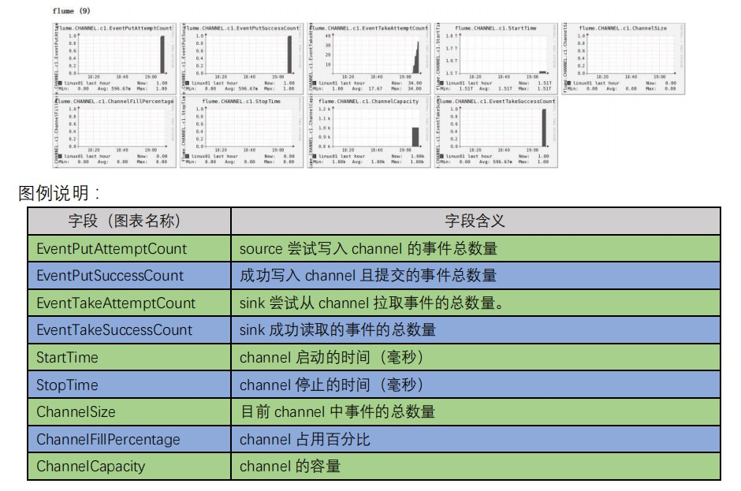

# Ganglia的安装与部署

1. **安装 httpd 服务与 php** 

   ```shell
   sudo yum -y install httpd php
   ```

2. **安装其他依赖** 

   ```shell
   sudo yum -y install rrdtool perl-rrdtool rrdtool-devel
   
   sudo yum -y install apr-devel
   ```

3. **安装 ganglia**

   ```shell
   sudo rpm -Uvh http://dl.fedoraproject.org/pub/epel/6/x86_64/epel-release-6-8.noarch.rpm
   
   sudo yum -y install ganglia-gmetad
   sudo yum -y install ganglia-web
   sudo yum -y install ganglia-gmond
   ```

   gmond（Ganglia Monitoring Daemon）是一种轻量级服务，安装在每台需要收集指标数据的节点主机上。使用 gmond，你可以很容易收集很多系统指标数据，如 CPU、内存、磁盘、网络和活跃进程的数据等。

   gmetad（Ganglia Meta Daemon）整合所有信息，并将其以 RRD 格式存储至磁盘的服务。

   gweb（Ganglia Web）Ganglia 可视化工具，gweb 是一种利用浏览器显示 gmetad 所存储数据的 PHP 前端。在 Web 界面中以图表方式展现集群的运行状态下收集的多种不同指标数据。

4. **修改配置文件/etc/httpd/conf.d/ganglia.conf** 

   ```shell
   sudo vim /etc/httpd/conf.d/ganglia.conf
   ```

   

5. **修改配置文件/etc/ganglia/gmetad.conf** 

   ```shell
   sudo vim /etc/ganglia/gmetad.conf
   
   data_source "hadoop102" 192.168.9.102
   ```

6. **修改配置文件/etc/ganglia/gmond.conf** 

   ```shell
   sudo vim /etc/ganglia/gmond.conf
   ```

   

7. **修改配置文件/etc/selinux/config**

   

8. **启动 ganglia**

   ```shell
   sudo service httpd start
   
   sudo service gmetad start
   
   sudo service gmond start
   ```

9. **打开网页浏览 ganglia 页面**

   

10. **启动 Flume 任务** 

    ```shell
    [atguigu@hadoop102 flume]$ bin/flume-ng agent \
    --conf conf/ \
    --name a1 \
    --conf-file job/flume-netcat-logger.conf \ -Dflume.root.logger==INFO,console \ -Dflume.monitoring.type=ganglia \ -Dflume.monitoring.hosts=192.168.9.102:8649
    ```

11. **发送数据观察 ganglia 监测图**

    ```shell
    nc localhost 44444
    ```

    