# Hbase逻辑结构

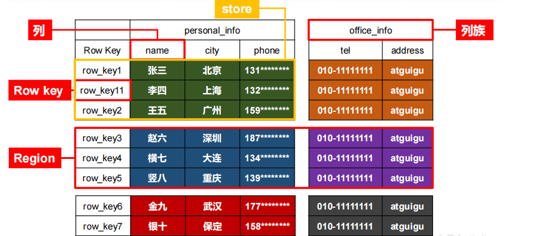

# HBase物理存储结构

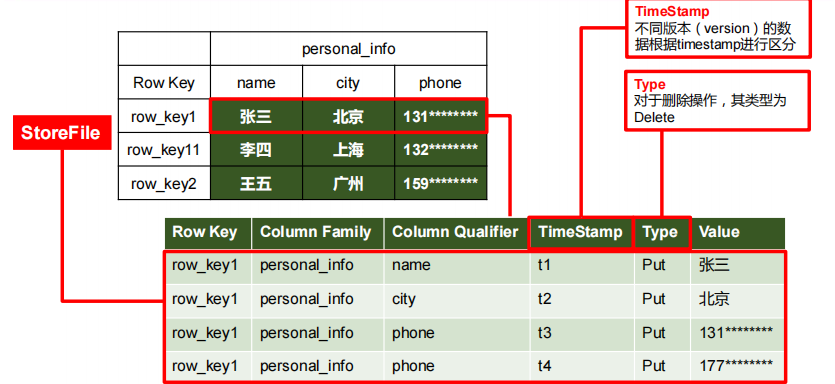

# 数据模型

1. **Name Space**

   命名空间，类似于关系型数据库的 DatabBase 概念，每个命名空间下有多个表。HBase有两个自带的命名空间，分别是 hbase 和 default，hbase 中存放的是 HBase 内置的表，default 表是用户默认使用的命名空间。

2. **Region**

   类似于关系型数据库的表概念。不同的是，HBase 定义表时只需要声明列族即可，不需要声明具体的列。这意味着，往 HBase 写入数据时，字段可以动态、按需指定。因此，和关系型数据库相比，HBase 能够轻松应对字段变更的场景。

3. **Row** 

   HBase 表中的每行数据都由一个 **RowKey** 和多个 **Column**（列）组成，数据是按照 RowKey的字典顺序存储的，并且查询数据时只能根据 RowKey 进行检索，所以 RowKey 的设计十分重要。

4. **Column**

   HBase 中的每个列都由 Column Family(列族)和 Column Qualifier（列限定符）进行限定，例如 info：name，info：age。建表时，只需指明列族，而列限定符无需预先定义。

5. **Time Stamp**

   用于标识数据的不同版本（version），每条数据写入时，如果不指定时间戳，系统会自动为其加上该字段，其值为写入 HBase 的时间。

6. **Cell**

   由{rowkey, column Family：column Qualifier, time Stamp} 唯一确定的单元。cell 中的数据是没有类型的，全部是字节码形式存贮。

# HBase基本架构

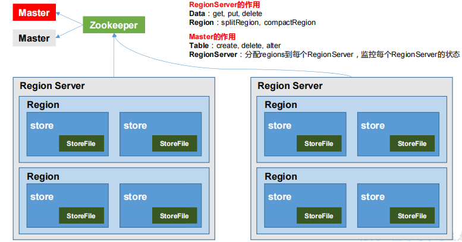

**架构角色**

1. **Region Server** 

   Region Server 为 Region 的管理者，其实现类为 HRegionServer，主要作用如下:

   对于数据的操作：get, put, delete；

   对于 Region 的操作：splitRegion、compactRegion。

2. **Master**

   Master 是所有 Region Server 的管理者，其实现类为 HMaster，主要作用如下：

   对于表的操作：create, delete, alter

   对于 RegionServer的操作：分配 regions到每个RegionServer，监控每个 RegionServer的状态，负载均衡和故障转移。

3. **Zookeeper** 

   HBase 通过 Zookeeper 来做 Master 的高可用、RegionServer 的监控、元数据的入口以及集群配置的维护等工作。

4. **HDFS** 

   HDFS 为 HBase 提供最终的底层数据存储服务，同时为 HBase 提供高可用的支持。


# Hbase详细架构

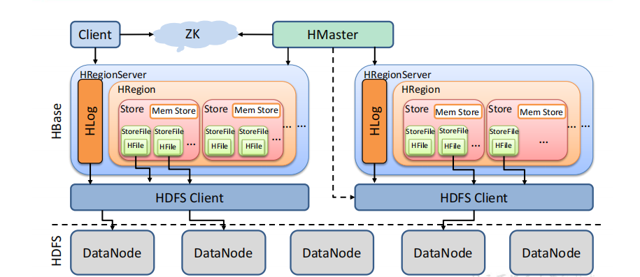

1. StoreFile

   保存实际数据的物理文件，StoreFile 以 HFile 的形式存储在 HDFS 上。每个 Store 会有一个或多个 StoreFile（HFile），数据在每个 StoreFile 中都是有序的。

2. MemStore

   写缓存，由于 HFile 中的数据要求是有序的，所以数据是先存储在 MemStore 中，排好序后，等到达刷写时机才会刷写到 HFile，每次刷写都会形成一个新的 HFile。

3. WAL

   由于数据要经 MemStore 排序后才能刷写到 HFile，但把数据保存在内存中会有很高的概率导致数据丢失，为了解决这个问题，数据会先写在一个叫做 Write-Ahead logfile 的文件中，然后再写入 MemStore 中。所以在系统出现故障的时候，数据可以通过这个日志文件重建。


# 写流程

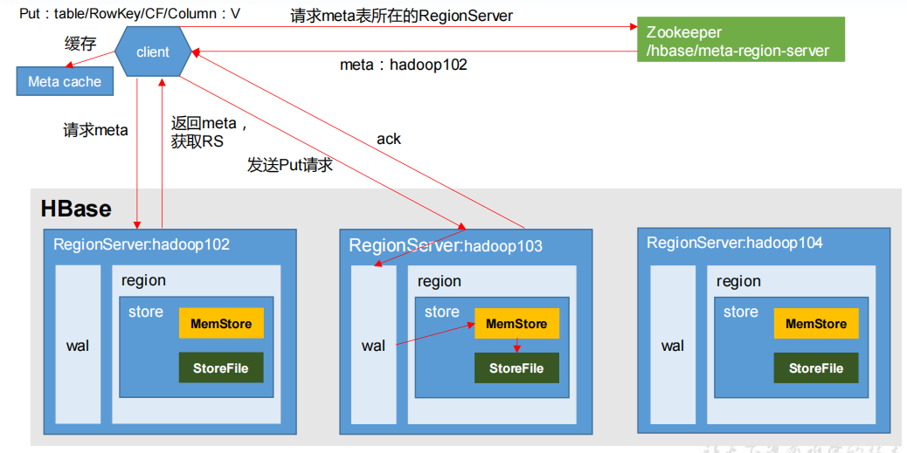

**写流程**

1. Client 先访问 zookeeper，获取 hbase:meta 表位于哪个 Region Server。
2. 访问对应的 Region Server，获取 hbase:meta 表，根据读请求的 namespace:table/rowkey，查询出目标数据位于哪个 Region Server 中的哪个 Region 中。并将该 table 的 region 信息以及 meta 表的位置信息缓存在客户端的 meta cache，方便下次访问。
3. 与目标 Region Server 进行通讯
4. 将数据顺序写入（追加）到 WAL
5. 将数据写入对应的 MemStore，数据会在 MemStore 进行排序；
6. 向客户端发送 ack；
7. 等达到 MemStore 的刷写时机后，将数据刷写到 HFile。


# MemStore Flush

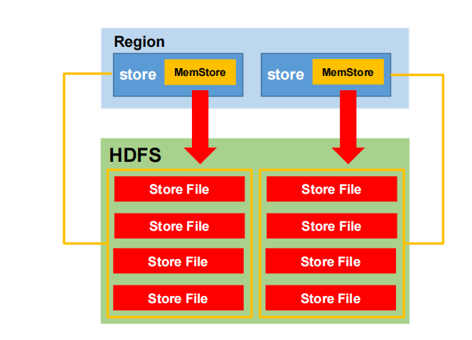

**MemStore 刷写时机**

1. 当某个 memstroe 的大小达到了 **hbase.hregion.memstore.flush.size**（默认值 **128M**）， 其所在 region 的所有 memstore 都会刷写。

   当 memstore 的大小达到了hbase.hregion.memstore.flush.size（默认值128M） ，hbase.hregion.memstore.block.multiplier（默认值4）时，会阻止继续往该 memstore 写数据。

2. .当 region server 中 memstore 的总大小达到java_heapsize*hbase.regionserver.global.memstore.size（默认值0.4），hbase.regionserver.global.memstore.size.lower.limit（默认值0.95），region 会按照其所有 memstore 的大小顺序（由大到小）依次进行刷写。直到 region server中所有 memstore 的总大小减小到上述值以下。

   当 region server 中 memstore 的总大小达到**java_heapsize\*hbase.regionserver.global.memstore.size**（默认值**0.4**）时，会阻止继续往所有的 memstore 写数据

3. 到达自动刷写的时间，也会触发 memstore flush。自动刷新的时间间隔由该属性进行配置 **hbase.regionserver.optionalcacheflushinterval**（默认 **1** **小时）**

# 读流程

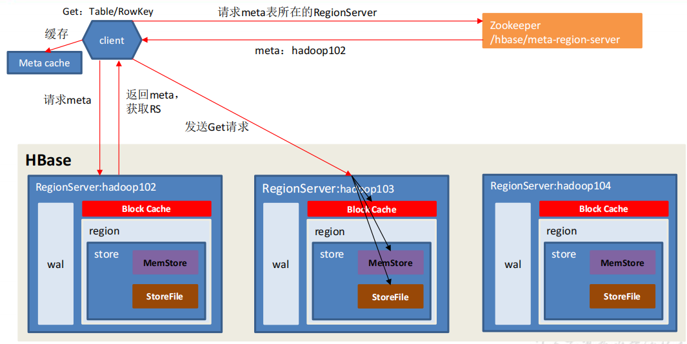

**读流程**

1. Client 先访问 zookeeper，获取 hbase:meta 表位于哪个 Region Server。
2. 访问对应的 Region Server，获取 hbase:meta 表，根据读请求的 namespace:table/rowkey，查询出目标数据位于哪个 Region Server 中的哪个 Region 中。并将该 table 的 region 信息以及 meta 表的位置信息缓存在客户端的 meta cache，方便下次访问。
3. 与目标 Region Server 进行通讯；
4. 分别在 Block Cache（读缓存），MemStore 和 Store File（HFile）中查询目标数据，并将查到的所有数据进行合并。此处所有数据是指同一条数据的不同版本（time stamp）或者不同的类型（Put/Delete）。
5. 将从文件中查询到的数据块（Block，HFile 数据存储单元，默认大小为 64KB）缓存到Block Cache。
6. 将合并后的最终结果返回给客户端。


# StoreFile Compaction

由于memstore每次刷写都会生成一个新的HFile，且同一个字段的不同版本（timestamp）和不同类型（Put/Delete）有可能会分布在不同的 HFile 中，因此查询时需要遍历所有的 HFile。为了减少 HFile 的个数，以及清理掉过期和删除的数据，会进行 StoreFile Compaction。

Compaction 分为两种，分别是 Minor Compaction 和 Major Compaction。Minor Compaction会将临近的若干个较小的 HFile 合并成一个较大的 HFile，但**不会**清理过期和删除的数据。Major Compaction 会将一个 Store 下的所有的 HFile 合并成一个大 HFile，并且**会**清理掉过期

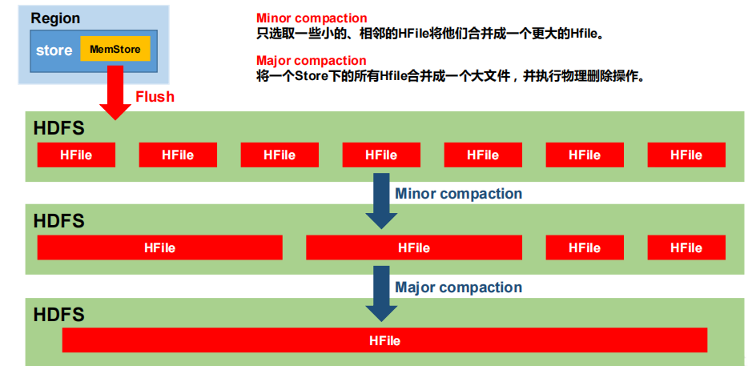


# Region Split

默认情况下，每个 Table 起初只有一个 Region，随着数据的不断写入，Region 会自动进行拆分。刚拆分时，两个子 Region 都位于当前的 Region Server，但处于负载均衡的考虑，HMaster 有可能会将某个 Region 转移给其他的 Region Server。

**Region Split 时机**

1. 当1个region中的某个Store下所有StoreFile的总大小超过hbase.hregion.max.filesize， 该 Region 就会进行拆分（0.94 版本之前）
2. 当 1 个 region 中 的 某 个 Store 下所有 StoreFile 的 总 大 小 超 过 Min(R^2 * "hbase.hregion.memstore.flush.size",hbase.hregion.max.filesize")，该 Region 就会进行拆分，其中 R 为当前 Region Server 中属于该 Table 的个数（0.94 版本之后）

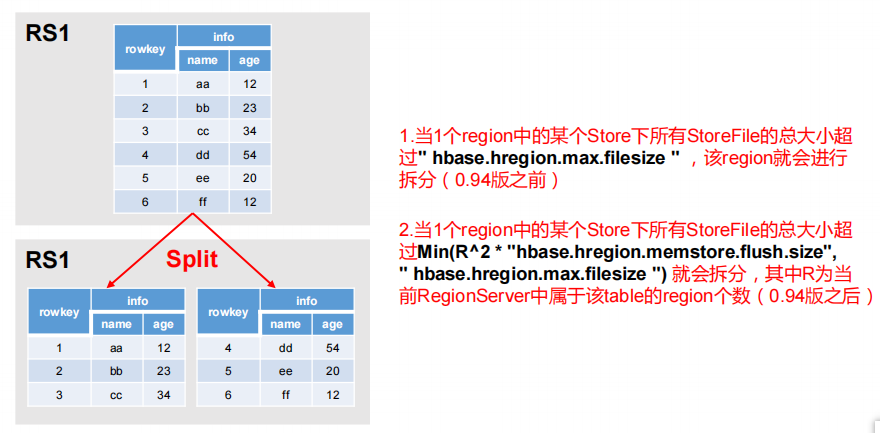


# MapReduce

通过 HBase 的相关 JavaAPI，我们可以实现伴随 HBase 操作的 MapReduce 过程，比如使用MapReduce 将数据从本地文件系统导入到 HBase 的表中，比如我们从 HBase 中读取一些原始数据后使用 MapReduce 做数据分析。

## 官方 HBase-MapReduce

1. 查看HBase的MapReduce任务执行

   ```shell
   bin/hbase mapredcp
   ```

2. 环境变量的导入

   1. 执行环境变量的导入（临时生效，在命令行执行下述操作）

      ```shell
      $ export HBASE_HOME=/opt/module/hbase
      $ export HADOOP_HOME=/opt/module/hadoop-2.7.2
      $ export HADOOP_CLASSPATH=`${HBASE_HOME}/bin/hbase mapredcp`
      ```

   2. 永久生效：在/etc/profile 配置

      ```shell
      export HBASE_HOME=/opt/module/hbase
      export HADOOP_HOME=/opt/module/hadoop-2.7.2
      ```

      **并在 hadoop-env.sh 中配置：（注意：在 for 循环之后配）**

      ```shell
      export HADOOP_CLASSPATH=$HADOOP_CLASSPATH:/opt/module/hbase/lib/*
      ```

      分发重启

   3. 官方案例

      1. 统计 Student 表中有多少行数据

         ```shell
         /opt/module/hadoop-2.7.2/bin/yarn jar lib/hbase-server-1.3.1.jar rowcounter student
         ```

      2. 使用 MapReduce 将本地数据导入到 HBase

         > 在本地创建一个 tsv 格式的文件：fruit.tsv

         ```shell
         1001 Apple Red
         1002 Pear Yellow
         1003 Pineapple Yellow
         ```

         > 创建 Hbase 表

         ```shell
          create 'fruit','info'
         ```

         > 在 HDFS 中创建 input_fruit 文件夹并上传 fruit.tsv 文件

         ```shell
          /opt/module/hadoop-2.7.2/bin/hdfs dfs -mkdir /input_fruit/
          /opt/module/hadoop-2.7.2/bin/hdfs dfs -put fruit.tsv /input_fruit/
         ```

         > 执行 MapReduce 到 HBase 的 fruit 表中

         ```shell
         /opt/module/hadoop-2.7.2/bin/yarn jar lib/hbase-server-1.3.1.jar 
         importtsv \ -Dimporttsv.columns=HBASE_ROW_KEY,info:name,info:color fruit \
         hdfs://hadoop102:9000/input_fruit
         ```

         > 使用 scan 命令查看导入后的结果

         ```shell
         scan 'fruit'
         ```


# 自定义 HBase - MapperReducer（HDFS读取数据存储到HBase中）

1. Mapper编写

   ```java
   public class FruitMapper extends Mapper<LongWritable, Text,LongWritable, Text> {
       @Override
       protected void map(LongWritable key, Text value, Context context) throws IOException, InterruptedException {
           context.write(key,value);
       }
   }
   ```

2. Reducer编写

   ```java
   public class FruitReducer extends TableReducer<LongWritable, Text, NullWritable> {
       @Override
       protected void reduce(LongWritable key, Iterable<Text> values, Context context) throws IOException, InterruptedException {
   
           // 1.遍历 100 Apple   red
           for (Text value: values) {
               String[] fields = value.toString().split("\t");
               Put put = new Put(Bytes.toBytes(fields[0]));
               put.addColumn(Bytes.toBytes("info"),Bytes.toBytes("name"),Bytes.toBytes(fields[1]));
               put.addColumn(Bytes.toBytes("info"),Bytes.toBytes("color"),Bytes.toBytes(fields[2]));
               context.write(NullWritable.get(),put);
           }
       }
   }
   ```

3. Driver编写

   ```java
   public class FruitDriver implements Tool {
   
       Configuration configuration = null;
   
       public int run(String[] args) throws Exception {
           // 1.获取Job对象
           Job job = Job.getInstance(configuration);
   
           // 2. 设置驱动类路径
           job.setJarByClass(FruitDriver.class);
   
           // 3.设置Mapper和Mapper输出的KV类型
           job.setMapperClass(FruitMapper.class);
           job.setMapOutputKeyClass(LongWritable.class);
           job.setMapOutputValueClass(Text.class);
   
           // 4.设置Reducer类
           TableMapReduceUtil.initTableReducerJob(args[1], FruitReducer.class,job);
   
           // 5.设置输入参数
           FileInputFormat.setInputPaths(job, new Path(args[0]));
   
           // 6.提交任务
           boolean res = job.waitForCompletion(true);
   
           return res ? 0 : 1;
       }
   
       public void setConf(Configuration configuration) {
           this.configuration = configuration;
       }
   
       public Configuration getConf() {
           return configuration;
       }
   
       public static void main(String[] args) {
           Configuration conf = new Configuration();
           try {
               int run = ToolRunner.run(conf, new FruitDriver(), args);
               System.exit(run);
           } catch (Exception e) {
               e.printStackTrace();
           }
       }
   }
   ```

4. Package上传Jar包并运行

   ```shell
   yarn jar bigdata_04_hbase-1.0-SNAPSHOT.jar top.damoncai.hbase.c02_customer_hbase_mr.FruitDriver /fruit/fruit.tsv fruit1
   ```

   

# 自定义 HBase - MapperReducer2（HBase读取数据存储到HBase中）

1. Mapper编写

   ```java
   public class FruitMapper extends TableMapper<ImmutableBytesWritable, Put> {
   
       @Override
       protected void map(ImmutableBytesWritable key, Result value, Context context) throws IOException, InterruptedException {
   
           // key就是rowkey
   
           Put put = new Put(key.get());
   
           for (Cell cell : value.rawCells()) {
               put.add(cell);
           }
   
           context.write(key,put);
       }
   }
   ```

2. Reducer编写

   ```java
   public class FruitReducer extends TableReducer<ImmutableBytesWritable, Put, NullWritable> {
       @Override
       protected void reduce(ImmutableBytesWritable key, Iterable<Put> values, Context context) throws IOException, InterruptedException {
   
           // 1.遍历 100 Apple   red
           for (Put put: values) {
               context.write(NullWritable.get(),put);
           }
       }
   }
   ```

3. Driver编写

   ```java
   public class FruitDriver implements Tool {
   
       Configuration configuration = null;
   
       public int run(String[] args) throws Exception {
           //得到 Configuration
           Configuration conf = this.getConf();
           //创建 Job 任务
           Job job = Job.getInstance(conf,
                   this.getClass().getSimpleName());
           job.setJarByClass(FruitDriver.class);
           //配置 Job
           Scan scan = new Scan();
           scan.setCacheBlocks(false);
           scan.setCaching(500);
           //设置 Mapper，注意导入的是 mapreduce 包下的，不是 mapred 包下的，后者 是老版本
           TableMapReduceUtil.initTableMapperJob(
                   args[0], //数据源的表名
                   scan, //scan 扫描控制器
                   FruitMapper.class,//设置 Mapper 类
                   ImmutableBytesWritable.class,//设置 Mapper 输出 key 类型
                   Put.class,//设置 Mapper 输出 value 值类型
                   job//设置给哪个 JOB
           );
           //设置 Reducer
           TableMapReduceUtil.initTableReducerJob(args[1],
                   FruitReducer.class, job);
           //设置 Reduce 数量，最少 1 个
           job.setNumReduceTasks(1);
           boolean isSuccess = job.waitForCompletion(true);
           if(!isSuccess){
               throw new IOException("Job running with error");
           }
           return isSuccess ? 0 : 1;
       }
   
       public void setConf(Configuration configuration) {
           this.configuration = configuration;
       }
   
       public Configuration getConf() {
           return configuration;
       }
   
       public static void main(String[] args) {
           Configuration conf = new Configuration();
           try {
               int run = ToolRunner.run(conf, new FruitDriver(), args);
               System.exit(run);
           } catch (Exception e) {
               e.printStackTrace();
           }
       }
   }
   
   ```

4. Package上传Jar包并运行

   ```shell
   yarn jar bigdata_04_hbase-1.0-SNAPSHOT.jar top.damoncai.hbase.c03_customer_hbase_mr2.FruitDriver fruit1 fruit2
   ```

   

# HBase MR 本地执行

1. Configuration使用HBase创建

   ```java
   public static void main(String[] args) {
       //        Configuration conf = new Configuration();
       Configuration conf = HBaseConfiguration.create();
       try {
           int run = ToolRunner.run(conf, new FruitDriver(), args);
           System.exit(run);
       } catch (Exception e) {
           e.printStackTrace();
       }
   }
   ```

2. 通过源码发现需要加载hbase-site.xm文件

   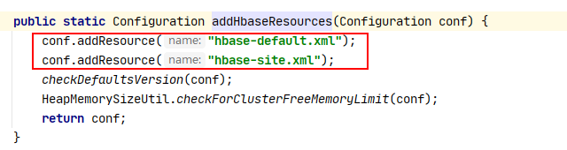

3. 在resources文件夹中添加hbase-site.xml文件


# HBase与Hive集成

## 对比

1. Hive

   Hive 的本质其实就相当于将 HDFS 中已经存储的文件在 Mysql 中做了一个双射关系,以方便使用 HQL 去管理查询。

   用于数据分析、清洗(Hive 适用于离线的数据分析和清洗，延迟较高)

   基于 HDFS、MapReduce,Hive 存储的数据依旧在 DataNode 上，编写的 HQL 语句终将是转换为 MapReduce 代码执行

2. HBase

   数据库 - 是一种面向列族存储的非关系型数据库

   用于存储结构化和非结构化的数据，适用于单表非关系型数据的存储，不适合做关联查询，类似 JOIN 等操作。

   基于 HDFS，数据持久化存储的体现形式是 HFile，存放于 DataNode 中，被 ResionServer 以 region 的形式进行管理。

   延迟较低，接入在线业务使用，面对大量的企业数据，HBase 可以直线单表大量数据的存储，同时提供了高效的数据访问速度

## HBase与Hive集成使用

**HBase 与 Hive 的集成在最新的两个版本中无法兼容。所以需要重新编译**

### 环境

因为我们后续可能会在操作 Hive 的同时对 HBase 也会产生影响，所以 Hive 需要持有操作HBase 的 Jar，那么接下来拷贝 Hive 所依赖的 Jar 包（或者使用软连接的形式）。

```shell
[root@ha01 hbase-1.3.1]# export HBASE_HOME=/opt/module/hbase-1.3.1
[root@ha01 hbase-1.3.1]# export HBASE_HOME=/opt/module/hive-3.1.2

ln -s $HBASE_HOME/lib/hbase-common-1.3.1.jar $HIVE_HOME/lib/hbase-common-1.3.1.jar
ln -s $HBASE_HOME/lib/hbase-server-1.3.1.jar $HIVE_HOME/lib/hbase-server-1.3.1.jar
ln -s $HBASE_HOME/lib/hbase-client-1.3.1.jar $HIVE_HOME/lib/hbase-client-1.3.1.jar
ln -s $HBASE_HOME/lib/hbase-protocol-1.3.1.jar $HIVE_HOME/lib/hbase-protocol-1.3.1.jar
ln -s $HBASE_HOME/lib/hbase-it-1.3.1.jar $HIVE_HOME/lib/hbase-it-1.3.1.jar
ln -s $HBASE_HOME/lib/htrace-core-3.1.0-incubating.jar $HIVE_HOME/lib/htrace-core-3.1.0-incubating.jar
ln -s $HBASE_HOME/lib/hbase-hadoop2-compat-1.3.1.jar $HIVE_HOME/lib/hbase-hadoop2-compat-1.3.1.jar
ln -s $HBASE_HOME/lib/hbase-hadoop-compat-1.3.1.jar $HIVE_HOME/lib/hbase-hadoop-compat-1.3.1.jar
```

同时在 hive-site.xml 中修改 zookeeper 的属性，如下：

```xml
<property> 
	<name>hive.zookeeper.quorum</name>
 	<value>ha01.prdigital.cn,ha02.prdigital.cn,ha03.prdigital.cn</value>
 	<description>The list of ZooKeeper servers to talk to. This is only needed for read/write locks.</description>
</property>
<property>
 	<name>hive.zookeeper.client.port</name>
 	<value>2181</value>
 	<description>The port of ZooKeeper servers to talk to. This is only needed for read/write locks.</description>
</property>
```


## 案例一

**建立 Hive 表，关联 HBase 表，插入数据到 Hive 表的同时能够影响 HBase 表**

1. 在 Hive 中创建表同时关联 HBase

   ```shell
   CREATE TABLE hive_hbase_emp_table(
   empno int,
   ename string,
   job string,
   mgr int,
   hiredate string,
   sal double,
   comm double,
   deptno int)
   STORED BY 'org.apache.hadoop.hive.hbase.HBaseStorageHandler'
   WITH SERDEPROPERTIES ("hbase.columns.mapping" = ":key,info:ename,info:job,info:mgr,info:hiredate,info:sal,info:co
   mm,info:deptno")
   TBLPROPERTIES ("hbase.table.name" = "hbase_emp_table");
   ```

   **完成之后，可以分别进入 Hive 和 HBase 查看，都生成了对应的表**

2. 在 Hive 中创建临时中间表，用于 load 文件中的数据

   ```shell
   CREATE TABLE emp(
   empno int,
   ename string,
   job string,
   mgr int,
   hiredate string,
   sal double,
   comm double,
   deptno int)
   row format delimited fields terminated by '\t';
   ```

3. 向 Hive 中间表中 load 数据

   ```shell
   load data local inpath '/home/admin/softwares/data/emp.txt' into table emp;
   ```

4. 通过 insert 命令将中间表中的数据导入到 Hive 关联 Hbase 的那张表中

   ```shell
   insert into table hive_hbase_emp_table select * from emp;
   ```

5. 查看 Hive 以及关联的 HBase 表中是否已经成功的同步插入了数据

   ```shell
   select * from hive_hbase_emp_table;
   
   scan ‘hbase_emp_table’
   ```

## 案例二

在 HBase 中已经存储了某一张表 hbase_emp_table，然后在 Hive 中创建一个外部表来关联 HBase 中的 hbase_emp_table 这张表，使之可以借助 Hive 来分析 HBase 这张表中的数据。

1. 在 Hive 中创建外部表

   ```shell
   CREATE EXTERNAL TABLE relevance_hbase_emp(
   empno int,
   ename string,
   job string,
   mgr int,
   hiredate string,
   sal double,
   comm double,
   deptno int)
   STORED BY 
   'org.apache.hadoop.hive.hbase.HBaseStorageHandler'
   WITH SERDEPROPERTIES ("hbase.columns.mapping" = 
   ":key,info:ename,info:job,info:mgr,info:hiredate,info:sal,info:co
   mm,info:deptno")
   TBLPROPERTIES ("hbase.table.name" = "hbase_emp_table");
   ```

2. 关联后就可以使用 Hive 函数进行一些分析操作了

   ```shell
   hive (default)> select * from relevance_hbase_emp;
   ```

   

# HBase高可用

1. 关闭HBase

   ```shell
   bin/stop-hbase.sh
   ```

2. 在conf目录下创建backup-masters文件

   ```shell
   touch conf/backup-masters
   
   ha01.prdigital.cn
   ha02.prdigital.cn
   ha03.prdigital.cn
   ```

3. 将整个conf目录scp到其他节点

   ```shell
   xsync ../conf/
   ```

4. 分别打开ha01,ha02,ha03 Web界面

   http://ha01.prdigital.cn:16010/master-status

   http://ha02.prdigital.cn:16010/master-status

   http://ha03.prdigital.cn:16010/master-status

   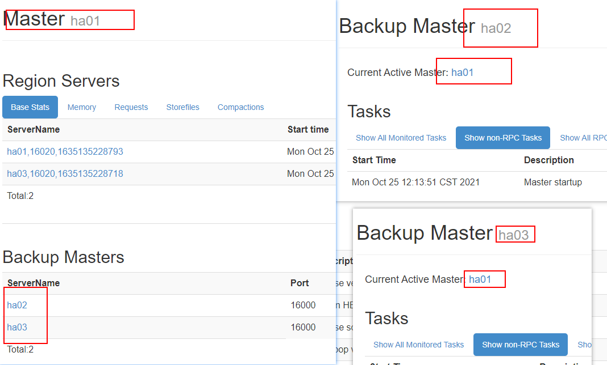


# 预分区

每一个 region 维护着 StartRow 与 EndRow，如果加入的数据符合某个 Region 维护的RowKey 范围，则该数据交给这个 Region 维护。那么依照这个原则，我们可以将数据所要投放的分区提前大致的规划好，以提高 HBase 性能。

1. 手动设定预分区

   ```shell
   create 'staff1','info','partition1',SPLITS => ['1000','2000','3000','4000']
   ```

2. 生成 16 进制序列预分区

   ```shell
   create 'staff2','info','partition2',{NUMREGIONS => 15, SPLITALGO => 'HexStringSplit'}
   ```

3. 按照文件中设置的规则预分区

   创建 splits.txt 文件内容如下：

   ```shell
   aaaa
   bbbb
   cccc
   dddd
   ```

   然后执行：

   ```shell
   create 'staff3','partition3',SPLITS_FILE => 'splits.txt'
   ```

4. 使用 JavaAPI 创建预分区

   ```shell
   //自定义算法，产生一系列 hash 散列值存储在二维数组中
   byte[][] splitKeys = 某个散列值函数
   //创建 HbaseAdmin 实例
   HBaseAdmin hAdmin = new HBaseAdmin(HbaseConfiguration.create());
   //创建 HTableDescriptor 实例
   HTableDescriptor tableDesc = new HTableDescriptor(tableName);
   //通过 HTableDescriptor 实例和散列值二维数组创建带有预分区的 Hbase 表
   hAdmin.createTable(tableDesc, splitKeys);
   ```

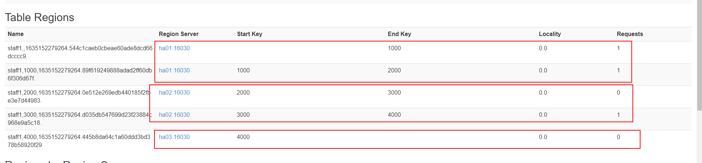

**预分区的设置往往由服务器数量和数据量大小决定**

1. 一台服务器一般 2~3个预分区
2. 数据量最好每个分区不超过10G,因为超过会自动拆分


# RowKey设计

一条数据的唯一标识就是 RowKey，那么这条数据存储于哪个分区，取决于 RowKey 处于哪个一个预分区的区间内，设计 RowKey 的主要目的 ，就是让数据均匀的分布于所有的region 中，在一定程度上防止数据倾斜。接下来我们就谈一谈 RowKey 常用的设计方案。


**需要结合自身业务无设计**


# 优化

## 内存优化

HBase 操作过程中需要大量的内存开销，毕竟 Table 是可以缓存在内存中的，一般会分配整个可用内存的 70%给 HBase 的 Java 堆。但是不建议分配非常大的堆内存，因为 GC 过程持续太久会导致 RegionServer 处于长期不可用状态，一般 16~48G 内存就可以了，如果因为框架占用内存过高导致系统内存不足，框架一样会被系统服务拖死。

## 基础优化

1. 允许在 HDFS 的文件中追加内容

   hdfs-site.xml、hbase-site.xml

   ```shell
   属性：dfs.support.append
   解释：开启 HDFS 追加同步，可以优秀的配合 HBase 的数据同步和持久化。默认值为 true。
   ```

2. 优化 DataNode 允许的最大文件打开数

   hdfs-site.xml

   ```shell
   属性：dfs.datanode.max.transfer.threads
   解释：HBase 一般都会同一时间操作大量的文件，根据集群的数量和规模以及数据动作，设置为 4096 或者更高。默认值：4096
   ```

3. 优化延迟高的数据操作的等待时间

   hdfs-site.xml

   ```shell
   属性：dfs.image.transfer.timeout
   解释：如果对于某一次数据操作来讲，延迟非常高，socket 需要等待更长的时间，建议把该值设置为更大的值（默认 60000 毫秒），以确保 socket 不会被 timeout 掉。
   ```

4. 优化数据的写入效率

   mapred-site.xml

   ```shell
   属性：mapreduce.map.output.compress
   	 mapreduce.map.output.compress.codec
   解释：开启这两个数据可以大大提高文件的写入效率，减少写入时间。第一个属性值修改为true，第二个属性值修改为：org.apache.hadoop.io.compress.GzipCodec 或者其他压缩方式
   ```

5. 优化 HStore 文件大小

   ```shell
   属性：hbase.hregion.max.filesize
   解释：默认值 10737418240（10GB），如果需要运行 HBase 的 MR 任务，可以减小此值，因为一个 region 对应一个 map 任务，如果单个 region 过大，会导致 map 任务执行时间过长。该值的意思就是，如果 HFile 的大小达到这个数值，则这个 region 会被切分为两个 Hfile。
   ```

6. 设置 RPC 监听数量

   hbase-site.xml

   ```shell
   属性：Hbase.regionserver.handler.count
   解释：默认值为 30，用于指定 RPC 监听的数量，可以根据客户端的请求数进行调整，读写请求较多时，增加此值。
   ```

7. 优化 HBase 客户端缓存

   hbase-site.xml

   ```shell
   属性：hbase.client.write.buffer
   解释：用于指定 Hbase 客户端缓存，增大该值可以减少 RPC 调用次数，但是会消耗更多内
   存，反之则反之。一般我们需要设定一定的缓存大小，以达到减少 RPC 次数的目的。
   ```

8. 指定 scan.next 扫描 HBase 所获取的行数

   hbase-site.xml

   ```shell
   属性：hbase.client.scanner.caching
   解释：用于指定 scan.next 方法获取的默认行数，值越大，消耗内存越大。
   ```

9. flush、compact、split 机制

   当 MemStore 达到阈值，将 Memstore 中的数据 Flush 进 Storefile；compact 机制则是把 flush出来的小文件合并成大的 Storefile 文件。split 则是当 Region 达到阈值，会把过大的 Region一分为二。

   **涉及属性：**

   即：128M 就是 Memstore 的默认阈值

   ```shell
   hbase.hregion.memstore.flush.size：134217728
   ```

   即：这个参数的作用是当单个 HRegion 内所有的 Memstore 大小总和超过指定值时，flush该 HRegion 的所有 memstore。RegionServer 的 flush 是通过将请求添加一个队列，模拟生产消费模型来异步处理的。那这里就有一个问题，当队列来不及消费，产生大量积压请求时，可能会导致内存陡增，最坏的情况是触发 OOM。 

   ```shell
   hbase.regionserver.global.memstore.upperLimit：0.4
   hbase.regionserver.global.memstore.lowerLimit：0.38
   ```
```
   
   即：当 MemStore 使用内存总量达到hbase.regionserver.global.memstore.upperLimit 指定值时，将会有多个 MemStores flush 到文件中，MemStore flush 顺序是按照大小降序执行的，直到刷新到 MemStore 使用内存略小于 lowerLimit
```