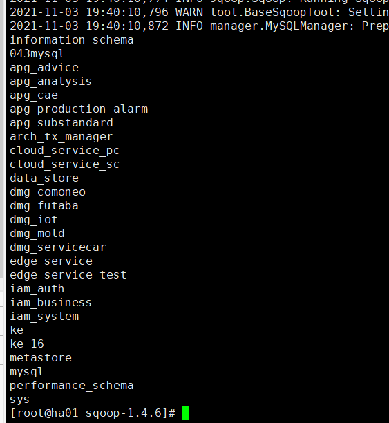

# Sqoop简介

Sqoop是一款开源的工具，主要用于在Hadoop(Hive)与传统的数据库(mysql、postgresql...)间进行数据的传递，可以将一个关系型数据库（例如 ： MySQL ,Oracle ,Postgres等）中的数据导进到Hadoop的HDFS中，也可以将HDFS的数据导进到关系型数据库中。

Sqoop项目开始于2009年，最早是作为Hadoop的一个第三方模块存在，后来为了让使用者能够快速部署，也为了让开发人员能够更快速的迭代开发，Sqoop独立成为一个[Apache](https://baike.baidu.com/item/Apache/6265)项目。

Sqoop2的最新版本是1.99.7。请注意，2与1不兼容，且特征不完整，它并不打算用于生产部署。

# Sqoop原理

将导入或导出命令翻译成mapreduce程序来实现

在翻译出的mapreduce中主要是对inputformat和outputformat进行定制

# Sqoop安装

1. 上传解压安装包

2. 重命名配置文件

   ```shell
   mv sqoop-env-template.sh sqoop-env.sh
   ```

3. 修改配置文件

   ```shell
   export HADOOP_COMMON_HOME=/opt/module/hadoop-3.1.3
   export HADOOP_MAPRED_HOME=/opt/module/hadoop-3.1.3
   export HIVE_HOME=/opt/module/hive-3.1.2
   export ZOOKEEPER_HOME=/opt/module/zookeeper
   export ZOOCFGDIR=/opt/module/zookeeper
   export HBASE_HOME=/opt/module/hbase-1.3.1
   ```

4. 拷贝JDBC驱动

   ```shell
   cp mysql-connector-java-5.1.27-bin.jar /opt/module/sqoop-1.4.6.bin__hadoop-2.0.4-alpha/lib/
   ```

5. 验证Sqoop

   ```shell
   bin/sqoop help
   ```

6. 测试Sqoop连接数据库

   ```shell
   bin/sqoop list-databases --connect jdbc:mysql://192.168.111.10:3306/ --username root --password prinfo
   ```

   

**列出数据库**

# 案例

## MySQL到HDFS

1. MysSQL上创建表和导入数据

   ```shell
   create database company;
   
   create table company.staff(id int(4) primary key not null auto_increment, name varchar(255), sex varchar(255));
   
   insert into company.staff(name, sex) values('Thomas', 'Male');
   insert into company.staff(name, sex) values('Catalina', 'FeMale');
   ```

2. 全部导入

   ```shell
   bin/sqoop import \
   --connect jdbc:mysql://192.168.111.10:3306/company \
   --username root \
   --password prinfo \
   --table staff \
   --target-dir /user/company \
   --delete-target-dir \
   --num-mappers 1 \
   --fields-terminated-by "\t"
   ```

3. 查询导入

   ```shell
   bin/sqoop import \
   --connect jdbc:mysql://192.168.111.10:3306/company \
   --username root \
   --password prinfo \
   --target-dir /user/company2 \
   --delete-target-dir \
   --num-mappers 1 \
   --fields-terminated-by "\t" \
   --query 'select name,sex from staff where id <=1 and $CONDITIONS;'
   ```

   **提示：must contain '$CONDITIONS' in WHERE clause.**

   **如果query后使用的是双引号，则$CONDITIONS前必须加转移符，防止shell识别为自己的变量。**

4. 导入指定列

   ```shell
   bin/sqoop import \
   --connect jdbc:mysql://192.168.111.10:3306/company \
   --username root \
   --password prinfo \
   --target-dir /user/company3 \
   --delete-target-dir \
   --num-mappers 1 \
   --fields-terminated-by "\t" \
   --columns id,sex \
   --table staff
   ```

   **提示：columns中如果涉及到多列，用逗号分隔，分隔时不要添加空格**

5. 使用sqoop关键字筛选查询导入数据

   ```shell
    bin/sqoop import \
   --connect jdbc:mysql://192.168.111.10:3306/company \
   --username root \
   --password prinfo \
   --target-dir /user/company4 \
   --delete-target-dir \
   --num-mappers 1 \
   --fields-terminated-by "\t" \
   --table staff \
   --where "id=1"
   ```

   

## MySQL到Hive

```shell
bin/sqoop import \
--connect jdbc:mysql://192.168.111.10:3306/company \
--username root \
--password prinfo \
--table staff \
--num-mappers 1 \
--hive-import \
--fields-terminated-by "\t" \
--hive-overwrite \
--hive-table staff_hive
```

**提示：该过程分为两步，第一步将数据导入到HDFS，第二步将导入到HDFS的数据迁移到Hive仓库，第一步默认的临时目录是/user/atguigu/表名**

## MySQL到HBase

```shell
bin/sqoop import \
--connect jdbc:mysql://192.168.111.10:3306/company \
--username root \
--password prinfo \
--table company \
--columns "id,name,sex" \
--column-family "info" \
--hbase-create-table \
--hbase-row-key "id" \
--hbase-table "hbase_company" \
--num-mappers 1 \
--split-by id
```

**提示：sqoop1.4.6只支持HBase1.0.1之前的版本的自动创建HBase表的功能**

**解决方案手动创建表**

# 数据导出

## HIVE/HDFS到MySQL

```shell
bin/sqoop export \
--connect jdbc:mysql://192.168.111.10:3306/company \
--username root \
--password prinfo \
--table staff \
--num-mappers 1 \
--export-dir /user/hive/warehouse/staff_hive \
--input-fields-terminated-by "\t"
```

**提示：Mysql中如果表不存在，不会自动创建**

# 打包脚本

使用opt格式的文件打包sqoop命令，然后执行

1. 创建一个.opt文件

   ```shell
   mkdir opt
   touch opt/job_HDFS2RDBMS.opt
   ```

2. 编写sqoop脚本

   ```shell
   export
   --connect
   jdbc:mysql://192.168.111.10:3306/company
   --username
   root
   --password
   prinfo
   --table
   staff
   --num-mappers
   1
   --export-dir
   /user/company
   --input-fields-terminated-by
   "\t"
   ```

3. 执行脚本

   ```shell
   bin/sqoop --options-file opt/job_HDFS2RDBMS.opt
   ```

# Sqoop常见命令和参数

