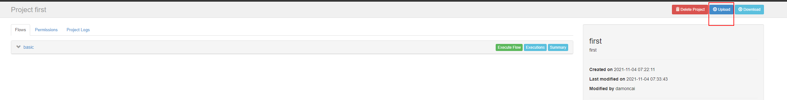
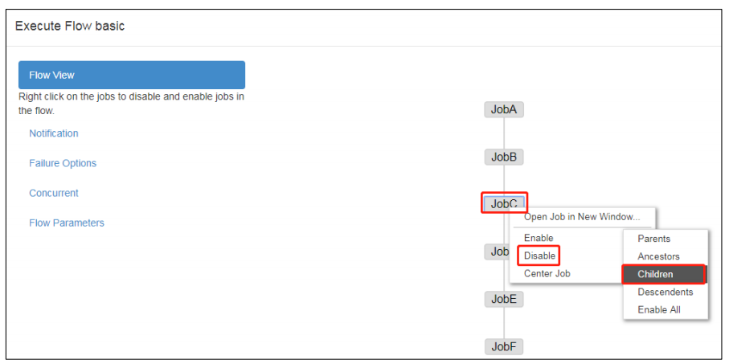
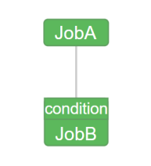
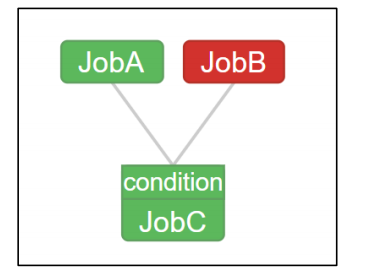
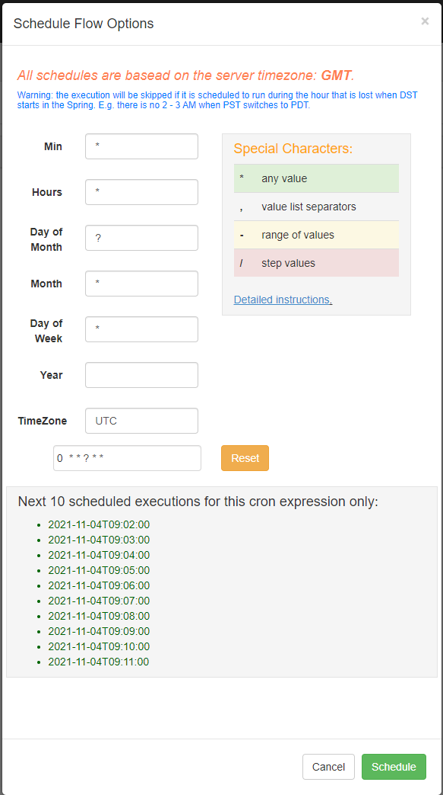

# 安装

1. 上传解压tar包 azkaban-db-3.84.4.tar.gz，azkaban-exec-server-3.84.4.tar.gz，azkaban-web-server-3.84.4.tar.gz 

2.  配置MySQL

   1. 创建数据库

      ```sql
      create database azkaban;
      ```

   2. 创建azkaban用户(使用root也可)

      1. 设置密码有效长度 4 位及以上

         ```sql
         set global validate_password_length=4;
         ```

      2. 设置密码策略最低级别

         ```sql
         set global validate_password_policy=0;
         ```

      3. 创建 Azkaban 用户，任何主机都可以访问 Azkaban，密码是 000000

         ```sql
         CREATE USER 'azkaban'@'%' IDENTIFIED BY '000000';
         ```

      4. 赋予 Azkaban 用户增删改查权限

         ```sql
         GRANT SELECT,INSERT,UPDATE,DELETE ON azkaban.* to 'azkaban'@'%' WITH GRANT OPTION;
         ```

      5. 创建 Azkaban 表，完成后退出 MySQL

         ```sql
         use azkaban;
         
         source /opt/module/azkaban/azkaban-db-3.84.4/create-all-sql-3.84.4.sql
         ```

   3. 更改 MySQL 包大小；防止 Azkaban 连接 MySQL 阻塞

      ```shell
      [mysqld]
      max_allowed_packet=1024M
      ```

   4. 重启MySQL

      ```shell
      sudo systemctl restart mysqld
      ```

3. 配置Executor Server

   **Azkaban Executor Server 处理工作流和作业的实际执行**

   1. 编辑 azkaban.properties

      ```shell
      #...
      default.timezone.id=Asia/Shanghai
      #...
      azkaban.webserver.url=http://ha01.prdigital.cn:8081
      executor.port=12321
      #...
      database.type=mysql
      mysql.port=3306
      mysql.host=192.168.111.10
      mysql.database=azkaban
      mysql.user=root
      mysql.password=prinfo
      mysql.numconnections=100
      ```

4. 同步 azkaban-exec 到所有节点

   ```shell
   xsync /opt/module/azkaban/azkaban-exec
   ```

5. **必须进入到/opt/module/azkaban/azkaban-exec 路径**，分别在三台机器上，启动 executor server

   ```shell
    bin/start-exec.sh
   ```

   **注意：如果在/opt/module/azkaban/azkaban-exec 目录下出现 executor.port 文件，说明启动成功**

6. 下面激活 executor，需要

   ```shell
   curl -G "ha01.prdigital.cn:12321/executor?action=activate" && echo
   curl -G "ha02.prdigital.cn:12321/executor?action=activate" && echo
   curl -G "ha03.prdigital.cn:12321/executor?action=activate" && echo
   ```

   **如果三台机器都出现如下提示，则表示激活成功**

7. 配置 Web Server

   1. 编辑 azkaban.properties

      ```shell
      default.timezone.id=Asia/Shanghai
      ...
      database.type=mysql
      mysql.port=3306
      mysql.host=192.168.111.10
      mysql.database=azkaban
      mysql.user=root
      mysql.password=prinfo
      mysql.numconnections=100
      ...
      azkaban.executorselector.filters=StaticRemainingFlowSize,CpuStatus
      ```

      **说明：**

      \#StaticRemainingFlowSize：正在排队的任务数；

      \#CpuStatus：CPU 占用情况

      #MinimumFreeMemory：内存占用情况。测试环境，必须将 MinimumFreeMemory 删除掉，否则它会认为集群资源不够，不执行。

   2. 修改 azkaban-users.xml 文件，添加 atguigu 用户

      ```xml
      <azkaban-users>
       <user groups="azkaban" password="azkaban" roles="admin" username="azkaban"/>
       <user password="metrics" roles="metrics" username="metrics"/>
       <user password="damoncai" roles="admin" username="damoncai"/>
       <role name="admin" permissions="ADMIN"/>
       <role name="metrics" permissions="METRICS"/>
      </azkaban-users>
      ```

   3. 必须进入到 hadoop102 的/opt/module/azkaban/azkaban-web 路径，启动 web server

      ```shell
      bin/start-web.sh
      ```

   4. 访问 http://ha01.prdigital.cn:8081,并用 atguigu 用户登陆

   

# 案例

## Hello World 案例

1. 新建 azkaban.project

   ```shell
   azkaban-flow-version: 2.0
   ```

2. 新建 basic.flow 文件，内容如下

   ```yaml
   nodes:
    - name: jobC
      type: command
      # jobC 依赖 JobA 和 JobB
      dependsOn:
      - jobA
      - jobB
      config:
      	command: echo "I’m JobC"
    - name: jobA
      type: command
      config:
      	command: echo "I’m JobA"
    - name: jobB
      type: command
      config:
      	command: echo "I’m JobB"
   ```

3. 将文件打包上传

   

4. 执行任务

   

## 自动失败重试

```yaml
nodes:
  - name: JobA
    type: command
    config:
      command: sh /not_exists.sh
      retries: 3
      retry.backoff: 10000
```

**retries：重试次数**

**retry.backoff：重试的时间间隔**

**也可以在 Flow 全局配置中添加任务失败重试配置，此时重试配置会应用到所有 Job。**

```yaml
config:
  retries: 3
  retry.backoff: 10000
nodes:
  - name: JobA
    type: command
    config:
      command: sh /not_exists.sh
```

## 手动失败重试

### 方案一



**将出错之前的job置为disabled，然后执行**

### 方案二

在history中找到失败的flow重新执行

​	

# JavaProcessor

JavaProcess 类型可以运行一个自定义主类方法，type 类型为 javaprocess，可用的配置为：

Xms：最小堆

Xmx：最大堆

classpath：类路径

java.class：要运行的 Java 对象，其中必须包含 Main 方法

main.args：main 方法的参数

## 案例

1. 编写测试类

   ```java
   public class Test {
   
       public static void main(String[] args) {
           System.out.println("JavaProcess Test~~~");
       }
   }
   ```

2. 配置flow文件

   ```yaml
   nodes:
     - name: JavaProcessTest
       type: javaprocess
       config:
         Xms: 96M
         Xmx: 200M
         java.class: top.damoncai.azkaban.javaprocess.Test
   ```

3. 将project、flow和jar包放在一起上传


# 条件工作流

条件工作流功能允许用户自定义执行条件来决定是否运行某些Job。条件可以由当前Job的父 Job 输出的运行时参数构成，也可以使用预定义宏。在这些条件下，用户可以在确定 Job执行逻辑时获得更大的灵活性，例如，只要父 Job 之一成功，就可以运行当前 Job。

## 运行时参数案例

### 基本原理

- 父 Job 将参数写入 JOB_OUTPUT_PROP_FILE 环境变量所指向的文件

- 子 Job 使用 ${jobName:param}来获取父 Job 输出的参数并定义执行条件

### 支持的条件运算符

- == 等于

- != 不等于

- \>大于

- \>= 大于等于
- < 小于

- <= 小于等于

- && 与 

- || 或 

- ! 非 

### 案例

**需求：**

JobA 执行一个 shell 脚本。

JobB 执行一个 shell 脚本，但 JobB 不需要每天都执行，而只需要每个周一执行。

1. 新建 JobA.sh

   ```shell
   #!/bin/bash
   echo "do JobA"
   wk=`date +%w`
   echo "{\"wk\":$wk}" > $JOB_OUTPUT_PROP_FILE
   ```

2. 新建 JobB.sh

   ```shell
   #!/bin/bash
   echo "do JobB"
   ```

3. 新建 condition.flow

   ```yaml
   nodes:
     - name: JobA
       type: command
       config:
       command: sh JobA.sh
     - name: JobB
       type: command
       dependsOn:
         - JobA
       config:
         command: sh JobB.sh
       condition: ${JobA:wk} == 1
   ```

4. 将 JobA.sh、JobB.sh、condition.flow 和 azkaban.project 打包成 condition.zip

5. 创建 condition 项目=》上传 condition.zip 文件=》执行作业=》观察结果

6. 按照我们设定的条件，JobB 会根据当日日期决定是否执行。



## 预定义宏案例

Azkaban 中预置了几个特殊的判断条件，称为预定义宏

预定义宏会根据所有父 Job 的完成情况进行判断，再决定是否执行。可用的预定义宏如下：

- all_success: 表示父 Job 全部成功才执行(默认) 

- all_done：表示父 Job 全部完成才执行
- all_failed：表示父 Job 全部失败才执行
- one_success：表示父 Job 至少一个成功才执行
- one_failed：表示父 Job 至少一个失败才执行

**需求：**

JobA 执行一个 shell 脚本

JobB 执行一个 shell 脚本

JobC 执行一个 shell 脚本，要求 JobA、JobB 中有一个成功即可执行

1. 新建 JobA.sh

   ```shell
   #!/bin/bash
   echo "do JobA"
   ```

2. 新建 JobC.sh

   ```shell
   #!/bin/bash
   echo "do JobC"
   ```

3. 新建 macro.flow

   ```
   nodes:
     - name: JobA
       type: command
       config:
         command: sh JobA.sh
     - name: JobB
       type: command
       config:
         command: sh JobB.sh
     - name: JobC
       type: command
       dependsOn:
         - JobA
         - JobB
       config:
         command: sh JobC.sh
       condition: one_success
   ```

4. JobA.sh、JobC.sh、macro.flow、azkaban.project 文件，打包成 macro.zip。注意：没有 JobB.sh。 

5. 创建 macro 项目=》上传 macro.zip 文件=》执行作业=》观察结果



# 定时调度



# 报警配置

## 邮箱

## 手机

#  Azkaban多Executor模式注意事项

Azkaban 多 Executor 模式是指，在集群中多个节点部署 Executor。在这种模式下，Azkaban web Server 会根据策略，选取其中一个 Executor 去执行任务

为确保所选的 Executor 能够准确的执行任务，我们须在以下两种方案任选其一，推荐使用方案二。

## 方案一

1. 在 MySQL 中 azkaban 数据库 executors 表中，查询 hadoop102 上的 Executor 的 id
2. 在执行工作流程时加入 useExecutor 属性，如下

## 方案二

在 Executor 所在所有节点部署任务所需脚本和应用