# Scala简介

## Scala和Java关系

一般来说，学 Scala 的人，都会 Java，而 Scala 是基于 Java 的，因此我们需要将 Scala和 Java 以及 JVM 之间的关系搞清楚，否则学习 Scala 你会蒙圈。

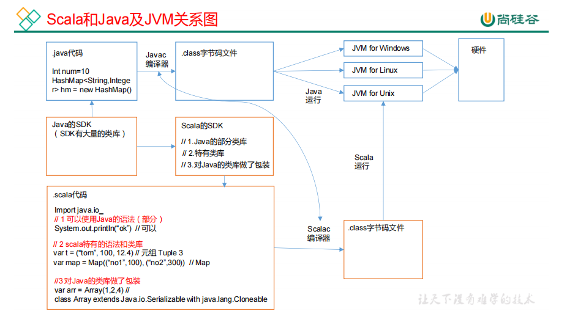

## Scala语言特点

Scala是一门以Java虚拟机（JVM）为运行环境并将面向对象和函数式编程的最佳特性结合在一起的静态类型编程语言（静态语言需要提前编译的如：Java、c、c++等，动态语言如：js）。 

1. Scala是一门多范式的编程语言，Scala支持面向对象和函数式编程。（多范式，就是多种编程方法的意思。有面向过程、面向对象、泛型、函数式四种程序设计方法。） 
2. Scala源代码（.scala）会被编译成Java字节码（.class），然后运行于JVM之上，并可以调用现有的Java类库，实现两种语言的无缝对接。
3. Scala单作为一门语言来看，非常的简洁高效**。**
4. Scala在设计时，马丁·奥德斯基是参考了Java的设计思想，可以说Scala是源于Java，同时马丁·奥德斯基也加入了自己的思想，将函数式编程语言的特点融合到JAVA中, 因此，对于学习过Java的同学，只要在学习Scala的过程中，搞清楚Scala和Java相同点和不同点，就可以快速的掌握Scala这门语言。

# Scala环境搭建

1. JDK1.8环境

2. 解压scala压缩包

3. 配置环境变量 SCALA_HOME和PATH (不能有中文路径)

4. 测试

   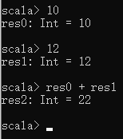

# Idea对Scala支持

1. 创建一个java项目

2. 安装scala插件

3. 添加框架支持

   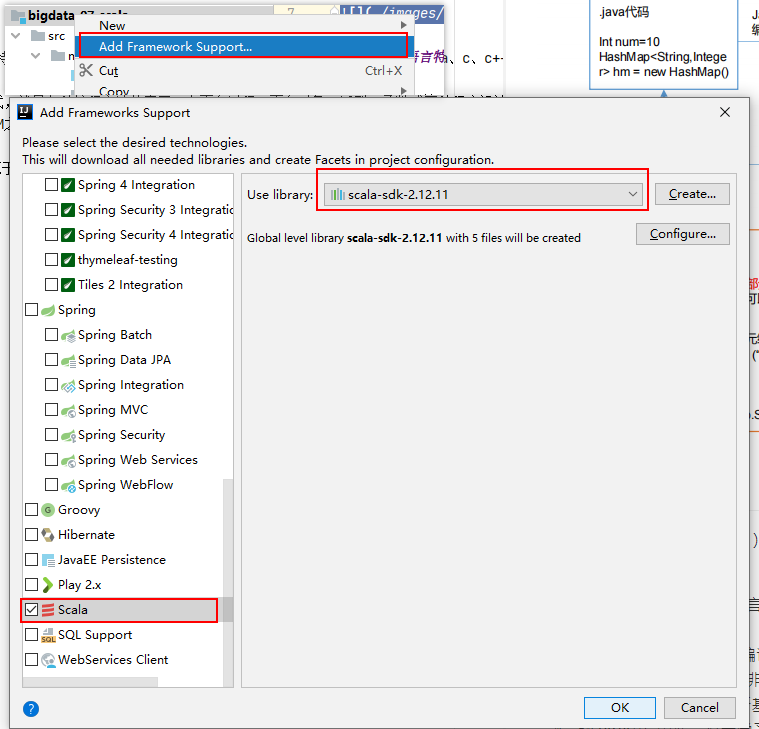

4. 创建scala文件夹并添加至resource root

# 入门Demo

## Hello World

```scala
package top.damoncai.scala.chapter01

/**
 * object：关键字，声明一个单例对象(伴生对象)
 */
object Demo_01_HelloWorld {

  /**
   * mian 方法：外部可执行的方法
   * def 方法名称(参数名：参数类型)：返回数据类型 = {方法体}
   * @param args
   */
  def main(args: Array[String]): Unit = {
    println("Hello World");
    println(Math.max(10,12)); // 调用java代码
  }
}
```

## 伴生类和伴生对象

```scala
package top.damoncai.scala.chapter02


class Student (name:String,age:Int) {

  def printInfo(): Unit = {
    println(name + " - " + age + " - " + Student.school);
  }
}


// 引入伴生对象
object Student {
  val school:String = "mashibing";

  def main(args: Array[String]): Unit = {
   val stu = new Student("张三",12);
    stu.printInfo();
  }
}
```

# 引入源码

# 变量和数据类型

## 变量和常量

1. Java 变量和常量语法

   ```java
   变量类型 变量名称 = 初始值 int a = 10
   final 常量类型 常量名称 = 初始值 final int b = 20
   ```

2. scala

   ```scals
   var 变量名 [: 变量类型] = 初始值 var i:Int = 10
   val 常量名 [: 常量类型] = 初始值 val j:Int = 20
   注意：能用常量的地方不用变量
   ```

**注意**

1. 声明变量时，类型可以省略，编译器自动推导，即类型推导
2. 类型确定后，就不能修改，说明 Scala 是强数据类型语言
3. 变量声明时，必须要有初始值
4. 在声明/定义一个变量时，可以使用 var 或者 val 来修饰，var 修饰的变量可改变

## 标识符

Scala 对各种变量、方法、函数等命名时使用的字符序列称为标识符。即：凡是自己可以起名字的地方都叫标识符。

1. 以字母或者下划线开头，后接字母、数字、下划线
2. 以操作符开头，且只包含操作符（+ - * / # !等）
3. 用反引号`....`包括的任意字符串，即使是 Scala 关键字（39 个）也可以

## 字符串输出

1. 字符串，通过+号连接
2. printf 用法：字符串，通过%传值
3. 字符串模板（插值字符串）：通过$获取变量值 

## 标准输入

​	StdIn.readLine()、StdIn.readShort()、StdIn.readDouble()

## Scala数据类型

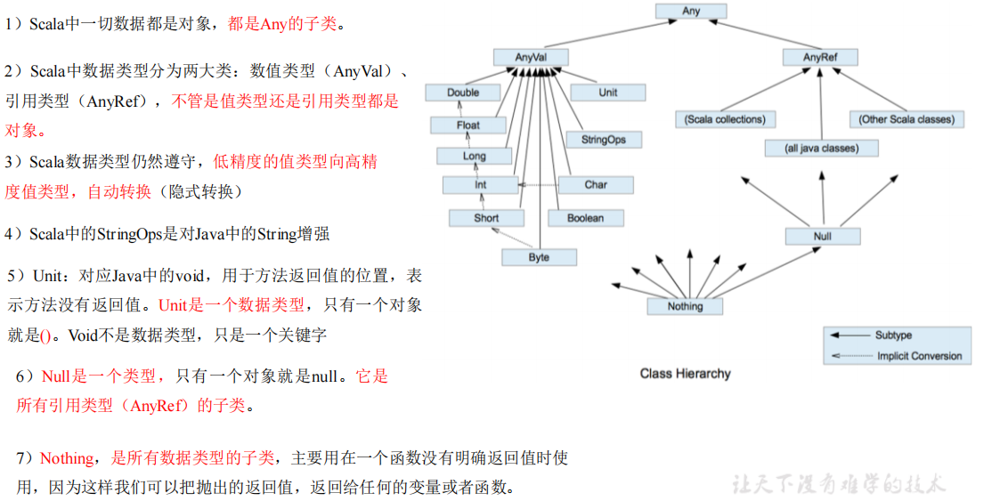

## 整数类型（Byte、Short、Int、Long）

| **数据类型** | **描述**                                                     |
| ------------ | ------------------------------------------------------------ |
| Byte [1]     | 8 位有符号补码整数。数值区间为 -128 到 127                   |
| Short [2]    | 16 位有符号补码整数。数值区间为 -32768 到 32767              |
| Int [4]      | 32 位有符号补码整数。数值区间为 -2147483648 到 2147483647    |
| Long [8]     | 64 位有符号补码整数。数值区间为 -9223372036854775808 到9223372036854775807 = 2 的(64-1)次方-1 |

## 字符类型Char

1. 字符常量是用单引号 ' ' 括起来的单个字符。
2. \t ：一个制表位，实现对齐的功能
3. \n ：换行符

## 布尔类型 Boolean

1. 布尔类型也叫 Boolean 类型，Booolean 类型数据只允许取值 true 和 false
2. boolean 类型占 1 个字节

## Unit类型、Null类型和Nothing类型

| **数据类型** | **描述**                                                     |
| ------------ | ------------------------------------------------------------ |
| **Unit**     | 表示无值，和其他语言中 void 等同。用作不返回任何结果的方法的结果，类型。Unit 只有一个实例值，写成()。 |
| **Null**     | null , Null 类型只有一个实例值 null                          |
| **Nothing**  | Nothing 类型在 Scala 的类层级最低端；它是任何其他类型的子类型。当一个函数，我们确定没有正常的返回值，可以用 Nothing 来指定返回类型，这样有一个好处，就是我们可以把返回的值（异常）赋给其它的函数或者变量（兼容性） |

## 类型转化

### 自动类型转换

当 Scala 程序在进行赋值或者运算时，精度小的类型自动转换为精度大的数值类型，这个就是自动类型转换（隐式转换）。数据类型按精度（容量）大小排序为：

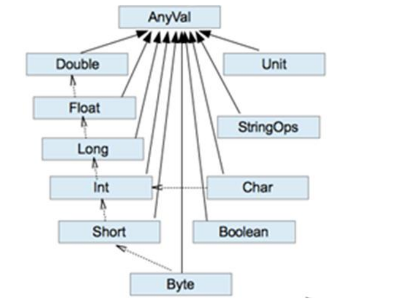

1. 自动提升原则：有多种类型的数据混合运算时，系统首先自动将所有数据转换成精度大的那种数据类型，然后再进行计算。
2. 把精度大的数值类型赋值给精度小的数值类型时，就会报错，反之就会进行自动类型转换。
3. （byte，short）和 char 之间不会相互自动转换。
4. byte，short，char 他们三者可以计算，在计算时首先转换为 int 类型。 

### 强制类型转换

自动类型转换的逆过程，将精度大的数值类型转换为精度小的数值类型。使用时要加上强制转函数，但可能造成精度降低或溢出，格外要注意

1. 将数据由高精度转换为低精度，就需要使用到强制转换
2. 强转符号只针对于最近的操作数有效，往往会使用小括号提升优先级

### 数字类型和String类型转换

1. 基本类型转 String 类型（语法：将基本类型的值+"" 即可）
2. String 类型转基本数值类型（语法：s1.toInt、s1.toFloat、s1.toDouble、s1.toByte、s1.toLong、s1.toShort）

# 运算符

## 算术运算符

```scala
object TestArithmetic {
 def main(args: Array[String]): Unit = {
 //（1）对于除号“/”，它的整数除和小数除是有区别的：整数之间做除法时，只保留整数部分而舍弃小数部分。
 var r1: Int = 10 / 3 // 3
 println("r1=" + r1)
 var r2: Double = 10 / 3 // 3.0
 println("r2=" + r2)
 var r3: Double = 10.0 / 3 // 3.3333
 println("r3=" + r3)
 println("r3=" + r3.formatted("%.2f")) // 含义：保留小数点 2位，使用四舍五入
```


## 关系运算符(比较运算符)

```scala
def main(args: Array[String]): Unit = {
    val st1:String = "hello"

    val st2:String = new String("hello");

    println(st1 == st2)
    println(st1.equals(st2))
    println(st1.eq(st2)) // scala中表示比较内存地址
  }
```

## 逻辑运算符

## 赋值运算符

**注意：**Scala 中没有++、--操作符，可以通过+=、-=来实现同样的效果；

## 位运算

## Scala运算符本质

在 Scala 中其实是没有运算符的，所有运算符都是方法。

1. 当调用对象的方法时，点.可以省略

2. 如果函数参数只有一个，或者没有参数，()可以省略

   ```scala
   object TestOpt {
    def main(args: Array[String]): Unit = {
    // 标准的加法运算
    val i:Int = 1.+(1)
    // （1）当调用对象的方法时，.可以省略
    val j:Int = 1 + (1)
    // （2）如果函数参数只有一个，或者没有参数，()可以省略
    val k:Int = 1 + 1
    
    println(1.toString())
    println(1 toString())
    println(1 toString)
    }
   }
   ```

# 流程控制

## if ... else if ... else

Scala 中 if else 表达式其实是有返回值的，具体返回值取决于满足条件的代码体的最后一行内容。

```scala
 def main(args: Array[String]): Unit = {

    println("=======================  if返回值  =======================")
    var age = 10;

    // any也可以省略
    var res1:Any = if(age > 18) {
      "成年人"
    }else if(age == 18) {
      "刚成年"
    }else{
      17
    }
    println(res1)

    println("=======================  if三元运算  =======================")

    var res2 = if( age > 18) "成年人" else "17"
    println(res2)
  }
}
```

## For循环

 ### 范围遍历 TO

### 范围遍历 Until

即使前闭合后开的范围

### 集合遍历

### 循环守卫

```scala
println("=======================  循环守卫  =======================")
    for(i <- 1 until 5 if i != 3) {
      println(i)
    }
```

### 步长

```scala
println("=======================  步长  =======================")
    for(i <- 1 to 10 by 2) {
      println(i)
    }

    println("=======================  步长 - reverse  =======================")
    for(i <- 1 to 10 by 2 reverse) {
      println(i)
    }

    println("=======================  步长 - 负数  =======================")
    for(i <- 10 to 1 by -2) {
      println(i)
    }
```

### 循环嵌套

```scala
  println("=======================  嵌套循环  =======================")
    for (i <- 1 to 4) {
      for (j <- 1 to 5) {
        println("i=" + i + ",j=" + j)
      }
    }

    println("=======================  嵌套循环  =======================")
    for (i <- 1 to 4; j <- 1 to 5) {
      println("i=" + i + ",j=" + j)
    }
```

### 引入变量

```scala
 println("=======================  引入变量  =======================")
    for (i <- 1 to 4; j = 4 -i) {
      println("i=" + i + ",j=" + j)
    }

    println("=======================  引入变量 2  =======================")
    for {
      i <- 1 to 4;
      j = 4 -i
    }
    {
      println("i=" + i + ",j=" + j)
    }
```

### 九层妖塔

```scala
 for (i <- 1 to 9; star = 2 * i -1 ; space = 9 -i){
      println((" "*space) + ("*"*star));
    }
```

### for循环返回值

```scala
val res = for(i <- 1 to 10) yield i
println(res)

或

object TestFor {
 def main(args: Array[String]): Unit = {
 var res = for(i <-1 to 10) yield {
 i * 2
 }
 println(res)
 } 
}
```

说明：将遍历过程中处理的结果返回到一个新 Vector 集合中，使用 yield 关键字。

注意：开发中很少使用

### 倒序打印

```scala
for(i <- 1 to 10 reverse){
 println(i)
}
```

### whie 和 do...while

**与 for 语句不同，while 语句没有返回值，即整个 while 语句的结果是 Unit 类型()**

### 循环中断

Scala 内置控制结构特地**去掉了** **break** **和** **continue**，是为了更好的适应**函数式编程**，推荐使用函数式的风格解决break和continue的功能，而不是一个关键字。Scala中使用breakable控制结构来实现 break 和 continue 功能。

```scala
def main(args: Array[String]): Unit = {
    // 循环中断 - 异常
    try {
      for (i <- 1 to 5 by 1) {
        if(i == 3) throw new RuntimeException
        println(i)
      }
    }catch {
      case e =>
    }

    // 循环中断 - scala自带函数
    Breaks.breakable(
      for (i <- 1 to 5 by 1) {
        if(i == 3) Breaks.break();
        println(i)
      }
    )
  }
```


# 函数式编程

## 基本语法

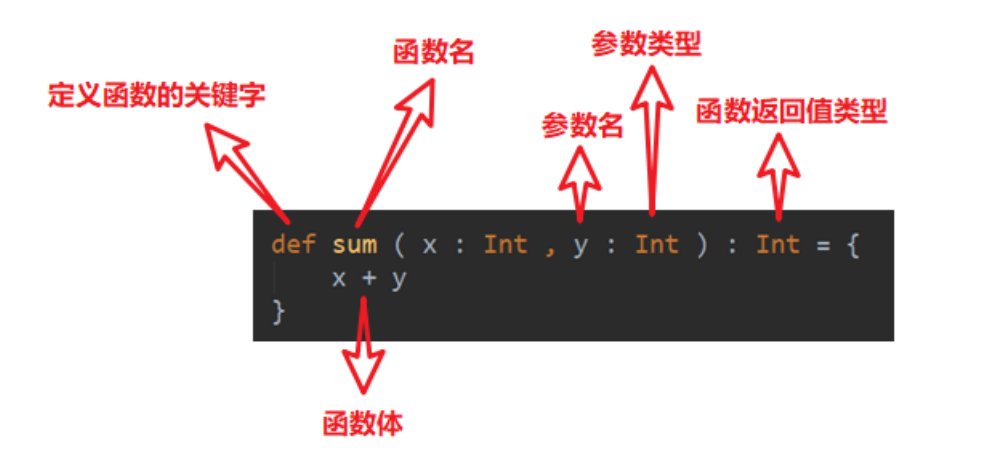

## 函数定义

```scala
函数 1：无参，无返回值
函数 2：无参，有返回值
函数 3：有参，无返回值
函数 4：有参，有返回值
函数 5：多参，无返回值
函数 6：多参，有返回值
```

## 函数参数

```scala
（1）可变参数
（2）如果参数列表中存在多个参数，那么可变参数一般放置在最后
（3）参数默认值，一般将有默认值的参数放置在参数列表的后面
（4）带名参数
```

```scala
	def main(args: Array[String]): Unit = {
//    （1）可变参数
      def fn1(name:String,hobbys:String*):Unit = {
        println(name)
        println(hobbys)
      }

//    （2）如果参数列表中存在多个参数，那么可变参数一般放置在最后
//    （3）参数默认值，一般将有默认值的参数放置在参数列表的后面
      def fn2(name:String,age:Int = 12):Unit = {
        println(name)
        println(age)
      }
//    （4）带名参数

      def fn3(name:String = "damoncai",age:Int = 12):Unit = {
        println(name)
        println(age)
      }

    fn1("damocnai2","pp","basketball")
    fn2("damocnai2")
    fn3(age=18);

  }
```

## 函数至简原则

```scala
（1）return 可以省略，Scala 会使用函数体的最后一行代码作为返回值
（2）如果函数体只有一行代码，可以省略花括号
（3）返回值类型如果能够推断出来，那么可以省略（:和返回值类型一起省略）
（4）如果有 return，则不能省略返回值类型，必须指定
（5）如果函数明确声明 unit，那么即使函数体中使用 return 关键字也不起作用
（6）Scala 如果期望是无返回值类型，可以省略等号
（7）如果函数无参，但是声明了参数列表，那么调用时，小括号，可加可不加
（8）如果函数没有参数列表，那么小括号可以省略，调用时小括号必须省略
（9）如果不关心名称，只关心逻辑处理，那么函数名（def）可以省略
```

```scala
def main(args: Array[String]): Unit = {
    //    （1）return 可以省略，Scala 会使用函数体的最后一行代码作为返回值
    def fun1(name: String): String = {
      "abc"
    }

    //    （2）如果函数体只有一行代码，可以省略花括号
    def fun2(name: String): String = "abc"

    //    （3）返回值类型如果能够推断出来，那么可以省略（:和返回值类型一起省略）
    def fun3(name: String) = "abc"

    //    （4）如果有 return，则不能省略返回值类型，必须指定
    def fun4(name: String): String = return "abc"

    //    （5）如果函数明确声明 unit，那么即使函数体中使用 return 关键字也不起作用
    def fun5(name: String): Unit = return "abc"

    println(fun5("damocnai")) // ()
    //    （6）Scala 如果期望是无返回值类型，可以省略等号
    def fun6(name: String){
      println(name)
    }
    fun6("xiix")
    //    （7）如果函数无参，但是声明了参数列表，那么调用时，小括号，可加可不加
    def fun7(): Unit = return "abc"
    fun7()
    fun7
    //    （8）如果函数没有参数列表，那么小括号可以省略，调用时小括号必须省略
    def fun8: Unit = return "abc"
    fun8
    //    （9）如果不关心名称，只关心逻辑处理，那么函数名（def）可以省略
    (name:String) => {
      println(name)
    }
  }
```

## 函数高阶

### 匿名函数

没有名字的函数就是匿名函数。

(x:Int)=>{函数体} 

x：表示输入参数类型；Int：表示输入参数类型；函数体：表示具体代码逻辑

```scala
def main(args: Array[String]): Unit = {

    //匿名函数赋值给变量
    val fun = (name:String) => {
      println(name)
    }

    //调用匿名函数
    fun("zhangsan");


    // 函数作为参数传输
    def f(func:String => Unit):Unit = {
      func("aiguigu")
    }

    f(fun);
    f((name:String) => {println(name)})

    //匿名函数简化原则
    // 1.参数的类型可以省略，会根据形参进行自动的推导
    f((name) => {println(name)})

    // 2.类型省略之后，发现只有一个参数，则圆括号可以省略；其他情况：没有参数和参数超过 1 的永远不能省略圆括号。
    f(name => { println(name)})

    // 3.匿名函数如果只有一行，则大括号也可以省略
    f(name => println(name))

    // 4.如果参数只出现一次，则参数省略且后面参数可以用_代替
    f(println(_))
    // 5.如果可以推断出，当前传入的println是个函数体，而不是调用语句，可以直接省略下划线
    f(println)
  }
```

### 闭包和柯里化

```scala
def main(args: Array[String]): Unit = {
    // 1. 闭包

    def funF(x:Int):Int =>Int =  x + _

    println(funF(4)(5));

    // 2.柯里化
    def funK(x:Int)(y:Int):Int = x + y
    println(funK(3)(7))
  }
```

### 递归和尾递归

```
package top.damoncai.scala.chapter07

object Demo_08_Stratum {

  def main(args: Array[String]): Unit = {

    // 递归
    def stratum(n: Int):Int = {
      if(n == 1) return 1
      n * stratum(n - 1)
    }

    println(stratum(5))
    
    // 尾递归
    def tailStratum(n: Int,result:Int):Int = {
      if(n == 1) return result
      tailStratum(n - 1,n * result)
    }
    
    println(tailStratum(5,1))

  }
}
```

### 控制抽象

```scala
package top.damoncai.scala.chapter07

object Demo_09_ControlAbstract {

  def main(args: Array[String]): Unit = {

    // 控制抽象 - 传值参数
    def fun(name:String) : Int = {
      println("fun被调用")
      println(name)
      12
    }
    fun("damoncai")

    // 控制抽象 - 传名参数
    println("========================================")
    def func(arg: => Int): Unit = {
      println("arg: " + arg)
      println("arg: " + arg)
    }
    func({12})
    func(fun("damoncai"))
  }
}
```

### 惰性加载

当**函数返回值被声明为** **lazy** **时**，函数的**执行将被推迟**，直到我们**首次对此取值，该函数才会执行**。这种函数我们称之为惰性函数。

```scala
def main(args: Array[String]): Unit = {
    lazy val res = fun();

    println("1.hello ")
    println("2.res " + res)

    def fun():Unit = {
      println("fun被调用")
    }
  }
```

# 面相对象

## 包

com.公司名称.项目名称.业务模块

### 包对象

### 包导入

```scala
1）和 Java 一样，可以在顶部使用 import 导入，在这个文件中的所有类都可以使用。
2）局部导入：什么时候使用，什么时候导入。在其作用范围内都可以使用
3）通配符导入：import java.util._
4）给类起名：import java.util.{ArrayList=>JL}
5）导入相同包的多个类：import java.util.{HashSet, ArrayList}
6）屏蔽类：import java.util.{ArrayList =>_,_}
7）导入包的绝对路径：new
```

## 类和对象

（1）Scala 语法中，类并不声明为 public，所有这些类都具有公有可见性（即默认就是public）

（2）一个 Scala 源文件可以包含多个类

## 封装

封装就是把抽象出的数据和对数据的操作封装在一起，数据被保护在内部，程序的其它部分只有通过被授权的操作（成员方法），才能对数据进行操作。Java 封装操作如下，

（1）将属性进行私有化

（2）提供一个公共的 set 方法，用于对属性赋值

（3）提供一个公共的 get 方法，用于获取属性的值

Scala 中的 public 属性，底层实际为 private，并通过 get 方法（obj.field()）和 set 方法（obj.field_=(value)）对其进行操作。所以 Scala 并不推荐将属性设为 private，再为其设置public 的 get 和 set 方法的做法。但由于很多 Java 框架都利用反射调用 getXXX 和 setXXX 方法，有时候为了和这些框架兼容，也会为 Scala 的属性设置 getXXX 和 setXXX 方法（通过@BeanProperty 注解实现）

### 访问权限

在 Java 中，访问权限分为：public，private，protected 和默认。在 Scala 中，你可以通过类似的修饰符达到同样的效果。但是使用上有区别。

1. Scala 中属性和方法的默认访问权限为 public，但 Scala 中无 public 关键字
2. private 为私有权限，只在类的内部和伴生对象中可用。
3. protected 为受保护权限，Scala 中受保护权限比 Java 中更严格，同类、子类可以访问，同包无法访问。
4. private[包名]增加包访问权限，包名下的其他类也可以使用

### 方法

### 创建对象

1. val 修饰对象，不能改变对象的引用（即：内存地址），可以改变对象属性的值
2. var 修饰对象，可以修改对象的引用和修改对象的属性值
3. 自动推导变量类型不能多态，所以多态需要显示声明

## 构造器

Scala 类的构造器包括：**主构造器和辅助构造器**

```scala
class 类名(形参列表) { // 主构造器
 // 类体
 def this(形参列表) { // 辅助构造器
 }
 def this(形参列表) { //辅助构造器可以有多个...
 } 
}
```

1. 辅助构造器，函数的名称 this，可以有多个，编译器通过参数的个数及类型来区分。
2. 辅助构造方法不能直接构建对象，必须直接或者间接调用主构造方法。
3. 构造器调用其他另外的构造器，要求被调用构造器必须提前声明。

### 构造器参数

Scala 类的主构造器函数的形参包括三种类型：未用任何修饰、var 修饰、val 修饰

1. 未用任何修饰符修饰，这个参数就是一个局部变量
2. var 修饰参数，作为类的成员属性使用，可以修改
3. val 修饰参数，作为类只读属性使用，不能修改

## 继承

**class** **子类名** **extends** **父类名** **{** **类体** **}** 

1. 子类继承父类的**属性**和**方法**
2. scala 是单继承
3. 继承的调用顺序：父类构造器->子类构造器

```scala
package top.damoncai.scala.chapter08

object Demo_03_Extend {

  def main(args: Array[String]): Unit = {
//    var par = new Par("张三",3);
      var son1 = new Son1("张三",3)
      println(son1.name) // null

    var son2 = new Son2("李四",4)
    println(son2.name) // 李四
  }
}

class Par() {

  var name:String = _
  var age:Int = _

  println("父 - 主 - 构造器")

  def say(): Unit = {
    println("par")
  }

  def this(name:String,age:Int) {
    this()
    this.name = name
    this.age = age
    println("父 - 辅 - 构造器")
  }
}

class Son1(name:String,age:Int) extends Par() {
  var no:String = _
  def this(name:String,age:Int,no:String) {
    this(name,age)
    this.no = no
  }
}

class Son2(name:String,age:Int) extends Par(name,age) {
  var no:String = _
  def this(name:String,age:Int,no:String) {
    this(name,age)
    this.no = no
  }
}
```

## 多态

Scala 中属性和方法都是动态绑定，而 Java 中只有方法为动态绑定。

```scala
package top.damoncai.scala.chapter08

object Demo_04_Polymorphism {
  def main(args: Array[String]): Unit = {

    val par:Parr = new Parr()
    println(par.name)
    par.printInfo()

    val son:Parr = new Sonn()
    println(son.name)
    son.printInfo()
  }
}

class Parr() {

  val name:String = "par"

  def printInfo(): Unit = {
    println("par")
  }
}


class Sonn extends Parr() {

  override val name:String = "son"

  override def printInfo(): Unit = {
    println("son")
  }
}
```

## 抽象类

1. 定义抽象类：abstract class Person{} //通过 abstract 关键字标记抽象类
2. 定义抽象属性：val|var name:String //一个属性没有初始化，就是抽象属性
3. 定义抽象方法：def hello():String //只声明而没有实现的方法，就是抽象方法

### 匿名子类

和 Java 一样，可以通过包含带有定义或重写的代码块的方式创建一个匿名的子类

```scala
package top.damoncai.scala.chapter08

object Demo_06_NoName {
  var p = new NPar {
    override val name: String = "张三"

    override def fun(): Unit = println("fun")
  }
}

abstract class NPar {
  val name:String;
  
  def fun():Unit;
}
```

## 伴生对象

Scala语言是完全面向对象的语言，所以并没有静态的操作（即在Scala中没有静态的概念）。但是为了能够和Java语言交互（因为Java中有静态概念），就产生了一种特殊的对象来模拟类对象，该对象为**单例对象**。若单例对象名与类名一致，则称该单例对象这个类的**伴生对象**，这个类的所有“静态”内容都可以放置在它的伴生对象中声明

### apply方法

1. 通过伴生对象的 apply 方法，实现不使用 new 方法创建对象。 
2. 如果想让主构造器变成私有的，可以在()之前加上 private。
3. apply 方法可以重载。
4. Scala 中 **obj(arg)**的语句实际是在调用该对象的 **apply** 方法，即 obj.apply(arg)。用以统一面向对象编程和函数式编程的风格
5. 当使用 new 关键字构建对象时，调用的其实是类的构造方法，当直接使用类名构建对象时，调用的其实时伴生对象的 apply 方法

```scala
package top.damoncai.scala.chapter08

// 伴生对象
object Demo_08_Apply_SingleIns {
  def main(args: Array[String]): Unit = {
    val dog1 = Dog.getInstance();
    val dog2 = Dog.getInstance();
    val dog3 = Dog.apply();
    //通过伴生对象的 apply 方法，实现不使用 new 关键字创建对象。
    val dog4 = Dog();
    println(dog1 == dog2) // true
    println(dog1 == dog3) // true
    println(dog1 == dog4) // true
  }
}

class Dog private () {
}

object Dog {
  var dog:Dog = null;
  def getInstance():Dog = {
    if(dog == null) dog = new Dog();
    dog
  }

  def apply():Dog = {
    println("apply ~~")
    if(dog == null) dog = new Dog();
    dog
  }
}
```

## 特质（Trait）

Scala 语言中，采用特质 trait（特征）来代替接口的概念，也就是说，多个类具有相同的特质（特征）时，就可以将这个特质（特征）独立出来，采用关键字 trait 声明。

Scala 中的 trait 中即**可以有抽象属性和方法，也可以有具体的属性和方法**，**一个类可以混入（mixin）多个特质**。这种感觉类似于 Java 中的抽象类。

Scala 引入 trait 特征，第一可以替代 Java 的接口，第二个也是对单继承机制的一种补充

**语法**

**没有父类**：class 类名 **extends** 特质 1 **with** 特质 2 **with** 特质 3 …

**有父类**：class 类名 **extends** 父类 **with** 特质 1 **with** 特质 2 **with** 特质 3…

```scala
trait 特质名 {
trait 主体
}
```

1. 类和特质的关系：使用继承的关系。
2. 当一个类去继承特质时，第一个连接词是 extends，后面是 with。 
3. 如果一个类在同时继承特质和父类时，应当把父类写在 extends 后

**实操**

1. 特质可以同时拥有抽象方法和具体方法
2. 一个类可以混入（mixin）多个特质
3. 所有的 Java 接口都可以当做 Scala 特质使用
4. **动态混入**：可灵活的扩展类的功能
   1. **动态混入：创建对象时混入** **trait**，而无需使类混入该**trai**
   2. 如果混入的 trait 中有未实现的方法，则需要实现

### 特质叠加

由于一个类可以混入（mixin）多个 trait，且 trait 中可以有具体的属性和方法，若混入的特质中具有相同的方法（方法名，参数列表，返回值均相同），必然会出现继承冲突问题。冲突分为以下两种：

1. 第一种，一个类（Sub）混入的两个 trait（TraitA，TraitB）中具有相同的具体方法，且两个 trait 之间没有任何关系，解决这类冲突问题，直接在类（Sub）中重写冲突方法。

   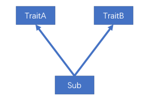

2. 第二种，一个类（Sub）混入的两个 trait（TraitA，TraitB）中具有相同的具体方法，且两个 trait 继承自相同的 trait（TraitC），及所谓的“钻石问题”，解决这类冲突问题，Scala采用了**特质叠加**的策略

   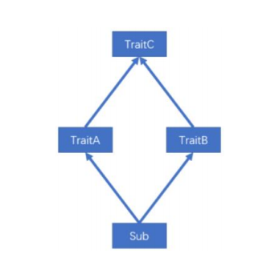

当一个类混入多个特质的时候，scala 会对所有的特质及其父特质按照一定的顺序进行排序，而此案例中的 super.describe()调用的实际上是排好序后的下一个特质中的 describe()方法。，排序规则如下：

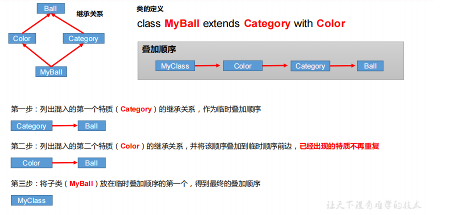

**结论**

1. 案例中的 super，不是表示其父特质对象，而是表示上述叠加顺序中的下一个特质，即，**MyClass** **中的** **super** **指代** **Color****，****Color** **中的** **super** **指代** **Category**，**Category** **中的** **super**指代Ball。

2. 如果想要调用某个指定的混入特质中的方法，可以增加约束：super[]，例如super[Category].describe()

### 特质自身类型

自身类型可实现依赖注入的功能。

```scala
object Demo_10_TraitSelfType {

  def main(args: Array[String]): Unit = {
    val user = new UserOper("damoncai","123")
    user.inster()
  }
}

trait UserDao {
  _:User =>
  def register(): Unit ={
    println("register == name: " + this.name)
  }
}

class User(var name:String, var pwd:String)

class UserOper(name:String, pwd:String) extends User(name, pwd) with UserDao {
  def inster(): Unit = {
    super.register()
  }
}
```

## 类型检测和转换

```scala
package top.damoncai.scala.chapter08

object Demo_11_TypeConvert {
  def main(args: Array[String]): Unit = {

    val eagleFish = new EagleFish()

    println(eagleFish.isInstanceOf[Fish])

    // 转换
    val fish:Fish = new EagleFish()
    val ef:EagleFish = fish.asInstanceOf[EagleFish]

  }
}
class Fish {
  def say(): Unit = {
    println("fish")
  }
}

class EagleFish extends Fish{
  override def say(): Unit = {
    println("fish")
  }
}
```

## 枚举类和应用类

```scala
package top.damoncai.scala.chapter08

object Demo_12_EnumAndApply {
  def main(args: Array[String]): Unit = {
    println(CustomWeek.MON)
    println(CustomWeek.MON.id)
  }
}

object CustomWeek extends Enumeration {
  val MON = Value(1,"MONN")
}

object TestApp extends App {
  println("TestApp ~~")
}
```

## Type定义新类型

使用 type 关键字可以定义新的数据数据类型名称，本质上就是类型的一个别名


# 集合类型

1. Scala 的集合有三大类：序列 Seq、集 Set、映射 Map，所有的集合都扩展自 Iterable特质。

2. 对于几乎所有的集合类，Scala 都同时提供了**可变**和**不可变**的版本，分别位于以下两个包

   不可变集合：scala.collection.**immutable**

   可变集合： scala.collection.**mutable**

3. Scala 不可变集合，就是指该集合对象不可修改，每次修改就会返回一个新对象，而不会对原对象进行修改。类似于 java 中的 String 对象

4. 可变集合，就是这个集合可以直接对原对象进行修改，而不会返回新的对象。类似于 java 中 StringBuilder 对象

**建议：在操作集合的时候，不可变用符号，可变用方法**

## 不可变集合继承图

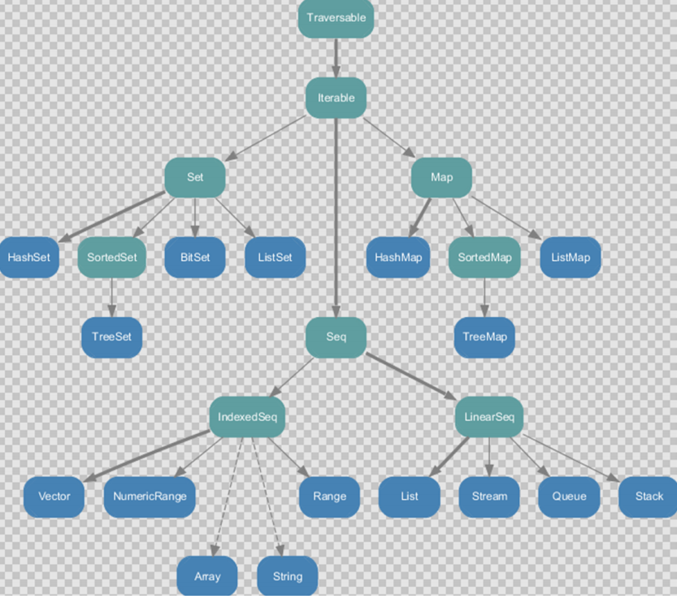

1. Set、Map 是 Java 中也有的集合
2. Seq 是 Java 没有的，我们发现 List 归属到 Seq 了，因此这里的 List 就和 Java 不是同一个概念了
3. 我们前面的 for 循环有一个 1 to 3，就是 IndexedSeq 下的 Range
4. String 也是属于 IndexedSeq
5. 我们发现经典的数据结构比如 Queue 和 Stack 被归属到 LinearSeq(线性序列)
6. 大家注意 Scala 中的 Map 体系有一个 SortedMap，说明 Scala 的 Map 可以支持排序
7. IndexedSeq 和 LinearSeq 的区别：
   1. **IndexedSeq** 是通过索引来查找和定位，因此速度快，比如 String 就是一个索引集合，通过索引即可定位
   2. **LinearSeq** 是线型的，即有头尾的概念，这种数据结构一般是通过遍历来查找

## 可变集合继承图

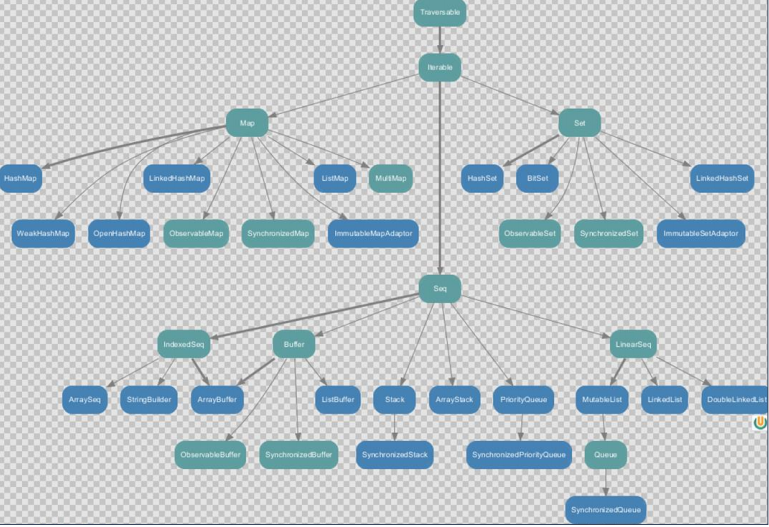

## 不可变数组

## 可变数组

## 不可变List

## 可变List

## 不可变Set

## 可变Set

## 不可变Map

## 可变Map

## 元组

# 常用函数操作

# 模式匹配

Scala 中的模式匹配类似于 Java 中的 switch 语法，但是 scala 从语法中补充了更多的功能，所以更加强大。

模式匹配语法中，采用 match 关键字声明，每个分支采用 case 关键字进行声明，当需要匹配时，会从第一个 case 分支开始，如果匹配成功，那么执行对应的逻辑代码，如果匹配不成功，继续执行下一个分支进行判断。如果所有 case 都不匹配，那么会执行 case _分支，类似于 Java 中 default 语句。

## 模式守卫

如果想要表达匹配某个范围的数据，就需要在模式匹配中增加条件守卫。

## 匹配常量和匹配类型

## 匹配数组

## 匹配列表

## 匹配元组

## 匹配对象

➢val user = User("zhangsan",11)，该语句在执行时，实际调用的是 User 伴生对象中的**apply** 方法，因此不用 **new** **关键字**就能构造出相应的对象。

➢ 当将 **User("zhangsan", 11)**写在 case 后时[case User("zhangsan", 11) => "yes"]，会默认调用 **unapply** 方法(对象提取器)，**user** **作为** **unapply** **方法的参数**，unapply 方法将 user 对象的 name 和 age 属性提取出来，与 User("zhangsan", 11)中的属性值进行匹配

➢ case 中对象的 unapply 方法(提取器)返回 Some，且所有属性均一致，才算匹配成功,属性不一致，或返回 None，则匹配失败。

➢ 若只提取对象的一个属性，则提取器为 **unapply**(obj:Obj):**Option[T]**

​	若提取对象的多个属性，则提取器为 **unapply**(obj:Obj):**Option[(T1,T2,T3…)]**

​	若提取对象的可变个属性，则提取器为 **unapplySeq**(obj:Obj):**Option[Seq[T]]**

## 样例类

## 偏函数

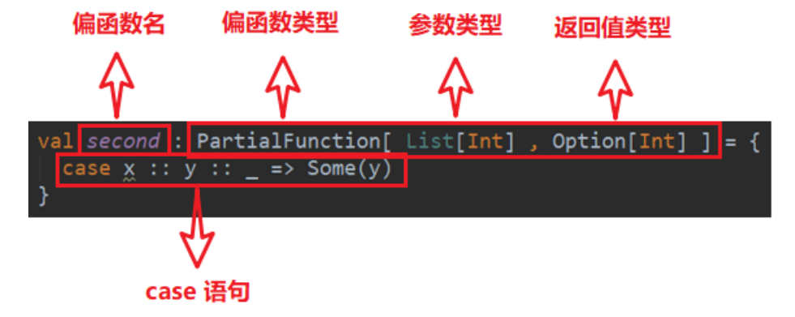

# 异常

1）我们将可疑代码封装在 try 块中。在 try 块之后使用了一个 catch 处理程序来捕获异常。如果发生任何异常，catch 处理程序将处理它，程序将不会异常终止。

2）Scala 的异常的工作机制和 Java 一样，但是 Scala 没有“checked（编译期）”异常， 即 Scala 没有编译异常这个概念，异常都是在运行的时候捕获处理。

3）异常捕捉的机制与其他语言中一样，如果有异常发生，catch 子句是按次序捕捉的。因此，在 catch 子句中，越具体的异常越要靠前，越普遍的异常越靠后，	  如果把越普遍的异常写在前，把具体的异常写在后，在 Scala 中也不会报错，但这样是非常不好的编程风格。

4）finally 子句用于执行不管是正常处理还是有异常发生时都需要执行的步骤，一般用于对象的清理工作，这点和 Java 一样。

5）用 throw 关键字，抛出一个异常对象。所有异常都是 Throwable 的子类型。throw 表达式是有类型的，就是 Nothing，因为 Nothing 是所有类型的子类型，   	  所以 throw 表达式可以用在需要类型的地方

``` scala
def test():Nothing = {
 throw new Exception("不对")
}
```

6）java 提供了 throws 关键字来声明异常。可以使用方法定义声明异常。它向调用者函数提供了此方法可能引发此异常的信息。它有助于调用函数处理并将该代	  码包含在 try-catch块中，以避免程序异常终止。在 Scala 中，可以使用 throws 注解来声明异常

```scala
def main(args: Array[String]): Unit = {
 f11()
}
@throws(classOf[NumberFormatException])
def f11()={
 "abc".toInt
}
```

# 隐式转化

**当编译器第一次编译失败的时候，会在当前的环境中查找能让代码编译通过的方法，用于将类型进行转换，实现二次编译**

## 隐式函数

## 隐式参数

普通方法或者函数中的参数可以通过 **implicit** 关键字声明为隐式参数，调用该方法时，就可以传入该参数，编译器会在相应的作用域寻找符合条件的隐式值

说明

1. 同一个作用域中，相同类型的隐式值只能有一个
2. 编译器按照隐式参数的类型去寻找对应类型的隐式值，与隐式值的名称无关
3. 隐式参数优先于默认参数


## 隐式类

在 Scala2.10 后提供了隐式类，可以使用 **implicit** 声明类，隐式类的非常强大，同样可以扩展类的功能，在集合中隐式类会发挥重要的作用。

1. 其所带的构造参数有且只能有一个
2. 隐式类必须被定义在“类”或“伴生对象”或“包对象”里，即隐式类不能是**顶级的**。

## 隐式解析机制

（1）首先会在当前代码作用域下查找隐式实体（隐式方法、隐式类、隐式对象）。（一般是这种情况）

（2）如果第一条规则查找隐式实体失败，会继续在隐式参数的类型的作用域里查找。类型的作用域是指与**该类型相关联的全部伴生对象**以及**该类型所在包的包		 对象**。 


# 泛型

**语法**

class MyList[**+T**]{ //协变} 

class MyList[**-T**]{ //逆变}

class MyList[**T**] //不变

**说明**

协变：Son 是 Father 的子类，则 MyList[Son] 也作为 MyList[Father]的“子类”。

逆变：Son 是 Father 的子类，则 MyList[Son]作为 MyList[Father]的“父类”。

不变：Son 是 Father 的子类，则 MyList[Father]与 MyList[Son]“无父子关系”。

## 泛型上下限定

