# Spark简介

Spark 是一种基于内存的快速、通用、可扩展的大数据分析计算引擎

# Spark核心模块

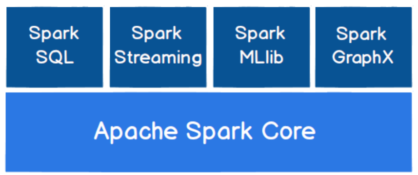

1. **Spark Core**

   Spark Core 中提供了 Spark 最基础与最核心的功能，Spark 其他的功能如：Spark SQL，Spark Streaming，GraphX, MLlib 都是在 Spark Core 的基础上进行扩展的

2. **Spark SQL**

   Spark SQL 是 Spark 用来操作结构化数据的组件。通过 Spark SQL，用户可以使用 SQL或者 Apache Hive 版本的 SQL 方言（HQL）来查询数据。

3. **Spark Streaming**

   Spark Streaming 是 Spark 平台上针对实时数据进行流式计算的组件，提供了丰富的处理数据流的 API

4. **Spark MLlib**

   MLlib 是 Spark 提供的一个机器学习算法库。MLlib 不仅提供了模型评估、数据导入等额外的功能，还提供了一些更底层的机器学习原语。

5. **Spark GraphX**

   GraphX 是 Spark 面向图计算提供的框架与算法库

# Spark快速上手

1. Scala环境

2. 添加Spark依赖

   ```xml
   <dependencies>
    <dependency>
    	<groupId>org.apache.spark</groupId>
    	<artifactId>spark-core_2.12</artifactId>
    	<version>3.0.0</version>
    </dependency>
   </dependencies>
   ```

3. 编写代码

   ```scala
   object Spark_02_Spark_WordCount {
   
     def main(args: Array[String]): Unit = {
       // 创建Spark运行配置对象
       val sparkConf = new SparkConf().setMaster("local").setAppName("wordcount")
       //创建Spark上下文对象
       val sparkContext = new SparkContext(sparkConf)
   
       // 业务逻辑
       //1.读取文件数据
       val wordRDD:RDD[String] = sparkContext.textFile("bigdata_08_spark/datas")
       // 扁平化
       val wordFlatMapRDD: RDD[String] = wordRDD.flatMap(_.split(" "))
       // 每个元素打上 1
       val value: RDD[(String, Int)] = wordFlatMapRDD.map((_, 1))
       // Spark提供根据key 将value做reduce操作
       val res: RDD[(String, Int)] = value.reduceByKey(_ + _)
       // 打印
       res.foreach(println)
       //关闭资源
       sparkContext.stop()
     }
   }
   ```

   

# 去除日志信息

执行过程中，会产生大量的执行日志，如果为了能够更好的查看程序的执行结果，可以在项

目的 resources 目录中创建 log4j.properties 文件，并添加日志配置信息：

```properties
log4j.rootCategory=ERROR, console
log4j.appender.console=org.apache.log4j.ConsoleAppender
log4j.appender.console.target=System.err
log4j.appender.console.layout=org.apache.log4j.PatternLayout
log4j.appender.console.layout.ConversionPattern=%d{yy/MM/dd 
HH:mm:ss} %p %c{1}: %m%n
# Set the default spark-shell log level to ERROR. When running the spark-shell, 
the
# log level for this class is used to overwrite the root logger's log level, so 
that
# the user can have different defaults for the shell and regular Spark apps.
log4j.logger.org.apache.spark.repl.Main=ERROR
# Settings to quiet third party logs that are too verbose
log4j.logger.org.spark_project.jetty=ERROR
log4j.logger.org.spark_project.jetty.util.component.AbstractLifeCycle=ERROR
log4j.logger.org.apache.spark.repl.SparkIMain$exprTyper=ERROR
log4j.logger.org.apache.spark.repl.SparkILoop$SparkILoopInterpreter=ERROR
log4j.logger.org.apache.parquet=ERROR
log4j.logger.parquet=ERROR
# SPARK-9183: Settings to avoid annoying messages when looking up nonexistent 
UDFs in SparkSQL with Hive support
log4j.logger.org.apache.hadoop.hive.metastore.RetryingHMSHandler=FATAL
log4j.logger.org.apache.hadoop.hive.ql.exec.FunctionRegistry=ERROR
```

# Spark运行环境

Spark 作为一个数据处理框架和计算引擎，被设计在所有常见的集群环境中运行, 在国内工作中主流的环境为 Yarn，不过逐渐容器式环境也慢慢流行起来。接下来，我们就分别看看不同环境下 Spark 的运行

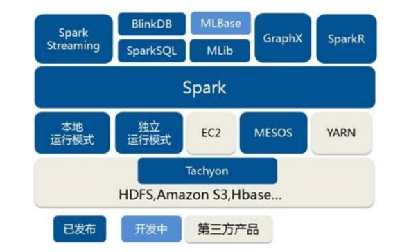

## Local模式

所谓的 Local 模式，就是不需要其他任何节点资源就可以在本地执行 Spark 代码的环境，一般用于教学，调试，演示等，之前在 IDEA 中运行代码的环境我们称之为开发环境，不太一样

1. 解压文件

2. 解压文件

   ```shell
   tar -zxvf spark-3.0.0-bin-hadoop3.2.tgz -C /opt/module
   cd /opt/module 
   mv spark-3.0.0-bin-hadoop3.2 spark-local
   ```

3. 启动Local环境

   ```shell
   bin/spark-shell
   ```

   运行后会在问价中创建data文件夹

4. 执行代码

   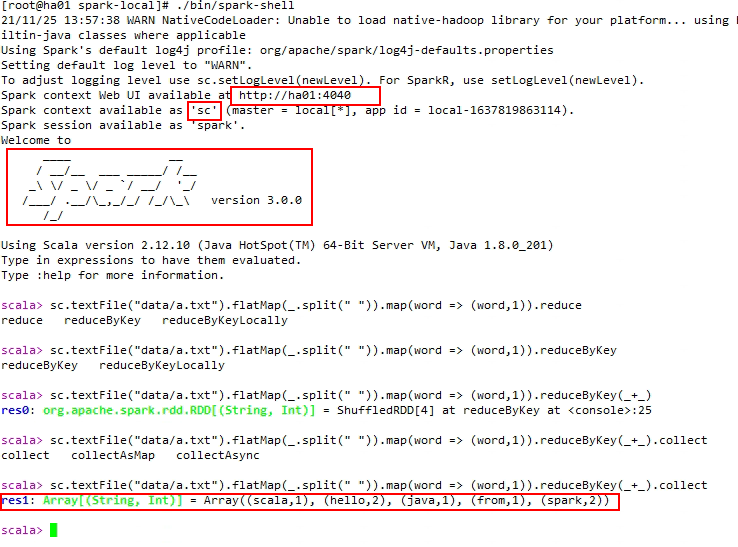

5. 通过浏览器访问

   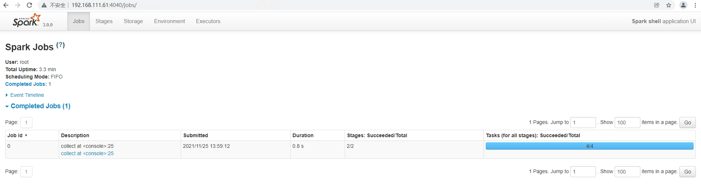

## Standalone模式

local 本地模式毕竟只是用来进行练习演示的，真实工作中还是要将应用提交到对应的集群中去执行，这里我们来看看只使用 Spark 自身节点运行的集群模式，也就是我们所谓的独立部署（Standalone）模式。Spark 的 Standalone 模式体现了经典的 master-slave 模式。集群规划

**集群规划:**


1. **解压缩文件** 

   将 spark-3.0.0-bin-hadoop3.2.tgz 文件上传到 Linux 并解压缩在指定位置

2. **修改配置文件** 

   1. 进入解压缩后路径的 conf 目录，修改 slaves.template 文件名为 slaves

   2. 修改 slaves 文件，添加 work 节点

      ```shell
      ha01.prdigital.cn
      ha02.prdigital.cn
      ha03.prdigital.cn
      ```

   3. 修改 spark-env.sh.template 文件名为 spark-env.sh

      ```shell
      mv spark-env.sh.template spark-env.sh
      ```

   4. 修改 spark-env.sh 文件，添加 JAVA_HOME 环境变量和集群对应的 master 节点

      ```shell
      export JAVA_HOME=/opt/module/jdk1.8.0_144
      SPARK_MASTER_HOST=ha01.prdigital.cn
      SPARK_MASTER_PORT=7077
      ```

      **注意：7077 端口，相当于 hadoop3 内部通信的 8020 端口，此处的端口需要确认自己的 Hadoop配置**

   5. 分发 spark-standalone 目录

      ```shell
      xsync spark-standalone
      ```

3. **启动集群**

   ```shell
   sbin/start-all.sh
   ```

4. 查看三台机器的服务进程

5. 查看web(**端口如果被占用户出现404问题**)

   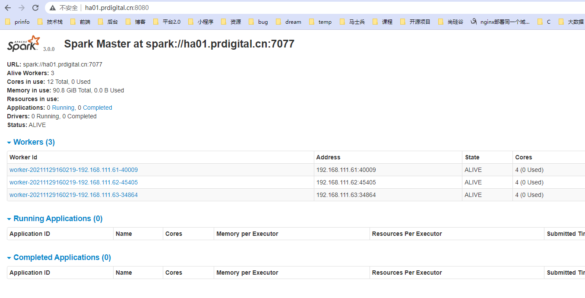

6. 提交应用

   ```shell
   bin/spark-submit \
   --class org.apache.spark.examples.SparkPi \
   --master spark://ha01.prdigital.cn:7077 \
   ./examples/jars/spark-examples_2.12-3.0.0.jar \
   10
   ```

   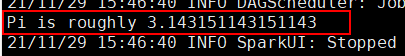


​		1) --class 表示要执行程序的主类

​		2) --master spark://linux1:7077 独立部署模式，连接到 Spark 集群

​		3) spark-examples_2.12-3.0.0.jar 运行类所在的 jar 包

​		4) 数字 10 表示程序的入口参数，用于设定当前应用的任务数量

7. 提交参数说明

   ```shell
   bin/spark-submit \
   --class <main-class>
   --master <master-url> \
   ... # other options
   <application-jar> \
   [application-arguments]
   ```

   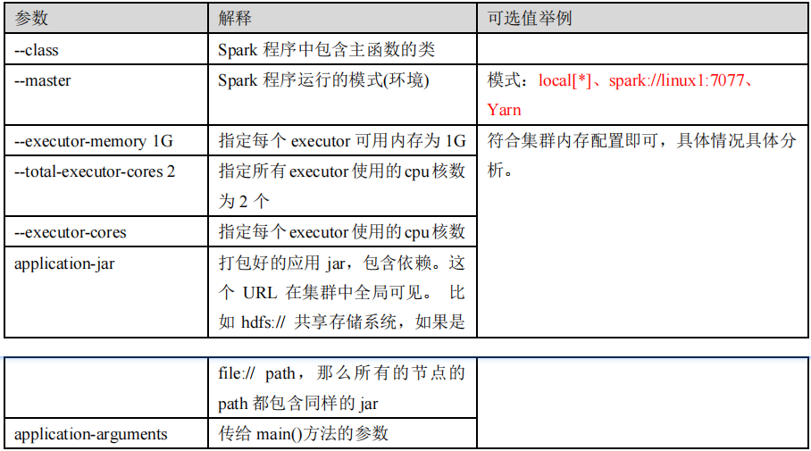

### **配置历史服务**

由于 spark-shell 停止掉后，集群监控 linux1:4040 页面就看不到历史任务的运行情况，所以开发时都配置历史服务器记录任务运行情况

1. 修改 spark-defaults.conf.template 文件名为 spark-defaults.conf

   ```shell
   mv spark-defaults.conf.template spark-defaults.conf
   ```

2. 修改 spark-default.conf 文件，配置日志存储路径

   ```shell
   spark.eventLog.enabled true
   spark.eventLog.dir hdfs://ha01.prdigital.cn:8020/directory
   ```

   **注意：需要启动 hadoop 集群，HDFS 上的 directory 目录需要提前存在。**

   ```shell
   sbin/start-dfs.sh
   hadoop fs -mkdir /directory
   ```

3. 修改 spark-env.sh 文件, 添加日志配置

   ```shell
   export SPARK_HISTORY_OPTS="
   -Dspark.history.ui.port=18080 
   -Dspark.history.fs.logDirectory=hdfs://ha01.prdigital.cn:8020/directory 
   -Dspark.history.retainedApplications=30"
   ```

   1. 参数 1 含义：WEB UI 访问的端口号为 18080
   2. 参数 2 含义：指定历史服务器日志存储路径
   3. 参数 3 含义：指定保存 Application 历史记录的个数，如果超过这个值，旧的应用程序信息将被删除，这个是内存中的应用数，而不是页面上显示的应用数。

4. 分发配置文件

   ```shell
   xsync conf
   ```

5. 重新启动集群和历史服务

   ```shell
   sbin/start-all.sh
   sbin/start-history-server.sh
   ```

6. 重新执行任务

   ```shell
   bin/spark-submit \
   --class org.apache.spark.examples.SparkPi \
   --master spark://ha01.prdigital.cn:7077 \
   ./examples/jars/spark-examples_2.12-3.0.0.jar \
   10
   ```

7. 查看历史服务：http://ha01.prdigital.cn:18080

### 配置高可用（HA）

所谓的高可用是因为当前集群中的 Master 节点只有一个，所以会存在单点故障问题。所以为了解决单点故障问题，需要在集群中配置多个 Master 节点，一旦处于活动状态的 Master发生故障时，由备用 Master 提供服务，保证作业可以继续执行。这里的高可用一般采用Zookeeper 设置

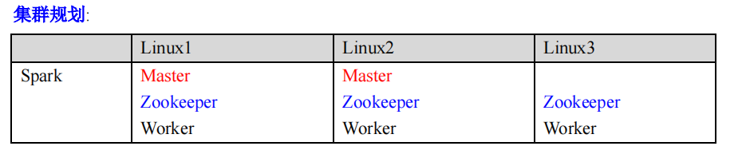

1. 停止集群

   ```shell
   sbin/stop-all.sh
   ```

2. 启动集群 Zookeeper

   ```
   ./myZK start
   ```

3. 修改 spark-env.sh 文件添加如下配置

   ```shell
   注释如下内容：
   #SPARK_MASTER_HOST=linux1
   #SPARK_MASTER_PORT=7077
   添加如下内容:
   #Master 监控页面默认访问端口为 8080，但是可能会和 Zookeeper 冲突，所以改成 8989，也可以自
   定义，访问 UI 监控页面时请注意
   SPARK_MASTER_WEBUI_PORT=8989
   export SPARK_DAEMON_JAVA_OPTS="
   -Dspark.deploy.recoveryMode=ZOOKEEPER 
   -Dspark.deploy.zookeeper.url=linux1,linux2,linux3
   -Dspark.deploy.zookeeper.dir=/spark"
   ```

4. 分发配置文件

   ```shell
   xsync conf/
   ```

5. 启动集群

   ```shell
   sbin/start-all.sh
   ```

6. 启动 ha02.prdigital.cn:8989 的单独 Master 节点，此时 linux2 节点 Master 状态处于备用状态

   ```shell
   sbin/start-master.sh
   ```

7. 访问ha01.prdigital.cn:8989

## yarn模式

独立部署（Standalone）模式由 Spark 自身提供计算资源，无需其他框架提供资源。这种方式降低了和其他第三方资源框架的耦合性，独立性非常强。但是你也要记住，Spark 主要是计算框架，而不是资源调度框架，所以本身提供的资源调度并不是它的强项，所以还是和其他专业的资源调度框架集成会更靠谱一些。所以接下来我们来学习在强大的 Yarn 环境下 Spark 是如何工作的（其实是因为在国内工作中，Yarn 使用的非常多）

1. 将 spark-3.0.0-bin-hadoop3.2.tgz 文件上传到 linux 并解压缩，放置在指定位置。

   ```shell
   mv spark-3.0.0-bin-hadoop3.2 spark-yarn
   ```

2. **修改配置文件** 

   修改 hadoop 配置文件/opt/module/hadoop/etc/hadoop/yarn-site.xml, 并分发

   ```shell
   <!--是否启动一个线程检查每个任务正使用的物理内存量，如果任务超出分配值，则直接将其杀掉，默认是 true -->
   <property>
    <name>yarn.nodemanager.pmem-check-enabled</name>
    <value>false</value>
   </property>
   <!--是否启动一个线程检查每个任务正使用的虚拟内存量，如果任务超出分配值，则直接将其杀掉，默认
   是 true -->
   <property>
    <name>yarn.nodemanager.vmem-check-enabled</name>
    <value>false</value>
   </property>
   ```

3. 修改 conf/spark-env.sh，添加 JAVA_HOME 和 YARN_CONF_DIR 配置

   ```shell
   mv spark-env.sh.template spark-env.sh
   
   export JAVA_HOME=/opt/module/jdk1.8.0_144
   YARN_CONF_DIR=/opt/module/hadoop/etc/hadoop
   ```

4. **启动** **HDFS** **以及** **YARN** **集群**

5. **提交应用** 

   ```shell
   bin/spark-submit \
   --class org.apache.spark.examples.SparkPi \
   --master yarn \
   --deploy-mode cluster \
   ./examples/jars/spark-examples_2.12-3.0.0.jar \
   10
   ```

   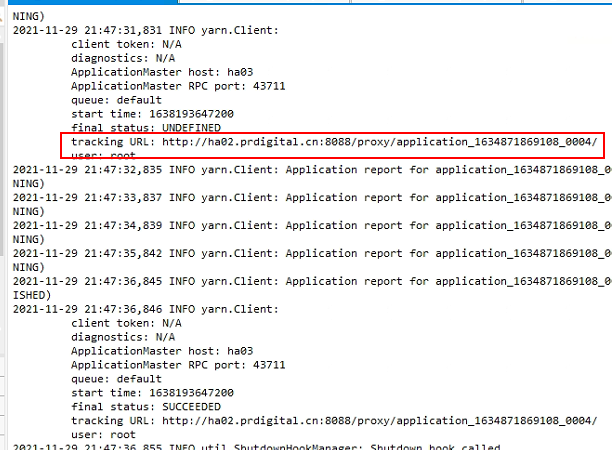

   查看 http://ha01.prdigital.cn:8088 页面，点击 History，查看历史页面

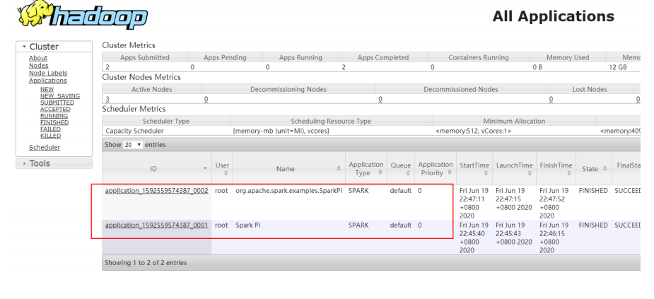

6. **配置历史服务器** 

   1. 修改 spark-defaults.conf.template 文件名为 spark-defaults.conf

      ```shell
      mv spark-defaults.conf.template spark-defaults.conf
      ```

   2. 修改 spark-default.conf 文件，配置日志存储路径

      ```shell
      spark.eventLog.enabled true
      spark.eventLog.dir hdfs://linux1:8020/directory
      ```

      **注意：需要启动 hadoop 集群，HDFS 上的目录需要提前存在。**

      ```shell
      [root@linux1 hadoop]# sbin/start-dfs.sh
      [root@linux1 hadoop]# hadoop fs -mkdir /directory
      ```

   3. 修改 spark-env.sh 文件, 添加日志配置

      ```shell'
      export SPARK_HISTORY_OPTS="
      -Dspark.history.ui.port=18080 
      -Dspark.history.fs.logDirectory=hdfs://linux1:8020/directory 
      -Dspark.history.retainedApplications=30"
      ```

   4. 修改 spark-defaults.conf

      ```shell
      spark.yarn.historyServer.address=linux1:18080
      spark.history.ui.port=18080
      ```

   5. 启动历史服务

      ```shell
      sbin/start-history-server.sh
      ```

   6. 重新提交应用(客户端提交模式)

      ```shell
      bin/spark-submit \
      --class org.apache.spark.examples.SparkPi \
      --master yarn \
      --deploy-mode client \
      ./examples/jars/spark-examples_2.12-3.0.0.jar \
      10
      ```

   7. Web 页面查看日志：http://linux2:8088

      

      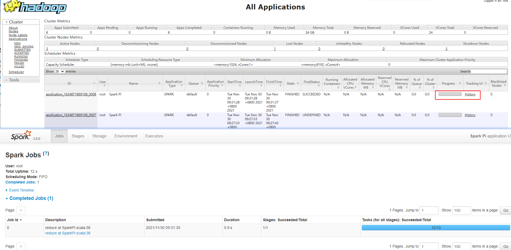（点击任务的history跳转）

## K82和Mesos模式

TODO

## Windows模式

在同学们自己学习时，每次都需要启动虚拟机，启动集群，这是一个比较繁琐的过程，并且会占大量的系统资源，导致系统执行变慢，不仅仅影响学习效果，也影响学习进度，Spark 非常暖心地提供了可以在 windows 系统下启动本地集群的方式，这样，在不使用虚拟机的情况下，也能学习 Spark 的基本使用

1. 将文件 spark-3.0.0-bin-hadoop3.2.tgz 解压缩到无中文无空格的路径中

2. **启动本地环境**

   ```shell
   执行解压缩文件路径下 bin 目录中的 spark-shell.cmd 文件，启动 Spark 本地环境
   ```

   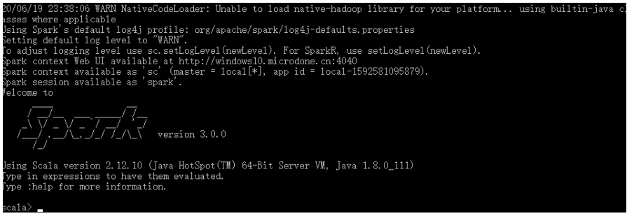

3. 在 bin 目录中创建 input 目录，并添加 word.txt 文件, 在命令行中输入脚本代码

   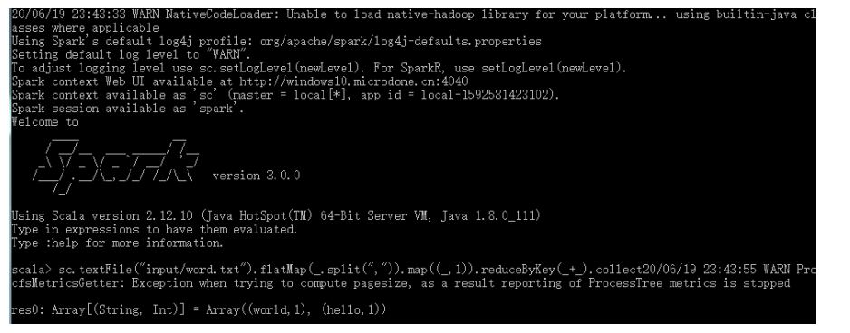

4. **命令行提交应用**

   在 DOS 命令行窗口中执行提交指令

   ```shell
   spark-submit --class org.apache.spark.examples.SparkPi --master local[2] ../examples/jars/spark-examples_2.12-3.0.0.jar 10
   ```

## 部署比较


##	**端口号**

➢ Spark 查看当前 Spark-shell 运行任务情况端口号：4040（计算） 

➢ Spark Master 内部通信服务端口号：7077

➢ Standalone 模式下，Spark Master Web 端口号：8080（资源）

➢ Spark 历史服务器端口号：18080

➢ Hadoop YARN 任务运行情况查看端口号：8088