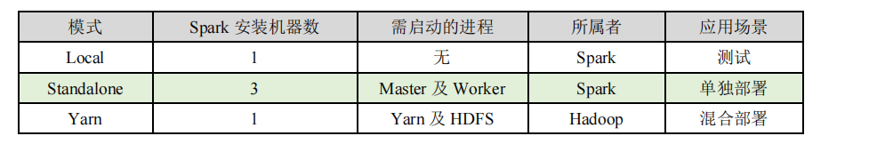

# Spark简介

Spark 是一种基于内存的快速、通用、可扩展的大数据分析计算引擎

# Spark核心模块


1. **Spark Core**

   Spark Core 中提供了 Spark 最基础与最核心的功能，Spark 其他的功能如：Spark SQL，Spark Streaming，GraphX, MLlib 都是在 Spark Core 的基础上进行扩展的

2. **Spark SQL**

   Spark SQL 是 Spark 用来操作结构化数据的组件。通过 Spark SQL，用户可以使用 SQL或者 Apache Hive 版本的 SQL 方言（HQL）来查询数据。

3. **Spark Streaming**

   Spark Streaming 是 Spark 平台上针对实时数据进行流式计算的组件，提供了丰富的处理数据流的 API

4. **Spark MLlib**

   MLlib 是 Spark 提供的一个机器学习算法库。MLlib 不仅提供了模型评估、数据导入等额外的功能，还提供了一些更底层的机器学习原语。

5. **Spark GraphX**

   GraphX 是 Spark 面向图计算提供的框架与算法库

# Spark快速上手

1. Scala环境

2. 添加Spark依赖

   ```xml
   <dependencies>
    <dependency>
    	<groupId>org.apache.spark</groupId>
    	<artifactId>spark-core_2.12</artifactId>
    	<version>3.0.0</version>
    </dependency>
   </dependencies>
   ```

3. 编写代码

   ```scala
   object Spark_02_Spark_WordCount {
   
     def main(args: Array[String]): Unit = {
       // 创建Spark运行配置对象
       val sparkConf = new SparkConf().setMaster("local").setAppName("wordcount")
       //创建Spark上下文对象
       val sparkContext = new SparkContext(sparkConf)
   
       // 业务逻辑
       //1.读取文件数据
       val wordRDD:RDD[String] = sparkContext.textFile("bigdata_08_spark/datas")
       // 扁平化
       val wordFlatMapRDD: RDD[String] = wordRDD.flatMap(_.split(" "))
       // 每个元素打上 1
       val value: RDD[(String, Int)] = wordFlatMapRDD.map((_, 1))
       // Spark提供根据key 将value做reduce操作
       val res: RDD[(String, Int)] = value.reduceByKey(_ + _)
       // 打印
       res.foreach(println)
       //关闭资源
       sparkContext.stop()
     }
   }
   ```

   

# 去除日志信息

执行过程中，会产生大量的执行日志，如果为了能够更好的查看程序的执行结果，可以在项

目的 resources 目录中创建 log4j.properties 文件，并添加日志配置信息：

```properties
log4j.rootCategory=ERROR, console
log4j.appender.console=org.apache.log4j.ConsoleAppender
log4j.appender.console.target=System.err
log4j.appender.console.layout=org.apache.log4j.PatternLayout
log4j.appender.console.layout.ConversionPattern=%d{yy/MM/dd 
HH:mm:ss} %p %c{1}: %m%n
# Set the default spark-shell log level to ERROR. When running the spark-shell, 
the
# log level for this class is used to overwrite the root logger's log level, so 
that
# the user can have different defaults for the shell and regular Spark apps.
log4j.logger.org.apache.spark.repl.Main=ERROR
# Settings to quiet third party logs that are too verbose
log4j.logger.org.spark_project.jetty=ERROR
log4j.logger.org.spark_project.jetty.util.component.AbstractLifeCycle=ERROR
log4j.logger.org.apache.spark.repl.SparkIMain$exprTyper=ERROR
log4j.logger.org.apache.spark.repl.SparkILoop$SparkILoopInterpreter=ERROR
log4j.logger.org.apache.parquet=ERROR
log4j.logger.parquet=ERROR
# SPARK-9183: Settings to avoid annoying messages when looking up nonexistent 
UDFs in SparkSQL with Hive support
log4j.logger.org.apache.hadoop.hive.metastore.RetryingHMSHandler=FATAL
log4j.logger.org.apache.hadoop.hive.ql.exec.FunctionRegistry=ERROR
```

# Spark运行环境

Spark 作为一个数据处理框架和计算引擎，被设计在所有常见的集群环境中运行, 在国内工作中主流的环境为 Yarn，不过逐渐容器式环境也慢慢流行起来。接下来，我们就分别看看不同环境下 Spark 的运行


## Local模式

所谓的 Local 模式，就是不需要其他任何节点资源就可以在本地执行 Spark 代码的环境，一般用于教学，调试，演示等，之前在 IDEA 中运行代码的环境我们称之为开发环境，不太一样

1. 解压文件

2. 解压文件

   ```shell
   tar -zxvf spark-3.0.0-bin-hadoop3.2.tgz -C /opt/module
   cd /opt/module 
   mv spark-3.0.0-bin-hadoop3.2 spark-local
   ```

3. 启动Local环境

   ```shell
   bin/spark-shell
   ```

   运行后会在问价中创建data文件夹

4. 执行代码

   

5. 通过浏览器访问

   

## Standalone模式

local 本地模式毕竟只是用来进行练习演示的，真实工作中还是要将应用提交到对应的集群中去执行，这里我们来看看只使用 Spark 自身节点运行的集群模式，也就是我们所谓的独立部署（Standalone）模式。Spark 的 Standalone 模式体现了经典的 master-slave 模式。集群规划

**集群规划:**


1. **解压缩文件** 

   将 spark-3.0.0-bin-hadoop3.2.tgz 文件上传到 Linux 并解压缩在指定位置

2. **修改配置文件** 

   1. 进入解压缩后路径的 conf 目录，修改 slaves.template 文件名为 slaves

   2. 修改 slaves 文件，添加 work 节点

      ```shell
      ha01.prdigital.cn
      ha02.prdigital.cn
      ha03.prdigital.cn
      ```

   3. 修改 spark-env.sh.template 文件名为 spark-env.sh

      ```shell
      mv spark-env.sh.template spark-env.sh
      ```

   4. 修改 spark-env.sh 文件，添加 JAVA_HOME 环境变量和集群对应的 master 节点

      ```shell
      export JAVA_HOME=/opt/module/jdk1.8.0_144
      SPARK_MASTER_HOST=ha01.prdigital.cn
      SPARK_MASTER_PORT=7077
      ```

      **注意：7077 端口，相当于 hadoop3 内部通信的 8020 端口，此处的端口需要确认自己的 Hadoop配置**

   5. 分发 spark-standalone 目录

      ```shell
      xsync spark-standalone
      ```

3. **启动集群**

   ```shell
   sbin/start-all.sh
   ```

4. 查看三台机器的服务进程

5. 查看web(**端口如果被占用户出现404问题**)

   

6. 提交应用

   ```shell
   bin/spark-submit \
   --class org.apache.spark.examples.SparkPi \
   --master spark://ha01.prdigital.cn:7077 \
   ./examples/jars/spark-examples_2.12-3.0.0.jar \
   10
   ```

   


​		1) --class 表示要执行程序的主类

​		2) --master spark://linux1:7077 独立部署模式，连接到 Spark 集群

​		3) spark-examples_2.12-3.0.0.jar 运行类所在的 jar 包

​		4) 数字 10 表示程序的入口参数，用于设定当前应用的任务数量

7. 提交参数说明

   ```shell
   bin/spark-submit \
   --class <main-class>
   --master <master-url> \
   ... # other options
   <application-jar> \
   [application-arguments]
   ```

   

### **配置历史服务**

由于 spark-shell 停止掉后，集群监控 linux1:4040 页面就看不到历史任务的运行情况，所以开发时都配置历史服务器记录任务运行情况

1. 修改 spark-defaults.conf.template 文件名为 spark-defaults.conf

   ```shell
   mv spark-defaults.conf.template spark-defaults.conf
   ```

2. 修改 spark-default.conf 文件，配置日志存储路径

   ```shell
   spark.eventLog.enabled true
   spark.eventLog.dir hdfs://ha01.prdigital.cn:8020/directory
   ```

   **注意：需要启动 hadoop 集群，HDFS 上的 directory 目录需要提前存在。**

   ```shell
   sbin/start-dfs.sh
   hadoop fs -mkdir /directory
   ```

3. 修改 spark-env.sh 文件, 添加日志配置

   ```shell
   export SPARK_HISTORY_OPTS="
   -Dspark.history.ui.port=18080 
   -Dspark.history.fs.logDirectory=hdfs://ha01.prdigital.cn:8020/directory 
   -Dspark.history.retainedApplications=30"
   ```

   1. 参数 1 含义：WEB UI 访问的端口号为 18080
   2. 参数 2 含义：指定历史服务器日志存储路径
   3. 参数 3 含义：指定保存 Application 历史记录的个数，如果超过这个值，旧的应用程序信息将被删除，这个是内存中的应用数，而不是页面上显示的应用数。

4. 分发配置文件

   ```shell
   xsync conf
   ```

5. 重新启动集群和历史服务

   ```shell
   sbin/start-all.sh
   sbin/start-history-server.sh
   ```

6. 重新执行任务

   ```shell
   bin/spark-submit \
   --class org.apache.spark.examples.SparkPi \
   --master spark://ha01.prdigital.cn:7077 \
   ./examples/jars/spark-examples_2.12-3.0.0.jar \
   10
   ```

7. 查看历史服务：http://ha01.prdigital.cn:18080

### 配置高可用（HA）

所谓的高可用是因为当前集群中的 Master 节点只有一个，所以会存在单点故障问题。所以为了解决单点故障问题，需要在集群中配置多个 Master 节点，一旦处于活动状态的 Master发生故障时，由备用 Master 提供服务，保证作业可以继续执行。这里的高可用一般采用Zookeeper 设置


1. 停止集群

   ```shell
   sbin/stop-all.sh
   ```

2. 启动集群 Zookeeper

   ```
   ./myZK start
   ```

3. 修改 spark-env.sh 文件添加如下配置

   ```shell
   注释如下内容：
   #SPARK_MASTER_HOST=linux1
   #SPARK_MASTER_PORT=7077
   添加如下内容:
   #Master 监控页面默认访问端口为 8080，但是可能会和 Zookeeper 冲突，所以改成 8989，也可以自
   定义，访问 UI 监控页面时请注意
   SPARK_MASTER_WEBUI_PORT=8989
   export SPARK_DAEMON_JAVA_OPTS="
   -Dspark.deploy.recoveryMode=ZOOKEEPER 
   -Dspark.deploy.zookeeper.url=linux1,linux2,linux3
   -Dspark.deploy.zookeeper.dir=/spark"
   ```

4. 分发配置文件

   ```shell
   xsync conf/
   ```

5. 启动集群

   ```shell
   sbin/start-all.sh
   ```

6. 启动 ha02.prdigital.cn:8989 的单独 Master 节点，此时 linux2 节点 Master 状态处于备用状态

   ```shell
   sbin/start-master.sh
   ```

7. 访问ha01.prdigital.cn:8989

## yarn模式

独立部署（Standalone）模式由 Spark 自身提供计算资源，无需其他框架提供资源。这种方式降低了和其他第三方资源框架的耦合性，独立性非常强。但是你也要记住，Spark 主要是计算框架，而不是资源调度框架，所以本身提供的资源调度并不是它的强项，所以还是和其他专业的资源调度框架集成会更靠谱一些。所以接下来我们来学习在强大的 Yarn 环境下 Spark 是如何工作的（其实是因为在国内工作中，Yarn 使用的非常多）

1. 将 spark-3.0.0-bin-hadoop3.2.tgz 文件上传到 linux 并解压缩，放置在指定位置。

   ```shell
   mv spark-3.0.0-bin-hadoop3.2 spark-yarn
   ```

2. **修改配置文件** 

   修改 hadoop 配置文件/opt/module/hadoop/etc/hadoop/yarn-site.xml, **并分发**

   ```shell
   <!--是否启动一个线程检查每个任务正使用的物理内存量，如果任务超出分配值，则直接将其杀掉，默认是 true -->
   <property>
    <name>yarn.nodemanager.pmem-check-enabled</name>
    <value>false</value>
   </property>
   <!--是否启动一个线程检查每个任务正使用的虚拟内存量，如果任务超出分配值，则直接将其杀掉，默认
   是 true -->
   <property>
    <name>yarn.nodemanager.vmem-check-enabled</name>
    <value>false</value>
   </property>
   ```

3. 修改 conf/spark-env.sh，添加 JAVA_HOME 和 YARN_CONF_DIR 配置

   ```shell
   mv spark-env.sh.template spark-env.sh
   
   export JAVA_HOME=/opt/module/jdk1.8.0_144
   YARN_CONF_DIR=/opt/module/hadoop/etc/hadoop
   ```

4. **启动** **HDFS** **以及** **YARN** **集群**

5. **提交应用** 

   ```shell
   bin/spark-submit \
   --class org.apache.spark.examples.SparkPi \
   --master yarn \
   --deploy-mode cluster \
   ./examples/jars/spark-examples_2.12-3.0.0.jar \
   10
   ```

   

   查看 http://ha01.prdigital.cn:8088 页面，点击 History，查看历史页面


6. **配置历史服务器** 

   1. 修改 spark-defaults.conf.template 文件名为 spark-defaults.conf

      ```shell
      mv spark-defaults.conf.template spark-defaults.conf
      ```

   2. 修改 spark-default.conf 文件，配置日志存储路径

      ```shell
      spark.eventLog.enabled true
      spark.eventLog.dir hdfs://linux1:8020/directory
      ```

      **注意：需要启动 hadoop 集群，HDFS 上的目录需要提前存在。**

      ```shell
      [root@linux1 hadoop]# sbin/start-dfs.sh
      [root@linux1 hadoop]# hadoop fs -mkdir /directory
      ```

   3. 修改 spark-env.sh 文件, 添加日志配置

      ```shell'
      export SPARK_HISTORY_OPTS="
      -Dspark.history.ui.port=18080 
      -Dspark.history.fs.logDirectory=hdfs://linux1:8020/directory 
      -Dspark.history.retainedApplications=30"
      ```

   4. 修改 spark-defaults.conf

      ```shell
      spark.yarn.historyServer.address=linux1:18080
      spark.history.ui.port=18080
      ```

   5. 启动历史服务

      ```shell
      sbin/start-history-server.sh
      ```

   6. 重新提交应用(客户端提交模式)

      ```shell
      bin/spark-submit \
      --class org.apache.spark.examples.SparkPi \
      --master yarn \
      --deploy-mode client \
      ./examples/jars/spark-examples_2.12-3.0.0.jar \
      10
      ```

   7. Web 页面查看日志：http://linux2:8088

      

      （点击任务的history跳转）

## K82和Mesos模式

TODO

## Windows模式

在同学们自己学习时，每次都需要启动虚拟机，启动集群，这是一个比较繁琐的过程，并且会占大量的系统资源，导致系统执行变慢，不仅仅影响学习效果，也影响学习进度，Spark 非常暖心地提供了可以在 windows 系统下启动本地集群的方式，这样，在不使用虚拟机的情况下，也能学习 Spark 的基本使用

1. 将文件 spark-3.0.0-bin-hadoop3.2.tgz 解压缩到无中文无空格的路径中

2. **启动本地环境**

   ```shell
   执行解压缩文件路径下 bin 目录中的 spark-shell.cmd 文件，启动 Spark 本地环境
   ```

   

3. 在 bin 目录中创建 input 目录，并添加 word.txt 文件, 在命令行中输入脚本代码

   

4. **命令行提交应用**

   在 DOS 命令行窗口中执行提交指令

   ```shell
   spark-submit --class org.apache.spark.examples.SparkPi --master local[2] ../examples/jars/spark-examples_2.12-3.0.0.jar 10
   ```

## 部署比较



##	**端口号**

➢ Spark 查看当前 Spark-shell 运行任务情况端口号：4040（计算） 

➢ Spark Master 内部通信服务端口号：7077

➢ Standalone 模式下，Spark Master Web 端口号：8080（资源）

➢ Spark 历史服务器端口号：18080

➢ Hadoop YARN 任务运行情况查看端口号：8088

# Spark运行架构

## 运行架构

Spark 框架的核心是一个计算引擎，整体来说，它采用了标准 master-slave 的结构。 

如下图所示，它展示了一个 Spark 执行时的基本结构。图形中的 Driver 表示 master，负责管理整个集群中的作业任务调度。图形中的 Executor 则是 slave，负责实际执行任务。

## **核心组件**

由上图可以看出，对于 Spark 框架有两个核心组件：

### Driver

Spark 驱动器节点，用于执行 Spark 任务中的 main 方法，负责实际代码的执行工作。

Driver 在 Spark 作业执行时主要负责：

➢ 将用户程序转化为作业（job） 

➢ 在 Executor 之间调度任务(task)

➢ 跟踪 Executor 的执行情况

➢ 通过 UI 展示查询运行情况

实际上，我们无法准确地描述 Driver 的定义，因为在整个的编程过程中没有看到任何有关Driver 的字眼。所以简单理解，所谓的 Driver 就是驱使整个应用运行起来的程序，也称之为Driver 类

### Executor

Spark Executor 是集群中工作节点（Worker）中的一个 JVM 进程，负责在 Spark 作业中运行具体任务（Task），任务彼此之间相互独立。Spark 应用启动时，Executor 节点被同时启动，并且始终伴随着整个 Spark 应用的生命周期而存在。如果有 Executor 节点发生了故障或崩溃，Spark 应用也可以继续执行，会将出错节点上的任务调度到其他 Executor 节点上继续运行

**Executor 有两个核心功能：**

➢ 负责运行组成 Spark 应用的任务，并将结果返回给驱动器进程

➢ 它们通过自身的块管理器（Block Manager）为用户程序中要求缓存的 RDD 提供内存式存储。RDD 是直接缓存在 Executor 进程内的，因此任务可以在运行时c    	 充分利用缓存数据加速运算

### **Master & Worker**

Spark 集群的独立部署环境中，不需要依赖其他的资源调度框架，自身就实现了资源调度的功能，所以环境中还有其他两个核心组件：Master 和 Worker，这里的 Master 是一个进程，主要负责资源的调度和分配，并进行集群的监控等职责，类似于 Yarn 环境中的 RM, 而Worker 呢，也是进程，一个 Worker 运行在集群中的一台服务器上，由 Master 分配资源对数据进行并行的处理和计算，类似于 Yarn 环境中 NM。

### **ApplicationMaster**

Hadoop 用户向 YARN 集群提交应用程序时,提交程序中应该包含 ApplicationMaster，用于向资源调度器申请执行任务的资源容器 Container，运行用户自己的程序任务 job，监控整个任务的执行，跟踪整个任务的状态，处理任务失败等异常情况

说的简单点就是，ResourceManager（资源）和 Driver（计算）之间的解耦合靠的就是ApplicationMaster。

## **核心概念**

Spark Executor 是集群中运行在工作节点（Worker）中的一个 JVM 进程，是整个集群中的专门用于计算的节点。在提交应用中，可以提供参数指定计算节点的个数，以及对应的资源。这里的资源一般指的是工作节点 Executor 的内存大小和使用的虚拟 CPU 核（Core）数量

**应用程序相关启动参数如下：**


### **并行度（**Parallelism**）**

在分布式计算框架中一般都是多个任务同时执行，由于任务分布在不同的计算节点进行计算，所以能够真正地实现多任务并行执行，记住，这里是并行，而不是并发。这里我们将整个集群并行执行任务的数量称之为并行度。那么一个作业到底并行度是多少呢？这个取决于框架的默认配置。应用程序也可以在运行过程中动态修改

### **有向无环图（**DAG**）**


大数据计算引擎框架我们根据使用方式的不同一般会分为四类，其中第一类就是Hadoop 所承载的 MapReduce,它将计算分为两个阶段，分别为 Map 阶段 和 Reduce 阶段。对于上层应用来说，就不得不想方设法去拆分算法，甚至于不得不在上层应用实现多个 Job 的串联，以完成一个完整的算法，例如迭代计算。 由于这样的弊端，催生了支持 DAG 框架的产生。因此，支持 DAG 的框架被划分为第二代计算引擎。如 Tez 以及更上层的Oozie。这里我们不去细究各种 DAG 实现之间的区别，不过对于当时的 Tez 和 Oozie 来说，大多还是批处理的任务。接下来就是以 Spark 为代表的第三代的计算引擎。第三代计算引擎的特点主要是 Job 内部的 DAG 支持（不跨越 Job），以及实时计算。这里所谓的有向无环图，并不是真正意义的图形，而是由 Spark 程序直接映射成的数据流的高级抽象模型。简单理解就是将整个程序计算的执行过程用图形表示出来,这样更直观，更便于理解，可以用于表示程序的拓扑结构

DAG（Directed Acyclic Graph）有向无环图是由点和线组成的拓扑图形，该图形具有方向，不会闭环

## **提交流程**

所谓的提交流程，其实就是我们开发人员根据需求写的应用程序通过 Spark 客户端提交给 Spark 运行环境执行计算的流程。在不同的部署环境中，这个提交过程基本相同，但是又有细微的区别，我们这里不进行详细的比较，但是因为国内工作中，将 Spark 引用部署到Yarn 环境中会更多一些，所以本课程中的提交流程是基于 Yarn 环境的


Spark 应用程序提交到 Yarn 环境中执行的时候，一般会有两种部署执行的方式：Client和 Cluster。两种模式主要区别在于：Driver 程序的运行节点位置

### **Yarn Client** **模式**

Client 模式将用于监控和调度的 Driver 模块在客户端执行，而不是在 Yarn 中，所以一般用于测试

➢ Driver 在任务提交的本地机器上运行

➢ Driver 启动后会和 ResourceManager 通讯申请启动 ApplicationMaster

➢ ResourceManager 分配 container，在合适的 NodeManager 上启动 ApplicationMaster，负责向 ResourceManager 申请 Executor 内存

➢ ResourceManager 接到 ApplicationMaster 的资源申请后会分配 container，然后ApplicationMaster 在资源分配指定的 NodeManager 上启动 Executor 进程

➢ Executor 进程启动后会向 Driver 反向注册，Executor 全部注册完成后 Driver 开始执行main 函数

➢ 之后执行到 Action 算子时，触发一个 Job，并根据宽依赖开始划分 stage，每个 stage 生成对应的 TaskSet，之后将 task 分发到各个 Executor 上执行。

### **Yarn Cluster** **模式**

Cluster 模式将用于监控和调度的 Driver 模块启动在 Yarn 集群资源中执行。一般应用于实际生产环境。

➢ 在 YARN Cluster 模式下，任务提交后会和 ResourceManager 通讯申请启动ApplicationMaster， 

➢ 随后 ResourceManager 分配 container，在合适的 NodeManager 上启动 ApplicationMaster，此时的 ApplicationMaster 就是 Driver。 

➢ Driver 启动后向 ResourceManager 申请 Executor 内存，ResourceManager 接到ApplicationMaster 的资源申请后会分配 container，然后在合适的   NodeManager 上启动Executor 进程

➢ Executor 进程启动后会向 Driver 反向注册，Executor 全部注册完成后 Driver 开始执行main 函数，

➢ 之后执行到 Action 算子时，触发一个 Job，并根据宽依赖开始划分 stage，每个 stage 生成对应的 TaskSet，之后将 task 分发到各个 Executor 上执行。

# Spark核心编程

Spark 计算框架为了能够进行高并发和高吞吐的数据处理，封装了三大数据结构，用于处理不同的应用场景。三大数据结构分别是:

➢ RDD : 弹性分布式数据集

➢ 累加器：分布式共享**只写**变量

➢ 广播变量：分布式共享**只读**变量

## RDD

### 简介

RDD（Resilient Distributed Dataset）叫做弹性分布式数据集，是 Spark 中最基本的数据处理模型。代码中是一个抽象类，它代表一个弹性的、不可变、可分区、里面的元素可并行计算的集合。

➢ 弹性

- 存储的弹性：内存与磁盘的自动切换；
- 容错的弹性：数据丢失可以自动恢复；
- 计算的弹性：计算出错重试机制；
- 分片的弹性：可根据需要重新分片。

➢ 分布式：数据存储在大数据集群不同节点上

➢ 数据集：RDD 封装了计算逻辑，并不保存数据

➢ 数据抽象：RDD 是一个抽象类，需要子类具体实现

➢ 不可变：RDD 封装了计算逻辑，是不可以改变的，想要改变，只能产生新的 RDD，在新的 RDD 里面封装计算逻辑

➢ 可分区、并行计算

### 核心属性

➢ 分区列表

​    RDD 数据结构中存在分区列表，用于执行任务时并行计算，是实现分布式计算的重要属性

➢ 分区计算函数

​	Spark 在计算时，是使用分区函数对每一个分区进行计算

➢ RDD 之间的依赖关系

​	RDD 是计算模型的封装，当需求中需要将多个计算模型进行组合时，就需要将多个 RDD 建立依赖关系

➢ 分区器（可选）

​	当数据为 KV 类型数据时，可以通过设定分区器自定义数据的分区

➢ 首选位置（可选）

​	计算数据时，可以根据计算节点的状态选择不同的节点位置进行计算

### **执行原理**

从计算的角度来讲，数据处理过程中需要计算资源（内存 & CPU）和计算模型（逻辑）。执行时，需要将计算资源和计算模型进行协调和整合。

Spark 框架在执行时，先申请资源，然后将应用程序的数据处理逻辑分解成一个一个的计算任务。然后将任务发到已经分配资源的计算节点上, 按照指定的计算模型进行数据计算。最后得到计算结果。

RDD 是 Spark 框架中用于数据处理的核心模型，接下来我们看看，在 Yarn 环境中，RDD的工作原理:

> **启动 Yarn 集群环境**


> **Spark 通过申请资源创建调度节点和计算节点**


> **Spark 框架根据需求将计算逻辑根据分区划分成不同的任务**


> **调度节点将任务根据计算节点状态发送到对应的计算节点进行计算**


从以上流程可以看出 RDD 在整个流程中主要用于将逻辑进行封装，并生成 Task 发送给Executor 节点执行计算，接下来我们就一起看看 Spark 框架中 RDD 是具体是如何进行数据处理的。

### **基础编程**

#### **RDD** **创建**

**在 Spark 中创建 RDD 的创建方式可以分为四种：**


> 1. 从集合中（内存中创建RDD）

从集合中创建 RDD，Spark 主要提供了两个方法：parallelize 和 makeRDD

```scala
def main(args: Array[String]): Unit = {

    // 从内存中读取数据
    val list = List(1,2,3,4,5)

    // 创建Spark运行配置对象
    // [*] 标识根据当前计算机的合数进行模拟
    val sparkConf = new SparkConf().setMaster("local[*]").setAppName("RDD")
    //创建Spark上下文对象
    val sc = new SparkContext(sparkConf)

    val value1: RDD[Int] = sc.parallelize(list)

    value1.collect().foreach(println);

    println("=" * 10)

    val value2: RDD[Int] = sc.makeRDD(list)

    value2.collect().foreach(println);

    // 关闭资源
    sc.stop()
  }
```


> 2. 从外部文件中获取

由外部存储系统的数据集创建 RDD 包括：本地的文件系统，所有 Hadoop 支持的数据集，比如 HDFS、HBase 等

```scala
 def main(args: Array[String]): Unit = {

    // 从文件中获取

    // 创建Spark运行配置对象
    val sparkConf = new SparkConf().setMaster("local[*]").setAppName("RDD")
    //创建Spark上下文对象
    val sc = new SparkContext(sparkConf)

    // 相对路径是父工程
    val value: RDD[String] = sc.textFile("bigdata_08_spark/datas")

    value.collect().foreach(println);

    println("=" * 10)

    // 文件可以使用正则
    val value2: RDD[String] = sc.textFile("bigdata_08_spark/datas/*.txt")

    // 可以从hdfs中获取数据
    val value3: RDD[String] = sc.textFile("hdfs://ha01.prdigital.cn/input")

    value3.collect().foreach(println);

    // 关闭资源
    sc.stop()
  }
```


> 3. 从其他RDD创建

主要是通过一个 RDD 运算完后，再产生新的 RDD。详情请参考后续章节


> 4.直接创建RDD(new)

使用 new 的方式直接构造 RDD，一般由 Spark 框架自身使用。


#### **RDD** **并行度与分区**

默认情况下，Spark 可以将一个作业切分多个任务后，发送给 Executor 节点并行计算，而能够并行计算的任务数量我们称之为并行度。这个数量可以在构建 RDD 时指定。记住，这里的并行执行的任务数量，并不是指的切分任务的数量，不要混淆了。

读取内存数据时，数据可以按照并行度的设定进行数据的分区操作，数据分区规则的

```scala
def positions(length: Long, numSlices: Int): Iterator[(Int, Int)] = {
 (0 until numSlices).iterator.map { i =>
 val start = ((i * length) / numSlices).toInt
 val end = (((i + 1) * length) / numSlices).toInt
 (start, end)
 }
}
```

读取文件数据时，数据是按照 Hadoop 文件读取的规则进行切片分区，而切片规则和数据读取的规则有些差异

#### RDD转换算子

算子类似于scala中的函数方法

RDD 根据数据处理方式的不同将算子整体上分为 Value 类型、双 Value 类型和 Key-Value类型

> **value类型**

- map

  ➢ 函数签名

  def map[U: ClassTag](f: T => U): RDD[U] 

  ➢ 函数说明

  将处理的数据逐条进行映射转换，这里的转换可以是类型的转换，也可以是值的转换。

  ```scala
  def main(args: Array[String]): Unit = {
  
      val sparkConf = new SparkConf().setMaster("local[*]").setAppName("RDD")
      val sc = new SparkContext(sparkConf)
  
      var list = List[Int](1,2,3,4,5)
  
      val value: RDD[Int] = sc.makeRDD(list)
  
      // 使用匿名函数
      value.map(_*2).collect().foreach(println)
  
      println("=" * 10)
  
      // 传递函数的方式
      def fun(num:Int):Int = num * 3
      value.map(fun).collect().foreach(println)
  
      sc.stop()
    }
  ```

  **同一个分区中执行时有序的**

  **不同分区之前是我发保证有序的**

  ```scala
   /**
     *
     * 同一个分区中执行时有序的
     * 不同分区之前是我发保证有序的
     * @param args
     */
  
    def main(args: Array[String]): Unit = {
      val sparkConf = new SparkConf().setMaster("local[*]").setAppName("RDD")
      val sc = new SparkContext(sparkConf)
  
      var list = List[Int](1,2,3,4,5)
  
      val value: RDD[Int] = sc.makeRDD(list,2)
      val map1: RDD[Int] = value.map(
        num => {
          println(">>>>>>>>>> " + num)
          num
        }
      )
  
      val map2: RDD[Int] = map1.map(
        num => {
          println("<<<<<<<<< " + num)
          num
        }
      )
  
      map2.collect()
      sc.stop()
    }
  ```

  

- **mapPartitions**

  ➢ 函数签名

  def mapPartitions[U: ClassTag](

   f: Iterator[T] => Iterator[U],

   preservesPartitioning: Boolean = false): RDD[U]

  ➢ 函数说明

  将待处理的数据以分区为单位发送到计算节点进行处理，这里的处理是指可以进行任意的处理，哪怕是过滤数据。

  ```scala
  val dataRDD1: RDD[Int] = dataRDD.mapPartitions(
   datas => {
   datas.filter(_==2)
   } )
  
  ||
  
  val value: RDD[Int] = sc.makeRDD(List[Int](1,2,3,4,5),2)
      // 传递函数参数为分区的迭代器
      val map1: RDD[Int] = value.mapPartitions(
        iter =>{
          println(">>>>>>")
          iter.map(_*2)
        }
      )
  ```

  **map 和 mapPartitions 的区别**

  ➢ 数据处理角度

  ​	Map 算子是分区内一个数据一个数据的执行，类似于串行操作。而 mapPartitions 算子是以分区为单位进行批处理操作。

  ➢ 功能的角度

  ​	Map 算子主要目的将数据源中的数据进行转换和改变。但是不会减少或增多数据。MapPartitions 算子需要传递一个迭代器，返回一个迭代器，没有要求的	元素的个数保持不变，所以可以增加或减少数据

  ➢ 性能的角度

  ​	Map 算子因为类似于串行操作，所以性能比较低，而是 mapPartitions 算子类似于批处理，所以性能较高。但是 mapPartitions 算子会长时间占用内存，	那么这样会导致内存可能不够用，出现内存溢出的错误。所以在内存有限的情况下，不推荐使用。使用 map 操作

- **mapPartitionsWithIndex**

  ➢ 函数签名

  def mapPartitionsWithIndex[U: ClassTag](

   f: (Int, Iterator[T]) => Iterator[U],

   preservesPartitioning: Boolean = false): RDD[U]

  ➢ 函数说明

  将待处理的数据以分区为单位发送到计算节点进行处理，这里的处理是指可以进行任意的处理，哪怕是过滤数据，在处理时同时可以获取当前分区索引。

  ```scala
  val dataRDD1 = dataRDD.mapPartitionsWithIndex(
   (index, datas) => {
   datas.map(index, _)
   } )
  ```

  **获取每条数据所在的分区**

  ```scala
  def main(args: Array[String]): Unit = {
      val sparkConf = new SparkConf().setMaster("local[*]").setAppName("RDD")
      val sc = new SparkContext(sparkConf)
  
  
      val rdd: RDD[Int] = sc.makeRDD(List[Int](1,2,3,4,5))
  
      val map1: RDD[(Int, Int)] = rdd.mapPartitionsWithIndex(
        (index, iter) => {
          iter.map((index, _))
        }
      )
  
      map1.collect().foreach(println)
      sc.stop()
    }
  ```

- flatMap

  ➢ 函数签名

  def flatMap[U: ClassTag](f: T => TraversableOnce[U]): RDD[U]

  ➢ 函数说明

  将处理的数据进行扁平化后再进行映射处理，所以算子也称之为扁平映射

  ```scala
  val dataRDD = sparkContext.makeRDD(List(
   List(1,2),List(3,4)
  ),1)
  val dataRDD1 = dataRDD.flatMap(
   list => list
  )
  ```

  **将 List(List(1,2),3,List(4,5))进行扁平化操作**

  ```scala
   // 将不规则集合扁平化操作
      val list = List(
        List(1,2),
        3,
        List(4,5)
      )
  
      val rdd: RDD[Any] = sc.makeRDD(list)
      val value: RDD[Any] = rdd.flatMap(
        data => {
          data match {
            case list:List[_] => list
            case dat => List(dat)
          }
        }
      )
  
  ```

- **glom**

  ➢ 函数签名

  def glom(): RDD[Array[T]]

  ➢ 函数说明

  将同一个分区的数据直接转换为相同类型的内存数组进行处理，分区不变

  ```scala
  val rdd: RDD[Int] = sc.makeRDD(List(1, 2, 3, 4), 2)
  val glonRDD: RDD[Array[Int]] = rdd.glom()
  glonRDD.collect().foreach(arr => println(arr.mkString(",")))
  
  输出：
  1,2
  3,4
  ```

- **groupBy**

  ➢ 函数签名

  def groupBy[K](f: T => K)(implicit kt: ClassTag[K]): RDD[(K, Iterable[T])]

  ➢ 函数说明

  将数据根据指定的规则进行分组, 分区默认不变，但是数据会被打乱重新组合，我们将这样的操作称之为 shuffle。极限情况下，数据可能被分在同一个分区中

  **一个组的数据在一个分区中，但是并不是说一个分区中只有一个组**

  ```scala
  val rdd: RDD[Int] = sc.makeRDD(List(1, 2, 3, 4), 1)
  val groupRdd: RDD[(Int, Iterable[Int])] = rdd.groupBy(num => num % 2)
  groupRdd.collect().foreach(println)
  sc.stop()
  ```

  **从服务器日志数据 apache.log 中获取每个时间段访问量。**

  ```scala
   val rdd: RDD[String] = sc.textFile("bigdata_08_spark/datas/apache.log")
      val sdf: SimpleDateFormat = new SimpleDateFormat("yyyy/MM/DD:HH:mm:ss")
  
      val mapRDD: RDD[(Int, Int)] = rdd.map(
        line => {
          var time = line.split(" ")(3)
          val hours: Int = sdf.parse(time).getHours
          (hours, 1)
        }
      )
  
      val groupRDD: RDD[(Int, Iterable[(Int, Int)])] = mapRDD.groupBy(_._1)
      val resRDD: RDD[(Int, Int)] = groupRDD.map({
        case (hour, iter) => (hour, iter.size)
      })
  ```

- **filter**

  ➢ 函数签名

  def filter(f: T => Boolean): RDD[T]

  ➢ 函数说明

  将数据根据指定的规则进行筛选过滤，符合规则的数据保留，不符合规则的数据丢弃。当数据进行筛选过滤后，分区不变，但是分区内的数据可能不均衡，生产环境下，可能会出现数据倾斜

  **从服务器日志数据 apache.log 中获取 2015 年 5 月 17 日的请求路径**

  ```scala
  val rdd: RDD[String] = sc.textFile("bigdata_08_spark/datas/apache.log")
      val filterDate = "17/05/2015";
      val filterRDD: RDD[String] = rdd.filter(
        line => {
          val dateStr = line.split(" ")(3)
          dateStr.startsWith(filterDate)
        }
      )
  ```

- **sample**

  ➢ 函数签名

  def sample(

   withReplacement: Boolean,

   fraction: Double,

   seed: Long = Utils.random.nextLong): RDD[T]

  ➢ 函数说明

  根据指定的规则从数据集中抽取数据

  ```scala
   val dataRDD = sc.makeRDD(List(
        1,2,3,4
      ),1)
      // 抽取数据不放回（伯努利算法）
      // 伯努利算法：又叫 0、1 分布。例如扔硬币，要么正面，要么反面。
      // 具体实现：根据种子和随机算法算出一个数和第二个参数设置几率比较，小于第二个参数要，大于不要
      // 第一个参数：抽取的数据是否放回，false：不放回
      // 第二个参数：抽取的几率，范围在[0,1]之间,0：全不取；1：全取；
      // 第三个参数：随机数种子
      val dataRDD1 = dataRDD.sample(false, 0.5)
      // 抽取数据放回（泊松算法）
      // 第一个参数：抽取的数据是否放回，true：放回；false：不放回
      // 第二个参数：重复数据的几率，范围大于等于 0.表示每一个元素被期望抽取到的次数
      // 第三个参数：随机数种子
      val dataRDD2 = dataRDD.sample(true, 2)
  ```

- **distinct**

  ➢ 函数签名

  def distinct()(implicit ord: Ordering[T] = null): RDD[T]

  def distinct(numPartitions: Int)(implicit ord: Ordering[T] = null): RDD[T]

  ➢ 函数说明

  将数据集中重复的数据去重

  ```scala
  val rdd: RDD[Int] = sc.makeRDD(List(1, 2, 3, 4, 5, 1, 2),1)
  rdd.distinct().collect().foreach(println)
  
  println("=" * 10)
  
  rdd.distinct(2).collect().foreach(println)
  ```

- **coalesce**

  ➢ 函数签名

  def coalesce(numPartitions: Int, shuffle: Boolean = false,

   partitionCoalescer: Option[PartitionCoalescer] = Option.empty)

   (implicit ord: Ordering[T] = null)

   : RDD[T]

  ➢ 函数说明

  根据数据量缩减分区，用于大数据集过滤后，提高小数据集的执行效率当 spark 程序中，存在过多的小任务的时候，可以通过 coalesce 方法，收缩合并分区，减少分区的个数，减小任务调度成本

  ```scala
  val rdd: RDD[Int] = sc.makeRDD(List(1, 2, 3, 4, 5, 6), 3)
  val coalesceRDD: RDD[Int] = rdd.coalesce(2)
  
  //会导致数据倾斜
  coalesceRDD.saveAsTextFile("bigdata_08_spark/datas/output")
  
  // 采用shuffer避免
  val coalesceRDD2: RDD[Int] = rdd.coalesce(2,true)
  
  coalesceRDD2.saveAsTextFile("bigdata_08_spark/datas/output2")
  ```

- **repartition**

  ➢ 函数签名

  def repartition(numPartitions: Int)(implicit ord: Ordering[T] = null): RDD[T]

  ➢ 函数说明

  该操作内部其实执行的是 coalesce 操作，参数 shuffle 的默认值为 true。无论是将分区数多的RDD 转换为分区数少的 RDD，还是将分区数少的 RDD 转换为分区数多的 RDD，repartition操作都可以完成，因为无论如何都会经 shuffle 过程。

  ```scala
  val rdd: RDD[Int] = sc.makeRDD(List(1, 2, 3, 4, 5, 6), 2)
  val coalesceRDD: RDD[Int] = rdd.repartition(3)
  ```

- **sortBy**

  ➢ 函数签名

  def sortBy[K](

   f: (T) => K,

  ascending: Boolean = true,

   numPartitions: Int = this.partitions.length)

   (implicit ord: Ordering[K], ctag: ClassTag[K]): RDD[T]

  ➢ 函数说明

  该操作用于排序数据。在排序之前，可以将数据通过 f 函数进行处理，之后按照 f 函数处理的结果进行排序，默认为升序排列。排序后新产生的 RDD 的分区数与原 RDD 的分区数一致。中间存在 shuffle 的过程

  ```scala
  val rdd: RDD[Int] = sc.makeRDD(List(6, 2, 4, 3, 5, 6), 2)
  val value: RDD[Int] = rdd.sortBy(num => num)
  
  // 第二个参数传递false，降序排序
  val value2: RDD[Int] = rdd.sortBy(num => num,false)
  value2.collect().foreach(println)
  ```

- **intersection**

  ➢ 函数签名

  def intersection(other: RDD[T]): RDD[T]

  ➢ 函数说明

  对源 RDD 和参数 RDD 求交集后返回一个新的 RDD

- **union**

  ➢ 函数签名

  def union(other: RDD[T]): RDD[T]

  ➢ 函数说明

  对源 RDD 和参数 RDD 求并集后返回一个新的 RDD

- **subtract**

  ➢ 函数签名

  def subtract(other: RDD[T]): RDD[T]

  ➢ 函数说明

  以一个 RDD 元素为主，去除两个 RDD 中重复元素，将其他元素保留下来。求差集

- **zip**

  ➢ 函数签名

  def zip[U: ClassTag](other: RDD[U]): RDD[(T, U)]

  ➢ 函数说明

  将两个 RDD 中的元素，以键值对的形式进行合并。其中，键值对中的 Key 为第 1 个 RDD中的元素，Value 为第 2 个 RDD 中的相同位置的元素。

  ```scala
  val rdd1: RDD[Int] = sc.makeRDD(List(1,2,3,4))
  val rdd2: RDD[Int] = sc.makeRDD(List(3,4,5,6))
  
  // 交集
  val rdd3: RDD[Int] = rdd1.intersection(rdd2)
  println(rdd3.collect().mkString(","))
  
  // 并集
  val rdd4: RDD[Int] = rdd1.union(rdd2)
  println(rdd4.collect().mkString(","))
  
  // 差集
  val rdd5: RDD[Int] = rdd1.subtract(rdd2)
  println(rdd5.collect().mkString(","))
  
  // 拉链 如果两个集合数据长度不一致，则报错
  val rdd6: RDD[(Int, Int)] = rdd1.zip(rdd2)
  println(rdd6.collect().mkString(","))
  ```

- **partitionBy**

  ➢ 函数签名

  def partitionBy(partitioner: Partitioner): RDD[(K, V)]

  ➢ 函数说明

  将数据按照指定 Partitioner 重新进行分区。Spark 默认的分区器是 HashPartitioner

  ```scala
  val rdd: RDD[Int] = sc.makeRDD(List(1,2,3,4),1)
  
  val mapRdd: RDD[(Int, Int)] = rdd.map((_, 1))
  mapRdd.partitionBy(new HashPartitioner(2))
  ```

- **reduceByKey**

  ➢ 函数签名

  def reduceByKey(func: (V, V) => V): RDD[(K, V)]

  def reduceByKey(func: (V, V) => V, numPartitions: Int): RDD[(K, V)]

  ➢ 函数说明

  可以将数据按照相同的 Key 对 Value 进行聚合

  ```scala
  val dataRDD1 = sparkContext.makeRDD(List(("a",1),("b",2),("c",3)))
  val dataRDD2 = dataRDD1.reduceByKey(_+_)
  val dataRDD3 = dataRDD1.reduceByKey(_+_, 2)
  ```

- **groupByKey**

  ➢ 函数签名

  def groupByKey(): RDD[(K, Iterable[V])]

  def groupByKey(numPartitions: Int): RDD[(K, Iterable[V])]

  def groupByKey(partitioner: Partitioner): RDD[(K, Iterable[V])]

  ➢ 函数说明

  将数据源的数据根据 key 对 value 进行分组

  ```scala
  val rdd: RDD[(String, Int)] = sc.makeRDD(List(("a", 1), ("a", 1), ("a", 1), ("b", 1)))
  val value: RDD[(String, Iterable[Int])] = rdd.groupByKey()
  value.collect().foreach(println)
  ```

  **reduceByKey 和 groupByKey 的区别？**

  **从** **shuffle** **的角度**：reduceByKey 和 groupByKey 都存在 shuffle 的操作,但是 reduceByKey可以在 shuffle 前对分区内相同 key 的数据进行预聚合（combine）功能，这样会减少落盘的数据量，而 groupByKey 只是进行分组，不存在数据量减少的问题，reduceByKey 性能比较高。

  **从功能的角度**：reduceByKey 其实包含分组和聚合的功能。GroupByKey 只能分组，不能聚合，所以在分组聚合的场合下，推荐使用 reduceByKey，如果仅仅是分组而不需要聚合。那么还是只能使用 groupByKey

- **aggregateByKey**

  ➢ 函数签名

  def aggregateByKey[U: ClassTag](zeroValue: U)(seqOp: (U, V) => U,

   combOp: (U, U) => U): RDD[(K, U)]

  ➢ 函数说明

  将数据根据不同的规则进行分区内计算和分区间计算

  ❖ 取出每个分区内相同 key 的最大值然后分区间相加

  ```scala
  // aggregateByKey 算子是函数柯里化，存在两个参数列表
  // 1. 第一个参数列表中的参数表示初始值
  // 2. 第二个参数列表中含有两个参数
  // 2.1 第一个参数表示分区内的计算规则
  // 2.2 第二个参数表示分区间的计算规则
  val rdd: RDD[(String, Int)] = sc.makeRDD(
      List(
          ("a",1),("a",2),("c",3),
          ("b",4),("c",5),("c",6)
      )
  )
  // 0:("a",1),("a",2),("c",3) => (a,10)(c,10)
  //                                           => (a,10)(b,10)(c,20)
  // 1:("b",4),("c",5),("c",6) => (b,10)(c,10)
  rdd.aggregateByKey(0)(
      (x,y) => math.max(x,y),
      (x,y) => x + y
  )
  ```

- **foldByKey**

  ➢ 函数签名

  def foldByKey(zeroValue: V)(func: (V, V) => V): RDD[(K, V)]

  ➢ 函数说明

  **当分区内计算规则和分区间计算规则相同时**，aggregateByKey 就可以简化为 foldByKey

  ```scala
  val dataRDD1 = sparkContext.makeRDD(List(("a",1),("b",2),("c",3)))
  val dataRDD2 = dataRDD1.foldByKey(0)(_+_)
  ```

- **aggregateByKey - demo**

  ```scala
   // 计算平均数
  
      val rdd: RDD[(String, Int)] = sc.makeRDD(
        List(
          ("a",1),("a",2),("c",3),
          ("b",4),("c",5),("c",6)
        )
      )
  
      val value: RDD[(String, (Int, Int))] = rdd.aggregateByKey((0, 0))(
        (t1, t2) => {
          val num = t1._1 + 1 //次数
          val sum = t1._2 + t2 // 和
          (num, sum)
        },
        (t1, t2) => {
          val num = t1._1 + t2._1 //次数
          val sum = t1._2 + t2._2 //和
          (num, sum)
        }
      )
  
      val res: RDD[(String, Int)] = value.mapValues({
        case (x, y) => y / x
      })
  
      res.collect().foreach(println)
  ```

- **combineByKey**

  ➢ 函数签名

  def combineByKey[C](

   createCombiner: V => C,

   mergeValue: (C, V) => C,

   mergeCombiners: (C, C) => C): RDD[(K, C)]

  ➢ 函数说明

  最通用的对 key-value 型 rdd 进行聚集操作的聚集函数（aggregation function）。类似于aggregate()，combineByKey()允许用户返回值的类型与输入不一致。

  ```scala
  val list: List[(String, Int)] = List(("a", 88), ("b", 95), ("a", 91), ("b", 93), 
  ("a", 95), ("b", 98))
  val input: RDD[(String, Int)] = sc.makeRDD(list, 2)
  val combineRdd: RDD[(String, (Int, Int))] = input.combineByKey(
      // 将分组的第一个参数初始转换
   (_, 1),
   (acc: (Int, Int), v) => (acc._1 + v, acc._2 + 1),
   (acc1: (Int, Int), acc2: (Int, Int)) => (acc1._1 + acc2._1, acc1._2 + acc2._2)
  )
  ```

  **需要指定参数类型**

- **join**

  ➢ 函数签名

  def join[W](other: RDD[(K, W)]): RDD[(K, (V, W))]

  ➢ 函数说明

  在类型为(K,V)和(K,W)的 RDD 上调用，返回一个相同 key 对应的所有元素连接在一起的(K,(V,W))的 RDD

  ```scala
  val list1 = List(("a",1),("a",2),("b",3),("c",4))
  val list2 = List(("a",11),("a",22),("b",33),("d",55))
  
  val rdd1: RDD[(String, Int)] = sc.makeRDD(list1)
  val rdd2: RDD[(String, Int)] = sc.makeRDD(list2)
  
  // 笛卡尔积（内连接）但需key相等
  val res: RDD[(String, (Int, Int))] = rdd1.join(rdd2)
  ```

- **leftOuterJoin  rightOuterJoin**

  ➢ 函数签名

  def leftOuterJoin[W](other: RDD[(K, W)]): RDD[(K, (V, Option[W]))]

  ➢ 函数说明

  类似于 SQL 语句的左外连接

  ```scala
  val list1 = List(("a",1),("a",2),("b",3),("c",4))
  val list2 = List(("a",11),("a",22),("b",33),("d",55))
  
  val rdd1: RDD[(String, Int)] = sc.makeRDD(list1)
  val rdd2: RDD[(String, Int)] = sc.makeRDD(list2)
  
  // 左连接
  val res: RDD[(String, (Int, Option[Int]))] = rdd1.leftOuterJoin(rdd2)
  ```

  

  

- **cogroup**

  ➢ 函数签名

  def cogroup[W](other: RDD[(K, W)]): RDD[(K, (Iterable[V], Iterable[W]))]

  ➢ 函数说明

  在类型为(K,V)和(K,W)的 RDD 上调用，返回一个(K,(Iterable<V>,Iterable<W>))类型的 RDD

  ```scala
  val list1 = List(("a",1),("a",2),("b",3),("c",4))
  val list2 = List(("a",11),("a",22),("b",33),("d",55))
  
  val rdd1: RDD[(String, Int)] = sc.makeRDD(list1)
  val rdd2: RDD[(String, Int)] = sc.makeRDD(list2)
  
  val res: RDD[(String, (Iterable[Int], Iterable[Int]))] = rdd1.cogroup(rdd2)
  ```

  

- **sortByKey**

  ➢ 函数签名

  def sortByKey(ascending: Boolean = true, numPartitions: Int = self.partitions.length)

   : RDD[(K, V)]

  ➢ 函数说明

  在一个(K,V)的 RDD 上调用，K 必须实现 Ordered 接口(特质)，返回一个按照 key 进行排序的

  ```scala
  val rdd: RDD[(Int, String)] = sc.makeRDD(list)
  val res: RDD[(Int, String)] = rdd.sortByKey(true) // 升序
  val res2: RDD[(Int, String)] = rdd.sortByKey(false) // 降序
  ```

#### **RDD** **行动算子**

- **reduce**

  ➢ 函数签名

  def reduce(f: (T, T) => T): T

  ➢ 函数说明

  聚集 RDD 中的所有元素，先聚合分区内数据，再聚合分区间数据

  ```scala
  val rdd: RDD[Int] = sc.makeRDD(List(1, 2, 3, 4, 5), 2)
  val res: Int = rdd.reduce((v1, v2) => {
      println(s"vl:$v1,v2:$v2")
      v1 + v2
  })
  
  println("res：" + res)
  ```

- **collect**

  ➢ 函数签名

  def collect(): Array[T]

  ➢ 函数说明

  在驱动程序中，以数组 Array 的形式返回数据集的所有元素

  ```scala
  val rdd: RDD[Int] = sc.makeRDD(List(1,2,3,4))
  // 收集数据到 Driver
  rdd.collect().foreach(println)
  ```

- **count**

  ➢ 函数签名

  def count(): Long

  ➢ 函数说明

  返回 RDD 中元素的个数

  ```scala
  val rdd: RDD[Int] = sc.makeRDD(List(1, 2, 3, 4, 5), 2)
  val count: Long = rdd.count();
  ```

- **first**

  ➢ 函数签名

  def first(): T

  ➢ 函数说明

  返回 RDD 中的第一个元素

  ```scala
  val rdd: RDD[Int] = sc.makeRDD(List(1,2,3,4))
  val firstResult: Int = rdd.first()
  ```

- **take**

  ➢ 函数签名

  def take(num: Int): Array[T]

  ➢ 函数说明

  返回一个由 RDD 的前 n 个元素组成的数组

  ```scala
  val rdd: RDD[Int] = sc.makeRDD(List(1, 2, 3, 4, 5), 2)
  val arr: Array[Int] = rdd.take(3);
  ```

- **takeOrdered**

  ➢ 函数签名

  def takeOrdered(num: Int)(implicit ord: Ordering[T]): Array[T]

  ➢ 函数说明

  返回该 RDD 排序后的前 n 个元素组成的数组

  ```scala
  val rdd: RDD[Int] = sc.makeRDD(List(1, 3, 2, 4, 5), 2)
  val arr: Array[Int] = rdd.takeOrdered(3);
  ```

- **aggregate**

  ➢ 函数签名

  def aggregate[U: ClassTag](zeroValue: U)(seqOp: (U, T) => U, combOp: (U, U) => U): U

  ➢ 函数说明

  分区的数据通过初始值和分区内的数据进行聚合，然后再和初始值进行分区间的数据聚合

  ```scala
  val rdd: RDD[Int] = sc.makeRDD(List(1, 2, 3, 4),2)
  val res: Int = rdd.aggregate(1)(_ + _, _ + _)
  ```

- **fold**

  ➢ 函数签名

  def fold(zeroValue: T)(op: (T, T) => T): T

  ➢ 函数说明

  折叠操作，aggregate 的简化版操作(**当分区内操作和分区间操作相同**)

  ```scala
  val rdd: RDD[Int] = sc.makeRDD(List(1, 2, 3, 4))
  val foldResult: Int = rdd.fold(0)(_+_)
  ```

- **countByKey**

  ➢ 函数签名

  def countByKey(): Map[K, Long]

  ➢ 函数说明

  统计每种 key 的个数

  ```scala
  val rdd: RDD[(String,Int)] = sc.makeRDD(
      List(
          ("a",1),
          ("a",2),
          ("a",3),
          ("b",1),
      )
  )
  
  val res: collection.Map[String, Long] = rdd.countByKey()
  ```

  

